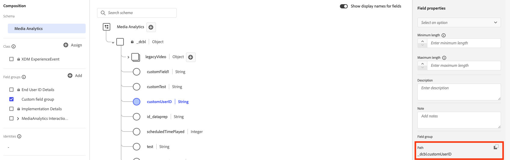

# Implementeer de Streaming Media Collection gebruikend de Edge Network

Met de Adobe Experience Platform-Edge Network kunt u gegevens die bestemd zijn voor meerdere producten naar een gecentraliseerde locatie verzenden. De ervaring met Edge geeft de juiste informatie door aan de gewenste producten. Met dit concept kunt u de implementatie-inspanningen consolideren, met name voor het overspannen van meerdere gegevensoplossingen.

In de volgende afbeelding ziet u hoe de Adobe Streaming Media Collection kan worden geïmplementeerd om Experience Platform Edge te gebruiken om gegevens beschikbaar te maken in Analysis Workspace, in Adobe Analytics of Customer Journey Analytics:

Voor een overzicht van alle implementatieopties, met inbegrip van implementatiemethodes die geen Experience Platform Edge gebruiken, zie [ de Streaming Inzameling van Media uitvoeren ](/help/implementation/overview.md).

Ongeacht of u de Adobe Experience Platform Web SDK, Adobe Experience Platform Mobile SDK, Adobe Experience Platform Roku SDK, of API gebruikt om de het stromen Media Inzameling met Ervaring Edge uit te voeren, moet u eerst de volgende secties voltooien:

## Schema instellen in Adobe Experience Platform

Om gegevensinzameling voor gebruik over toepassingen te standaardiseren die hefboomwerking Adobe Experience Platform, heeft de Adobe de open en openbaar gedocumenteerde norm, het Model van de Gegevens van de Ervaring (XDM) gecreeerd.

Een schema maken en instellen:

1. In Adobe Experience Platform, begin creërend het schema zoals die in [ wordt beschreven creeer en geef schema&#39;s in UI ](https://experienceleague.adobe.com/docs/experience-platform/xdm/ui/resources/schemas.html?lang=en) uit.

1. Op de pagina van de details van het Schema wanneer het creëren van het schema, kies {de Gebeurtenis van de 0} Ervaring **wanneer het kiezen van de basisklasse voor het schema.**

   

1. Selecteer [!UICONTROL **daarna**].

1. Specificeer een naam en een beschrijving van de schemavertoning, dan uitgezochte [!UICONTROL **Afwerking**].

1. In het **gebied van de Samenstelling**, in de [!UICONTROL **3&rbrace; sectie van de Groepen van het Gebied &lbrace;, uitgezocht[!UICONTROL **&#x200B; voeg &#x200B;**]toe, dan onderzoek naar en voeg de volgende nieuwe gebiedsgroepen aan het schema toe:**]
   * `Adobe Analytics ExperienceEvent Template`
   * `Implementation Details`
   * `MediaAnalytics Interaction Details`

   Nadat u de gebiedsgroepen toevoegt, zouden zij in de [!UICONTROL **sectie van de Groepen van het Gebied**], als volgt moeten tonen:

   

1. Selecteer [!UICONTROL **sparen**] om uw veranderingen te bewaren.

1. (Optioneel) U kunt bepaalde velden verbergen die niet worden gebruikt door de Media Edge API. Het verbergen van deze gebieden maakt het schema gemakkelijker te lezen en te begrijpen, maar het wordt niet vereist. Deze velden verwijzen alleen naar de velden in de veldgroep `MediaAnalytics Interaction Details` .

+++ Vouw hier uit om instructies weer te geven voor velden die u kunt verbergen.

   1. Op het [!UICONTROL **gebied van de Structuur**], selecteer het `Media Collection Details` gebied, dan uitgezocht [!UICONTROL **beheer verwante gebieden**].

      

   1. Laat de optie toe om [!UICONTROL **vertoningsnamen voor gebieden**] te tonen, dan het schema als volgt bij te werken:

      * Verberg in het veld `Media Collection Details` > `Advertising Details` de volgende rapportvelden: `Ad Completed` , `Ad Started` en `Ad Time Played` .

      * Verberg het volgende rapportveld in het veld `Media Collection Details` > `Advertising Pod Details` : `Ad Break ID`

      * Verberg in het veld `Media Collection Details` > `Chapter Details` de volgende rapportvelden: `Chapter Completed` , `Chapter ID` , `Chapter Started` en `Chapter Time Played` .

      * Verberg het veld `List Of States` in het veld `Media Collection Details` .

        

      * Verberg in het veld `Media Collection Details` > `List Of States End` en `Media Collection Details` > `List Of States Start` de volgende rapportvelden: `Player State Count` , `Player State Set` en `Player State Time` .

        

      * Verberg in het veld `Media Collection Details` > `Qoe Data Details` de volgende rapporteringsvelden: `Average Bitrate` , `Average Bitrate Bucket`, `Bitrate Change Impacted Streams` , `Bitrate Changes`, `Buffer Impacted Streams` , `Buffer Events`, `Dropped Frame Impacted Streams`, `Drops Before Starts`, `Errors`, `External Error IDs`, `Error Impacted Streams`, `Media SDK Error IDs`, `Player SDK Error IDs`, `Stalling Impacted Streams`, `Stalling Events`, `Total Buffer Duration` en `Total Stalling Duration` 8&rbrace;.

      * Verberg in het veld `Media Collection Details` > `Session Details` de volgende rapporteringsvelden: `10% Progress Marker` , `25% Progress Marker`, `50% Progress Marker` , `75% Progress Marker`, `95% Progress Marker` , `Ad Count`, `Average Minute Audience`, `Content Completes`, `Chapter Count`, `Content Starts`, `Content Time Spent`, `Estimated Streams`, `Federated Data`, `Media Segment Views`, `Media Downloaded Flag`, `Media Starts`, `Pause Impacted Streams` 8&rbrace;, `Media Session Server Timeout`, `Media Time Spent`, `Pause Events`, `Media Session ID`, `Pev3`, `Pccr`, `Total Pause Duration`, `Unique Time Played` en `Video Segment` .

   1. Selecteer [!UICONTROL **bevestigen**] om uw veranderingen te bewaren.

   1. Op het [!UICONTROL **gebied van de Structuur**], laat de optie toe [!UICONTROL **vertoningsnamen voor gebieden**] tonen, dan het `List Of Media Collection Downloaded Content Events` gebied selecteren.

   1. Selecteer [!UICONTROL **beheer verwante gebieden**], dan werk het schema als volgt bij:

      * Verberg in het veld `List Of Media Collection Downloaded Content Events` > `Media Details` > `Advertising Details` de volgende rapportvelden: `Ad Completed` , `Ad Started` en `Ad Time Played` .

      * Verberg het volgende rapportveld in het veld `List Of Media Collection Downloaded Content Events` > `Media Details` > `Advertising Pod Details` : `Ad Break ID`

      * Verberg in het veld `List Of Media Collection Downloaded Content Events` > `Media Details` > `Chapter Details` de volgende rapportvelden: `Chapter Completed` , `Chapter ID` , `Chapter Started` en `Chapter Time Played` .

      * Verberg het veld `List Of States` in het veld `List Of Media Collection Downloaded Content Events` > `Media Details` .

      * Verberg in het veld `List Of Media Collection Downloaded Content Events` > `Media Details` > `List Of States End` en `Media Collection Details` > `List Of States Start` de volgende rapportvelden: `Player State Count`, `Player State Set` en `Player State Time` .

      * Verberg in het veld `List Of Media Collection Downloaded Content Events` > `Media Details` > `Qoe Data Details` de volgende rapporteringsvelden: `Average Bitrate`, `Average Bitrate Bucket`, `Bitrate Change Impacted Streams`, `Bitrate Changes`, `Buffer Events`, `Buffer Impacted Streams`, `Drops Before Starts`, `Dropped Frame Impacted Streams`, `Error Impacted Streams`, `Errors`, `External Error IDs`, `Media SDK Error IDs`, `Player SDK Error IDs`, `Stalling Events`, `Stalling Impacted Streams`, `Total Buffer Duration` 8&rbrace; en `Total Stalling Duration` .

      * Verberg in het veld `List Of Media Collection Downloaded Content Events` > `Media Details` > `Session Details` de volgende rapporteringsvelden: `10% Progress Marker`, `25% Progress Marker`, `50% Progress Marker`, `75% Progress Marker`, `95% Progress Marker`, `Ad Count`, `Average Minute Audience`, `Chapter Count`, `Content Completes`, `Content Starts`, `Content Time Spent`, `Estimated Streams`, `Federated Data`, `Media Downloaded Flag`, `Media Segment Views`, `Pause Events` 8&rbrace;, `Media Session Server Timeout`, `Media Starts`, `Media Time Spent`, `Media Session ID`, `Pause Impacted Streams`, `Pccr`, `Pev3`, `Total Pause Duration`, `Unique Time Played` en `Video Segment` .

      * Verberg het veld `Media Session ID` in het veld `List Of Media Collection Downloaded Content Events` > `Media Details` .

   1. Selecteer [!UICONTROL **bevestigen**] om uw veranderingen te bewaren.

   1. Op het [!UICONTROL **gebied van de Structuur**], selecteer het `Media Reporting Details` gebied, uitgezocht [!UICONTROL **beheer verwante gebieden**].

   1. Laat de optie toe om [!UICONTROL **vertoningsnamen voor gebieden**] te tonen, dan het schema als volgt bij te werken:

      * Verberg in het veld `Media Reporting Details` de volgende velden: `Error Details` , `List Of States End` , `List of States Start` en `Media Session ID` .

   1. Selecteer [!UICONTROL **bevestigen**] > [!UICONTROL **sparen**] om uw veranderingen te bewaren.

+++

1. (Optioneel) U kunt aangepaste metagegevens toevoegen aan uw schema. Op deze manier kunt u aanvullende, door de gebruiker gedefinieerde metagegevens opnemen die u kunt aanpassen aan specifieke behoeften of contexten. Deze flexibiliteit is handig in situaties waarin bestaande schema&#39;s de gewenste gegevenspunten niet dekken. (U kunt ook werken met aangepaste metagegevens met Media Edge API&#39;s. Voor meer informatie, zie [ douanemetagegevens met Media Edge APIs ](https://developer.adobe.com/cja-apis/docs/endpoints/media-edge/custom-metadata/) creëren.)

+++ Vouw hier uit om instructies weer te geven over het toevoegen van aangepaste metagegevens aan uw schema.

   1. Bepaal de plaats van de naam van de huurder van de org door [!UICONTROL **Info van de Rekening**] > [!UICONTROL **Toegewezen organen**] > [!UICONTROL _**organnaam**_] > [!UICONTROL **huurder**] te selecteren.

      Deze aangepaste velden worden via dit pad ontvangen. (Bijvoorbeeld naam huurder: _dcbl → myCustomField path: _dcbl.myCustomField.)

   1. Voeg een aangepaste veldgroep toe aan het door u gedefinieerde mediaschema.

      

   1. Voeg aangepaste velden die u wilt bijhouden toe aan de veldgroep.

      

   1. [ Gebruik de weg die ](https://experienceleague.adobe.com/en/docs/experience-platform/xdm/ui/fields/overview#type-specific-properties) voor het douanegebied in uw verzoeklading wordt geproduceerd.

      

+++

1. Ga met [ verder creeer een dataset in Adobe Experience Platform ](#create-a-dataset-in-adobe-experience-platform).

## Een gegevensset maken in Adobe Experience Platform

1. Zorg ervoor dat u opstelling een schema zoals die in [ wordt beschreven opstelling het Schema in Adobe Experience Platform ](#set-up-the-schema-in-adobe-experience-platform).

1. In Adobe Experience Platform, begin creërend de dataset zoals die in [ wordt beschreven gids UI van Datasets ](https://experienceleague.adobe.com/docs/experience-platform/catalog/datasets/user-guide.html?lang=en#create).

   Wanneer het selecteren van een schema voor uw dataset, kies het schema dat u eerder creeerde, zoals die in [ wordt beschreven Opstelling het Schema in Adobe Experience Platform ](#set-up-the-schema-in-adobe-experience-platform).

1. Ga met [ verder vormen een gegevensstroom in Customer Journey Analytics ](#configure-a-datastream-in-adobe-experience-platform).

## Een gegevensstroom configureren in Adobe Experience Platform

1. Zorg ervoor dat u een dataset zoals die in [ wordt beschreven creeerde een dataset in Adobe Experience Platform ](#create-a-dataset-in-adobe-experience-platform).

1. Creeer een nieuwe gegevensstroom zoals die in [ wordt beschreven vormt een datastream ](https://experienceleague.adobe.com/docs/experience-platform/edge/datastreams/configure.html?lang=en).

   Zorg er bij het maken van de gegevensstroom voor dat u de volgende configuratieselecties maakt:

   * Op het [!UICONTROL **Schema van de Gebeurtenis**] gebied wanneer het creëren van de gegevensstroom, zorg ervoor dat u het schema selecteert dat u in [ opstelling het schema in Adobe Experience Platform ](#set-up-the-schema-in-adobe-experience-platform) creeerde. Selecteer [!UICONTROL **sparen**].

     >[!IMPORTANT]
     >
     >Selecteer niet [!UICONTROL **sparen en voeg Toewijzing**] toe omdat het doen dit in afbeeldingsfouten voor het gebied van de Chronologie zal resulteren.

     

   * Voeg een van de volgende services toe aan de gegevensstroom, afhankelijk van of u Adobe Analytics of Customer Journey Analytics gebruikt:

      * [!UICONTROL **Adobe Analytics**] (als het gebruiken van Adobe Analytics)

        Als u Adobe Analytics gebruikt, zorg ervoor u een rapportreeks bepaalt, zoals die in [ wordt beschreven creeer een rapportreeks ](https://experienceleague.adobe.com/en/docs/analytics/admin/admin-tools/manage-report-suites/c-new-report-suite/t-create-a-report-suite).

      * [!UICONTROL **Adobe Experience Platform**] (als het gebruiken van Customer Journey Analytics)

     Voor informatie over hoe te om de dienst aan een datastream toe te voegen, zie de &quot;diensten aan een datastream&quot;sectie in [ een datastream ](https://experienceleague.adobe.com/docs/experience-platform/edge/datastreams/configure.html?lang=en#view-details) vormen.

      toe

      * Breid [!UICONTROL **Geavanceerde Opties**] uit, dan laat de [!UICONTROL **Analytics van Media**] optie toe.

     

1. U bent nu klaar om [ Media Edge API ](/help/implementation/edge/implementation-edge-api.md) of [ Media Edge SDK ](/help/implementation/edge/edge-mobile-sdk.md) uit te voeren om media analysegegevens te beginnen verzamelen.

   Nadat u wat gegevens hebt verzameld, kunt u [ een verbinding in Customer Journey Analytics ](#create-a-connection-in-customer-journey-analytics) tot stand brengen.

## Verbinding maken in Customer Journey Analytics

>[!NOTE]
>
>De volgende procedure is alleen vereist als u Customer Journey Analytics gebruikt.

1. Zorg ervoor dat u een gegevensstroom zoals die in [ wordt beschreven vormde een gegevensstroom in Customer Journey Analytics ](#configure-a-datastream-in-adobe-experience-platform).

1. In Customer Journey Analytics, creeer een verbinding zoals die in [ wordt beschreven creeer een verbinding ](https://experienceleague.adobe.com/docs/analytics-platform/using/cja-connections/create-connection.html?lang=en).

   Wanneer u de verbinding maakt, zijn de volgende configuratieselecties vereist voor de implementatie van de streamingmedia-verzameling:

   1. Selecteer de dataset die u eerder creeerde, zoals die in [ wordt beschreven creeer een dataset in Adobe Experience Platform ](#create-a-dataset-in-adobe-experience-platform).

   1. Zorg ervoor dat de [!UICONTROL **Invoer alle nieuwe gegevens**] het plaatsen wordt toegelaten.

1. Ga met [ verder creeer een gegevensmening in Customer Journey Analytics ](#create-a-new-data-view-in-customer-journey-analytics).

## Een gegevensweergave maken in Customer Journey Analytics

>[!NOTE]
>
>De volgende procedure is alleen vereist als u Customer Journey Analytics gebruikt.

1. Zorg ervoor dat u een verbinding in Customer Journey Analytics zoals die in [ wordt beschreven creeerde een verbinding in Customer Journey Analytics ](#create-a-connection-in-customer-journey-analytics).

1. In de Analtyics van de Reis van de Klant, creeer een gegevensmening zoals die in [ wordt beschreven creeer of geef een gegevensmening ](https://experienceleague.adobe.com/docs/analytics-platform/using/cja-dataviews/create-dataview.html?lang=en) uit.

   Bij het maken van de gegevensweergave zijn de volgende configuratieselecties vereist voor de implementatie van de Streaming Media Collection:

   1. Op het [!UICONTROL **gebied van de Verbinding**], selecteer de verbinding die u eerder creeerde, zoals die in [ wordt beschreven creeer een verbinding in Customer Journey Analytics ](#create-a-connection-in-customer-journey-analytics).

      Het kan 15 minuten duren voordat de verbinding die u hebt gemaakt beschikbaar is om te selecteren.

   1. Op het [!UICONTROL **lusje van Componenten**], in de [!UICONTROL **gebieden van het Schema**] sectie, onderzoek naar elke component die in de lijsten hieronder wordt vermeld en sleep het in het [!UICONTROL **Metriek**] paneel. Als er meerdere velden met dezelfde naam bestaan, gebruikt u het XDM-pad om te controleren of dit het juiste veld is.

      **Belangrijkste inhoud - de metriek van de Inhoud**

      | Componentnaam | XDM-pad |
      |----------|---------|
      | Start media | mediaReporting.sessionDetails.isViewed |
      | Weergaven van mediasegment | mediaReporting.sessionDetails.hasSegmentView |
      | Inhoud start | mediaReporting.sessionDetails.isPlayed |
      | Inhoud voltooid | mediaReporting.sessionDetails.isCompleted |
      | Tijd van inhoud besteed | mediaReporting.sessionDetails.timePlayed |
      | Tijd besteed aan media | mediaReporting.sessionDetails.totalTimePlayed |
      | Unieke afgespeelde tijd | mediaReporting.sessionDetails.uniqueTimePlayed |
      | Voortgangsmarkering 10% | mediaReporting.sessionDetails.hasProgress10 |
      | Gemiddeld aantal minuten publiek | mediaReporting.sessionDetails.averageMinuteAudience |

      **Hoofdstuk &amp; Advertenties - Hoofdstuk &amp; de metriek van Advertenties**

      | Componentnaam | XDM-pad |
      |----------|---------|
      | Hoofdstuk gestart | mediaReporting.chapterDetails.isStarted |
      | Hoofdstuk voltooid | mediaReporting.chapterDetails.isCompleted |
      | Afspeeltijd van hoofdstuk | mediaReporting.chapterDetails.timePlayed |
      | Advertentie gestart | mediaReporting.advertisingDetails.isStarted |
      | Advertentie voltooid | mediaReporting.advertisingDetails.isCompleted |
      | Ad-tijd afgespeeld | mediaReporting.advertisingDetails.timePlayed |

      **QoE - QoE metriek**

      | Componentnaam | XDM-pad |
      |----------|---------|
      | Te starten tijd | mediaReporting.qoeDataDetails.timeToStart |
      | Drops voordat wordt gestart | mediaReporting.qoeDataDetails.isDroppedBeforeStart |
      | Door buffer beïnvloede stromen | mediaReporting.qoeDataDetails.hasBufferImpactedStreams |
      | Door bitsnelheidwijziging beïnvloede stromen | mediaReporting.qoeDataDetails.hasBitrateChangeImpactedStreams |
      | Wijzigingen in bitsnelheid | mediaReporting.qoeDataDetails.bitrateChangeCount |
      | Gemiddelde bitsnelheid | mediaReporting.qoeDataDetails.bitrateAverage |
      | Gedropte frames | mediaReporting.qoeDataDetails.droppedFrames |
      | Fouten | mediaReporting.qoeDataDetails.errorCount |
      | Fout beïnvloede stromen | mediaReporting.qoeDataDetails.hasErrorImpactedStreams |
      | Gedropte framestromen | mediaReporting.qoeDataDetails.hasDroppedFrameImpactedStreams |

      **staat van de Speler - de staatsmetriek van de Speler**

      | Componentnaam | XDM-pad |
      |----------|---------|
      | Set spelerstatussen | mediaReporting.states.isSet |
      | Aantal statussen van speler | mediaReporting.states.count |
      | Frametijd van speler | mediaReporting.states.time |

   1. Werk de etiketten (in het [!UICONTROL **drop-down menu van de Context labels**]) voor de componenten in de volgende lijst bij. Zoek naar componenten en sleep om het even welke componenten die nog niet in het metriekpaneel in het paneel zijn.

      | Componentnaam | Contextlabel |
      |---------|----------|
      | Tijdslimiet mediasessie | Media: Seconden sinds laatste vraag |
      | Tijd besteed aan media | Media: media-tijd besteed |
      | Totale bufferduur | Media: totale bufferduur |
      | Te starten tijd | Media: Te starten tijd |
      | Totale pauzeduur | Media: totale pauzeduur |

   1. Om onderverdelingen aan uw project van de Customer Journey Analytics toe te voegen, voeg de volgende afmetingen aan het [!UICONTROL **Dimensionen**] paneel toe:

      | XDM-pad | Componentnaam |
      |---------|----------|
      | mediaReporting.states.name | Framenaam van speler |
      | mediaReporting.sessionDetails.ID | Mediasessie-id |

      Naast de afmetingen in deze lijst, kunt u in om het even welke andere afmetingen toevoegen die u aan filtergegevens door in projecten van de Customer Journey Analytics ter beschikking wilt stellen.

1. Selecteer [!UICONTROL **sparen en ga**] > [!UICONTROL **&#x200B;**] verder sparen en beëindigen om uw veranderingen te bewaren.

1. Ga met [ voort creeer en vorm een project in Customer Journey Analytics ](#create-and-configure-a-project-in-customer-journey-analytics).

## Creeer en vorm een project in Customer Journey Analytics

1. Zorg ervoor dat u een gegevensmening in Customer Journey Analytics zoals die in [ wordt beschreven creeerde een gegevensmening in Customer Journey Analytics ](#create-a-new-data-view-in-customer-journey-analytics).

1. In Customer Journey Analytics, in het [!UICONTROL **Workspace**] lusje, in het [!UICONTROL **gebied van Projecten**], uitgezocht [!UICONTROL **creeer project**].

1. Selecteer [!UICONTROL **Leeg project**] > [!UICONTROL **creëren**].

1. Selecteer in het nieuwe project de gegevensweergave die u eerder hebt gemaakt.

   Wanneer het creëren van panelen in uw project, kunt u om het even welke componenten gebruiken die u aan uw gegevensmening toevoegde, zoals die in [ wordt beschreven creeer een gegevensmening in Customer Journey Analytics ](#create-a-new-data-view-in-customer-journey-analytics).

   De volgende vier deelvensters zijn voorbeelden van deelvensters die u kunt maken:

   

   

   

   

1. Selecteer het **pictogram van Panelen** in het linkerspoor, dan belemmering in het [!UICONTROL **gelijktijdige kijkers van Media**] paneel en de [!UICONTROL **doorgebrachte tijd van de media playback**] paneel.

   De twee deelvensters moeten er als volgt uitzien:

   

   

1. (Voorwaardelijk) als u douanemetagegevens aan uw schema toevoegde, zoals die in Stap 8 van [ worden beschreven opstelling het schema in Adobe Experience Platform ](#set-up-the-schema-in-adobe-experience-platform), dan moet u de persistentie voor de douanegebieden plaatsen, zoals die in [ de montages van de componenten van de Persistentie ](https://experienceleague.adobe.com/en/docs/analytics-platform/using/cja-dataviews/component-settings/persistence) in de gids van de Customer Journey Analytics wordt beschreven.

   Wanneer de gegevens in Customer Journey Analytics aankomen, zal de dimensie van de Gebruiker van de Douane beschikbaar zijn.

   

   >[!NOTE]
   >
   >Als u Adobe Analytics instelt als een upstream voor uw gegevensstroom, zijn de aangepaste metagegevens ook aanwezig in ContextData, met de naam die u instelt in het schema (zonder het voorvoegsel van de huurder, bijvoorbeeld myCustomField). Dit maakt het mogelijk om alle eigenschappen van Adobe Analytics beschikbaar voor ContextData, zoals [ te gebruiken creërend een verwerkingsregel ](https://experienceleague.adobe.com/en/docs/analytics/admin/admin-tools/manage-report-suites/edit-report-suite/report-suite-general/c-processing-rules/processing-rules).

1. Deel het project zoals die in [ wordt beschreven de projecten van het Aandeel ](https://experienceleague.adobe.com/docs/analytics-platform/using/cja-workspace/curate-share/share-projects.html?lang=en).

   >[!NOTE]
   >
   >   Als de gebruikers u wilt delen met niet beschikbaar zijn, zorg ervoor de gebruikers gebruiker en admin toegang tot Customer Journey Analytics in Adobe Admin Console hebben.

1. Ga met [ verder verzenden gegevens naar Experience Platform Edge ](#send-data-to-experience-platform-edge).

## Gegevens verzenden naar Experience Platform Edge

Afhankelijk van het type gegevens dat u naar Experience Platform Edge wilt verzenden, kunt u een van de volgende methoden gebruiken:

### Web: De Adobe Experience Platform Web SDK gebruiken

* [ begonnen worden ](https://developer.adobe.com/client-sdks/documentation/media-for-edge-network/)

* [Webgegevens naar Edge verzenden met de Adobe Experience Platform Web SDK](/help/implementation/edge/edge-web-sdk.md)

* [ Migreer aan Adobe het Streamen Media voor de uitbreiding van de Edge Network ](https://developer.adobe.com/client-sdks/documentation/adobe-media-analytics/migration-guide/)

### Mobiel: Adobe Experience Platform Mobile SDK gebruiken

Gebruik de volgende documentatiebronnen om de implementatie voor zowel iOS als Android te voltooien:

* [ begonnen worden ](https://developer.adobe.com/client-sdks/documentation/media-for-edge-network/)

* [ API verwijzing ](https://developer.adobe.com/client-sdks/documentation/media-for-edge-network/api-reference/)

* [ Migreer aan Adobe het Streamen Media voor de uitbreiding van de Edge Network ](https://developer.adobe.com/client-sdks/documentation/adobe-media-analytics/migration-guide/)

### Roku: Adobe Experience Platform Roku SDK

* [ begonnen worden ](https://developer.adobe.com/client-sdks/documentation/media-for-edge-network/)

* [ Adobe Experience Platform Roku SDK ](https://github.com/adobe/aepsdk-roku/tree/main)

* [ Migreer aan Adobe het Streamen Media voor de uitbreiding van de Edge Network ](https://developer.adobe.com/client-sdks/documentation/adobe-media-analytics/migration-guide/) <!-- is the information here also applicable for Roku? -->

### API: Web en andere

De API is momenteel de enige ondersteunde manier om webgegevens naar Experience Platform Edge te verzenden.

De API is ook beschikbaar als u een aangepaste implementatie van de Edge API&#39;s wilt gebruiken.

Zie de volgende bronnen voor meer informatie over de media Edge API:

* [ het overzicht van Edge API van Media ](https://experienceleague.adobe.com/docs/experience-platform/edge-network-server-api/media-edge-apis/overview.html)

* [ Aan de slag Edge API van Media ](https://experienceleague.adobe.com/docs/experience-platform/edge-network-server-api/media-edge-apis/getting-started.html)

* [ het oplossen van problemengids van Edge API van Media ](https://experienceleague.adobe.com/docs/experience-platform/edge-network-server-api/media-edge-apis/troubleshooting.html)

* [ Gebruikend het Open API specificatiedossier voor Media Edge APIs ](https://developer.adobe.com/data-collection-apis/docs/api/media-edge/)
