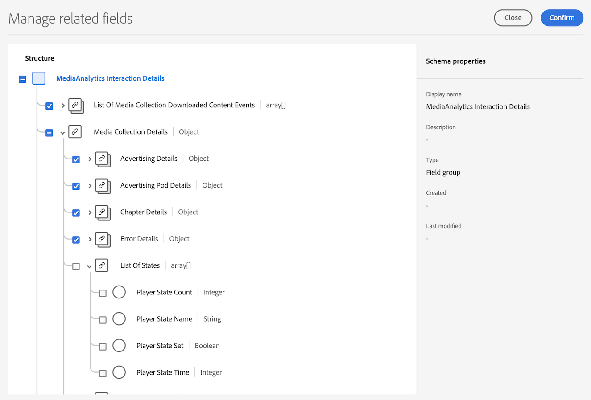
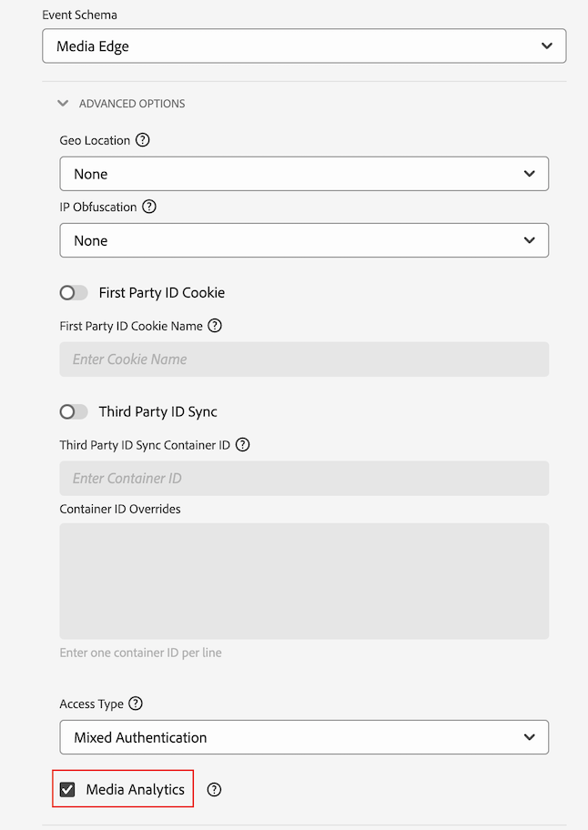

# Media Analytics installeren met Experience Platform Edge

Met Adobe Experience Platform Edge kunt u gegevens die bestemd zijn voor meerdere producten naar een gecentraliseerde locatie verzenden. De ervaring Edge stuurt de juiste informatie door naar de gewenste producten. Met dit concept kunt u de implementatie-inspanningen consolideren, met name voor het overspannen van meerdere gegevensoplossingen.

In de volgende afbeelding ziet u hoe een Media Analytics-implementatie Experience Platform Edge kan gebruiken om gegevens beschikbaar te maken in Analysis Workspace, in Adobe Analytics of Customer Journey Analytics:

Voor een overzicht van alle implementatieopties, met inbegrip van implementatiemethodes die geen Rand van het Experience Platform gebruiken, zie [Streaming media implementeren voor Adobe Analytics of Customer Journey Analytics](/help/implementation/overview.md).

Ongeacht of u de Adobe Experience Platform Web SDK, de Adobe Experience Platform Mobile SDK, de Adobe Experience Platform Roku SDK of de API gebruikt om Streaming Media met Experience Edge te implementeren, moet u eerst de volgende secties voltooien:

## Schema instellen in Adobe Experience Platform

Om gegevensinzameling voor gebruik over toepassingen te standaardiseren die hefboomwerking Adobe Experience Platform, heeft de Adobe de open en openbaar gedocumenteerde norm, het Model van de Gegevens van de Ervaring (XDM) gecreeerd.

Een schema maken en instellen:

1. Maak in Adobe Experience Platform het schema zoals beschreven in [Schema&#39;s maken en bewerken in de gebruikersinterface](https://experienceleague.adobe.com/docs/experience-platform/xdm/ui/resources/schemas.html?lang=en).

1. Kies op de pagina Schema-details bij het maken van het schema de optie [!UICONTROL **Experience Event**] wanneer u de basisklasse voor het schema kiest.

   

1. Selecteren [!UICONTROL **Volgende**].

1. Geef een naam en beschrijving voor de schemaweergave op en selecteer [!UICONTROL **Voltooien**].

1. In de [!UICONTROL **Samenstelling**] in het gebied [!UICONTROL **Veldgroepen**] sectie, selecteert u [!UICONTROL **Toevoegen**], dan onderzoek naar en voeg de volgende nieuwe gebiedsgroepen aan het schema toe:
   * `Adobe Analytics ExperienceEvent Template`
   * `Implementation Details`
   * `MediaAnalytics Interaction Details`

   Nadat u de veldgroepen hebt toegevoegd, worden deze weergegeven in het dialoogvenster [!UICONTROL **Veldgroepen**] als volgt:

   

1. Selecteren [!UICONTROL **Opslaan**] om uw wijzigingen op te slaan.

1. (Optioneel) U kunt bepaalde velden verbergen die niet worden gebruikt door de Media Edge-API. Het verbergen van deze gebieden maakt het schema gemakkelijker te lezen en te begrijpen, maar het wordt niet vereist. Deze velden verwijzen alleen naar de velden in de `MediaAnalytics Interaction Details` veldgroep.

+++ Vouw hier uit om instructies weer te geven voor velden die u kunt verbergen.

   1. In de [!UICONTROL **Structuur**] gebied, selecteert u de `Media Collection Details` veld, selecteer vervolgens [!UICONTROL **Gerelateerde velden beheren**].

      

   1. Schakel de optie in om [!UICONTROL **Weergavenamen voor velden tonen**] Vervolgens werkt u het schema als volgt bij:

      * In de `Media Collection Details` > `Advertising Details` veld, verbergt u de volgende rapportvelden: `Ad Completed`, `Ad Started`, en `Ad Time Played`.

      * In de `Media Collection Details` > `Advertising Pod Details` veld, verbergt u het volgende rapportveld: `Ad Break ID`

      * In de `Media Collection Details` > `Chapter Details` veld, verbergt u de volgende rapportvelden: `Chapter Completed`, `Chapter ID`, `Chapter Started`, en `Chapter Time Played`.

      * In de `Media Collection Details` veld, verbergen `List Of States` veld.

        

      * In de `Media Collection Details` > `List Of States End` en `Media Collection Details` > `List Of States Start` veld, verbergt u de volgende rapportvelden: `Player State Count`, `Player State Set`, en `Player State Time`.

        

      * In de `Media Collection Details` > `Qoe Data Details` veld, verbergt u de volgende rapportvelden: `Average Bitrate`, `Average Bitrate Bucket`, `Bitrate Change Impacted Streams`, `Bitrate Changes`, `Buffer Impacted Streams`, `Buffer Events`, `Dropped Frame Impacted Streams`, `Drops Before Starts`, `Errors`, `External Error IDs`, `Error Impacted Streams`, `Media SDK Error IDs`, `Player SDK Error IDs`, `Stalling Impacted Streams`, `Stalling Events`, `Total Buffer Duration`, en `Total Stalling Duration`.

      * In de `Media Collection Details` > `Session Details` veld, verbergt u de volgende rapportvelden: `10% Progress Marker`, `25% Progress Marker`, `50% Progress Marker`, `75% Progress Marker`, `95% Progress Marker`, `Ad Count`, `Average Minute Audience`, `Content Completes`, `Chapter Count`, `Content Starts`, `Content Time Spent`, `Estimated Streams`, `Federated Data`, `Media Segment Views`, `Media Downloaded Flag`, `Media Starts`, `Media Session ID`, `Media Session Server Timeout`, `Media Time Spent`, `Pause Events`, `Pause Impacted Streams`, `Pev3`, `Pccr`, `Total Pause Duration`, `Unique Time Played`, en `Video Segment`.

   1. Selecteren [!UICONTROL **Bevestigen**] om uw wijzigingen op te slaan.

   1. In de [!UICONTROL **Structuur**] gebied, inschakelen van de optie [!UICONTROL **Weergavenamen voor velden tonen**] en selecteert u vervolgens de `List Of Media Collection Downloaded Content Events` veld.

   1. Selecteren [!UICONTROL **Gerelateerde velden beheren**] Vervolgens werkt u het schema als volgt bij:

      * In de `List Of Media Collection Downloaded Content Events` > `Media Details` > `Advertising Details` veld, verbergt u de volgende rapportvelden: `Ad Completed`, `Ad Started`, en `Ad Time Played`.

      * In de `List Of Media Collection Downloaded Content Events` > `Media Details` > `Advertising Pod Details` veld, verbergt u het volgende rapportveld: `Ad Break ID`

      * In de `List Of Media Collection Downloaded Content Events` > `Media Details` > `Chapter Details` veld, verbergt u de volgende rapportvelden: `Chapter Completed`, `Chapter ID`, `Chapter Started`, en `Chapter Time Played`.

      * In de `List Of Media Collection Downloaded Content Events` > `Media Details` veld, verbergen `List Of States` veld.

      * In de `List Of Media Collection Downloaded Content Events` > `Media Details` > `List Of States End` en `Media Collection Details` > `List Of States Start` veld, verbergt u de volgende rapportvelden: `Player State Count`, `Player State Set`, en `Player State Time`.

      * In de `List Of Media Collection Downloaded Content Events` > `Media Details` > `Qoe Data Details` veld, verbergt u de volgende rapportvelden: `Average Bitrate`, `Average Bitrate Bucket`, `Bitrate Change Impacted Streams`, `Bitrate Changes`, `Buffer Events`, `Buffer Impacted Streams`, `Drops Before Starts`, `Dropped Frame Impacted Streams`, `Error Impacted Streams`, `Errors`, `External Error IDs`, `Media SDK Error IDs`, `Player SDK Error IDs`, `Stalling Events`, `Stalling Impacted Streams`, `Total Buffer Duration`, en `Total Stalling Duration`.

      * In de `List Of Media Collection Downloaded Content Events` > `Media Details` > `Session Details` veld, verbergt u de volgende rapportvelden: `10% Progress Marker`, `25% Progress Marker`, `50% Progress Marker`, `75% Progress Marker`, `95% Progress Marker`, `Ad Count`, `Average Minute Audience`, `Chapter Count`, `Content Completes`, `Content Starts`, `Content Time Spent`, `Estimated Streams`, `Federated Data`, `Media Downloaded Flag`, `Media Segment Views`, `Media Session ID`, `Media Session Server Timeout`, `Media Starts`, `Media Time Spent`, `Pause Events`, `Pause Impacted Streams`, `Pccr`, `Pev3`, `Total Pause Duration`, `Unique Time Played`, en `Video Segment`.

      * In de `List Of Media Collection Downloaded Content Events` > `Media Details`  veld, verbergen `Media Session ID` veld.

   1. Selecteren [!UICONTROL **Bevestigen**] om uw wijzigingen op te slaan.

   1. In de [!UICONTROL **Structuur**] gebied, selecteert u de `Media Reporting Details` veld, selecteren [!UICONTROL **Gerelateerde velden beheren**].

   1. Schakel de optie in om [!UICONTROL **Weergavenamen voor velden tonen**] Vervolgens werkt u het schema als volgt bij:

      * In de `Media Reporting Details` veld, verbergt u de volgende velden: `Error Details`, `List Of States End`, `List of States Start`, en `Media Session ID`.

   1. Selecteren [!UICONTROL **Bevestigen**] > [!UICONTROL **Opslaan**]  om uw wijzigingen op te slaan.

1. Doorgaan met [Een gegevensset maken in Adobe Experience Platform](#create-a-dataset-in-adobe-experience-platform).

## Een gegevensset maken in Adobe Experience Platform

1. Zorg ervoor dat u een schema instelt zoals beschreven in [Het schema instellen in Adobe Experience Platform](#set-up-the-schema-in-adobe-experience-platform).

1. In Adobe Experience Platform begint u met het maken van de gegevensset zoals beschreven in [UI-gids voor gegevensbestanden](https://experienceleague.adobe.com/docs/experience-platform/catalog/datasets/user-guide.html?lang=en#create).

   Wanneer het selecteren van een schema voor uw dataset, kies het schema dat u eerder creeerde, zoals die in [Het schema instellen in Adobe Experience Platform](#set-up-the-schema-in-adobe-experience-platform).

1. Doorgaan met [Een gegevensstroom configureren in Customer Journey Analytics](#configure-a-datastream-in-adobe-experience-platform).

## Een gegevensstroom configureren in Adobe Experience Platform

1. Zorg ervoor dat u een gegevensset hebt gemaakt zoals in [Een gegevensset maken in Adobe Experience Platform](#create-a-dataset-in-adobe-experience-platform).

1. Een nieuwe gegevensstroom maken zoals wordt beschreven in [Een gegevensstroom configureren](https://experienceleague.adobe.com/docs/experience-platform/edge/datastreams/configure.html?lang=en).

   Zorg er bij het maken van de gegevensstroom voor dat u de volgende configuratieselecties maakt:

   * In de [!UICONTROL **Gebeurtenisschema**] veld bij het maken van de gegevensstroom, zorg ervoor dat u het schema selecteert waarin u hebt gemaakt [Schema instellen in Adobe Experience Platform](#set-up-the-schema-in-adobe-experience-platform). Selecteren [!UICONTROL **Opslaan**].

     >[!IMPORTANT]
     >
         > Niet selecteren [!UICONTROL **Save and Add Mapping**] omdat dit leidt tot toewijzingsfouten voor het veld Tijdstempel.
     
     

   * Voeg een van de volgende services toe aan de gegevensstroom, afhankelijk van of u Adobe Analytics of Customer Journey Analytics gebruikt:

      * [!UICONTROL **Adobe Analytics**] (als u Adobe Analytics gebruikt)

        Als u Adobe Analytics gebruikt, moet u een rapportsuite definiëren, zoals beschreven in [Een rapportsuite maken](https://experienceleague.adobe.com/en/docs/analytics/admin/admin-tools/manage-report-suites/c-new-report-suite/t-create-a-report-suite).

      * [!UICONTROL **Adobe Experience Platform**] (bij gebruik van Customer Journey Analytics)

     Voor informatie over hoe te om de dienst aan een datastream toe te voegen, zie de &quot;Add diensten aan een datastream&quot;sectie in [Een gegevensstroom configureren](https://experienceleague.adobe.com/docs/experience-platform/edge/datastreams/configure.html?lang=en#view-details).

     

   * Uitbreiden [!UICONTROL **Geavanceerde opties**] en stelt vervolgens de [!UICONTROL **Media Analytics**] -optie.

     

1. U bent nu klaar om het [Media Edge-API](/help/implementation/edge/implementation-edge-api.md) of [Media Edge SDK](/help/implementation/edge/edge-mobile-sdk.md) om gegevens van mediaconalyse te verzamelen.

   Nadat u gegevens hebt verzameld, kunt u [Verbinding maken in Customer Journey Analytics](#create-a-connection-in-customer-journey-analytics).

## Verbinding maken in Customer Journey Analytics

>[!NOTE]
>
>De volgende procedure is alleen vereist als u Customer Journey Analytics gebruikt.

1. Zorg ervoor dat u een gegevensstroom hebt gemaakt zoals beschreven in [Een gegevensstroom configureren in Customer Journey Analytics](#configure-a-datastream-in-adobe-experience-platform).

1. Maak in Customer Journey Analytics een verbinding zoals beschreven in [Verbinding maken](https://experienceleague.adobe.com/docs/analytics-platform/using/cja-connections/create-connection.html?lang=en).

   Bij het maken van de verbinding zijn de volgende configuratieselecties vereist voor de implementatie van streaming media:

   1. Selecteer de gegevensset die u eerder hebt gemaakt, zoals beschreven in [Een gegevensset maken in Adobe Experience Platform](#create-a-dataset-in-adobe-experience-platform).

   1. Zorg ervoor dat de [!UICONTROL **Alle nieuwe gegevens importeren**] instelling is ingeschakeld.

1. Doorgaan met [Een gegevensweergave maken in Customer Journey Analytics](#create-a-new-data-view-in-customer-journey-analytics).

## Een gegevensweergave maken in Customer Journey Analytics

>[!NOTE]
>
>De volgende procedure is alleen vereist als u Customer Journey Analytics gebruikt.

1. Zorg ervoor dat u een verbinding hebt gemaakt in de Customer Journey Analytics zoals beschreven in [Verbinding maken in Customer Journey Analytics](#create-a-connection-in-customer-journey-analytics).

1. In de Analtyics van de Reis van de Klant, creeer een gegevensmening zoals die in [Een gegevensweergave maken of bewerken](https://experienceleague.adobe.com/docs/analytics-platform/using/cja-dataviews/create-dataview.html?lang=en).

   Bij het maken van de gegevensweergave zijn de volgende configuratieselecties vereist voor de implementatie van streaming media:

   1. In de [!UICONTROL **Verbinding**] , selecteert u de verbinding die u eerder hebt gemaakt, zoals beschreven in [Verbinding maken in Customer Journey Analytics](#create-a-connection-in-customer-journey-analytics).

      Het kan 15 minuten duren voordat de verbinding die u hebt gemaakt beschikbaar is om te selecteren.

   1. Op de [!UICONTROL **Componenten**] tabblad, in de [!UICONTROL **Schema-velden**] , zoekt u naar elke component in de onderstaande tabellen en sleept u deze naar de [!UICONTROL **Metrisch**] deelvenster. Als er meerdere velden met dezelfde naam bestaan, gebruikt u het XDM-pad om te controleren of dit het juiste veld is.

      **Belangrijkste inhoud - Metrische inhoud**

      | Componentnaam | XDM-pad |
      |----------|---------|
      | Start media | mediaReporting.sessionDetails.isViewed |
      | Weergaven van mediasegment | mediaReporting.sessionDetails.hasSegmentView |
      | Inhoud start | mediaReporting.sessionDetails.isPlayed |
      | Inhoud voltooid | mediaReporting.sessionDetails.isCompleted |
      | Tijd van inhoud besteed | mediaReporting.sessionDetails.timePlayed |
      | Tijd besteed aan media | mediaReporting.sessionDetails.totalTimePlayed |
      | Unieke afgespeelde tijd | mediaReporting.sessionDetails.uniqueTimePlayed |
      | Voortgangsmarkering 10% | mediaReporting.sessionDetails.hasProgress10 |
      | Gemiddeld aantal minuten publiek | mediaReporting.sessionDetails.averageMinuteAudience |

      **Hoofdstuk en advertenties - Metrische hoofdstuk en advertenties**

      | Componentnaam | XDM-pad |
      |----------|---------|
      | Hoofdstuk gestart | mediaReporting.chapterDetails.isStarted |
      | Hoofdstuk voltooid | mediaReporting.chapterDetails.isCompleted |
      | Afspeeltijd van hoofdstuk | mediaReporting.chapterDetails.timePlayed |
      | Advertentie gestart | mediaReporting.advertisingDetails.isStarted |
      | Advertentie voltooid | mediaReporting.advertisingDetails.isCompleted |
      | Ad-tijd afgespeeld | mediaReporting.advertisingDetails.timePlayed |

      **QoE - QoE-cijfers**

      | Componentnaam | XDM-pad |
      |----------|---------|
      | Te starten tijd | mediaReporting.qoeDataDetails.timeToStart |
      | Drops voordat wordt gestart | mediaReporting.qoeDataDetails.isDroppedBeforeStart |
      | Door buffer beïnvloede stromen | mediaReporting.qoeDataDetails.hasBufferImpactedStreams |
      | Door bitsnelheidwijziging beïnvloede stromen | mediaReporting.qoeDataDetails.hasBitrateChangeImpactedStreams |
      | Wijzigingen in bitsnelheid | mediaReporting.qoeDataDetails.bitrateChangeCount |
      | Gemiddelde bitsnelheid | mediaReporting.qoeDataDetails.bitrateAverage |
      | Gedropte frames | mediaReporting.qoeDataDetails.droppedFrames |
      | Fouten | mediaReporting.qoeDataDetails.errorCount |
      | Fout beïnvloede stromen | mediaReporting.qoeDataDetails.hasErrorImpactedStreams |
      | Gedropte framestromen | mediaReporting.qoeDataDetails.hasDroppedFrameImpactedStreams |

      **Staat van de speler - de staatsmetriek van de Speler**

      | Componentnaam | XDM-pad |
      |----------|---------|
      | Set spelerstatussen | mediaReporting.states.isSet |
      | Aantal statussen van speler | mediaReporting.states.count |
      | Frametijd van speler | mediaReporting.states.time |

   1. De labels bijwerken (in het dialoogvenster [!UICONTROL **Contextlabels**] (vervolgkeuzelijst) voor de componenten in de volgende tabel. Zoek naar componenten en sleep om het even welke componenten die nog niet in het metriekpaneel in het paneel zijn.

      | Componentnaam | Contextlabel |
      |---------|----------|
      | Tijdslimiet mediasessie | Media: Seconden sinds laatste vraag |
      | Tijd besteed aan media | Media: media-tijd besteed |
      | Totale bufferduur | Media: totale bufferduur |
      | Te starten tijd | Media: Te starten tijd |
      | Totale pauzeduur | Media: totale pauzeduur |

   1. Om onderverdelingen aan uw project van de Customer Journey Analytics toe te voegen, voeg de volgende afmetingen aan toe [!UICONTROL **Dimensionen**] paneel:

      | XDM-pad | Componentnaam |
      |---------|----------|
      | mediaReporting.states.name | Framenaam van speler |
      | mediaReporting.sessionDetails.ID | Mediasessie-id |

      Naast de afmetingen in deze lijst, kunt u in om het even welke andere afmetingen toevoegen die u aan filtergegevens door in projecten van de Customer Journey Analytics ter beschikking wilt stellen.

1. Selecteren [!UICONTROL **Opslaan en doorgaan**] > [!UICONTROL **Opslaan en voltooien**] om uw wijzigingen op te slaan.

1. Doorgaan met [Creeer en vorm een project in Customer Journey Analytics](#create-and-configure-a-project-in-customer-journey-analytics).

## Creeer en vorm een project in Customer Journey Analytics

1. Zorg ervoor dat u een gegevensweergave hebt gemaakt in Customer Journey Analytics zoals beschreven in [Een gegevensweergave maken in Customer Journey Analytics](#create-a-new-data-view-in-customer-journey-analytics).

1. In Customer Journey Analytics, in [!UICONTROL **Werkruimte**] tabblad, in de [!UICONTROL **Projecten**] gebied, selecteren [!UICONTROL **Project maken**].

1. Selecteren [!UICONTROL **Leeg project**] > [!UICONTROL **Maken**].

1. Selecteer in het nieuwe project de gegevensweergave die u eerder hebt gemaakt.

   Wanneer u deelvensters maakt in uw project, kunt u alle componenten gebruiken die u aan de gegevensweergave hebt toegevoegd, zoals beschreven in [Een gegevensweergave maken in Customer Journey Analytics](#create-a-new-data-view-in-customer-journey-analytics).

   De volgende vier deelvensters zijn voorbeelden van deelvensters die u kunt maken:

   

   

   

   

1. Selecteer de **Deelvensters** pictogram in de linkerspoorstaaf, dan belemmering in [!UICONTROL **Gelijktijdige viewers voor media**] en de [!UICONTROL **De afspeeltijd van media is verstreken**] deelvenster.

   De twee deelvensters moeten er als volgt uitzien:

   

   

1. Het project delen zoals beschreven in [Projecten delen](https://experienceleague.adobe.com/docs/analytics-platform/using/cja-workspace/curate-share/share-projects.html?lang=en).

   >[!NOTE]
   >
   >   Als de gebruikers u wilt delen met niet beschikbaar zijn, zorg ervoor de gebruikers gebruiker en admin toegang tot Customer Journey Analytics in Adobe Admin Console hebben.

1. Doorgaan met [Gegevens verzenden naar Experience Platform Edge](#send-data-to-experience-platform-edge).

## Gegevens verzenden naar Experience Platform Edge

Afhankelijk van het type gegevens dat u naar Rand van Experience Platform wilt verzenden, kunt u een van de volgende methoden gebruiken:

### Web: De SDK van het Web van Adobe Experience Platform gebruiken

* [Aan de slag](https://developer.adobe.com/client-sdks/documentation/media-for-edge-network/)

* [Webgegevens naar Edge verzenden met de SDK van Adobe Experience Platform Web](/help/implementation/edge/edge-web-sdk.md)

* [Migreren naar Adobe streamingmedia voor extensie Edge Network](https://developer.adobe.com/client-sdks/documentation/adobe-media-analytics/migration-guide/)

### Mobiel: gebruik de Adobe Experience Platform Mobile SDK

Gebruik de volgende documentatiebronnen om de implementatie voor zowel iOS als Android te voltooien:

* [Aan de slag](https://developer.adobe.com/client-sdks/documentation/media-for-edge-network/)

* [API-referentie](https://developer.adobe.com/client-sdks/documentation/media-for-edge-network/api-reference/)

* [Migreren naar Adobe streamingmedia voor extensie Edge Network](https://developer.adobe.com/client-sdks/documentation/adobe-media-analytics/migration-guide/)

### Roku: Adobe Experience Platform Roku SDK

* [Aan de slag](https://developer.adobe.com/client-sdks/documentation/media-for-edge-network/)

* [Adobe Experience Platform Roku SDK](https://github.com/adobe/aepsdk-roku/tree/main)

* [Migreren naar Adobe streamingmedia voor extensie Edge Network](https://developer.adobe.com/client-sdks/documentation/adobe-media-analytics/migration-guide/) <!-- is the information here also applicable for Roku? -->

### API: Web en andere

De API is momenteel de enige ondersteunde manier om webgegevens naar Experience Platform Edge te verzenden.

De API is ook beschikbaar als u een aangepaste implementatie van de Edge API&#39;s wilt gebruiken.

Zie de volgende bronnen voor meer informatie over de Media Edge API:

* [Overzicht van de Media Edge API](https://experienceleague.adobe.com/docs/experience-platform/edge-network-server-api/media-edge-apis/overview.html)

* [Media Edge API aan de slag](https://experienceleague.adobe.com/docs/experience-platform/edge-network-server-api/media-edge-apis/getting-started.html)

* [Handleiding voor het oplossen van problemen met de Media Edge API](https://experienceleague.adobe.com/docs/experience-platform/edge-network-server-api/media-edge-apis/troubleshooting.html)

* [Het API-specificatiebestand van de Open-API gebruiken voor Media Edge-API&#39;s](https://experienceleague.adobe.com/docs/experience-platform/edge-network-server-api/media-edge-apis/swagger.html)
