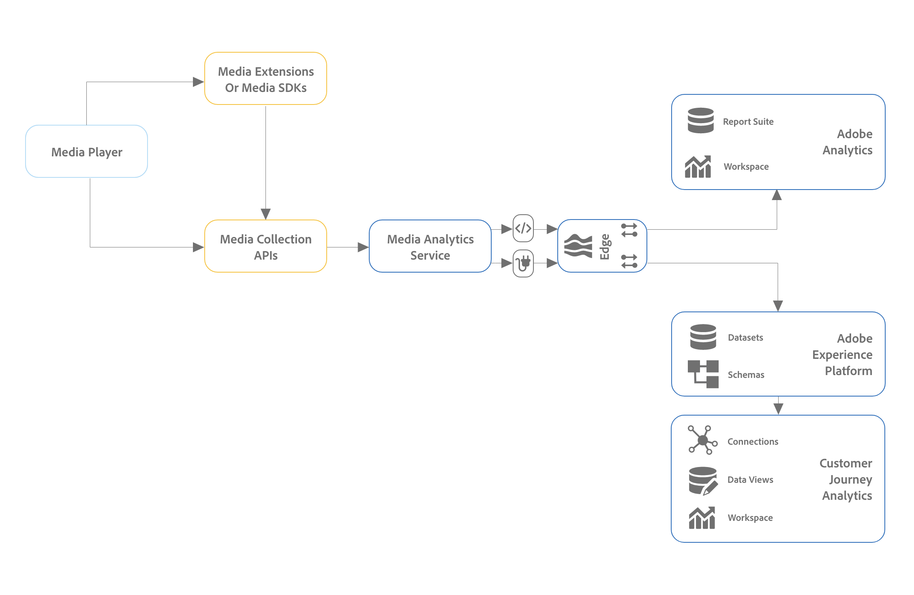

# Media Analytics installeren met Experience Platform Edge

Met Adobe Experience Platform Edge kunt u gegevens die bestemd zijn voor meerdere producten naar een gecentraliseerde locatie verzenden. De ervaring Edge stuurt de juiste informatie door naar de gewenste producten. Met dit concept kunt u de implementatie-inspanningen consolideren, met name voor het overspannen van meerdere gegevensoplossingen.

In de volgende afbeelding ziet u een Media Analytics-implementatie die gebruikmaakt van Experience Platform Edge:

>[!IMPORTANT]
>
>U kunt op dit moment alleen gegevens naar Experience Edge verzenden met de Adobe Experience Platform Mobile SDK.

<!-- Replace the above sentence with this after it web releases: You can send data to Experience Edge using any of the following implementation methods:

* Adobe Experience Platform Web SDK (Coming soon)
* Adobe Experience Platform Mobile SDK
* Edge Network Server API

Regardless of which Experience Edge implementation method you use for configuring media tracking, you must first complete the following sections:

-->

Voer de volgende secties uit om Media Analytics met Experience Platform Edge te implementeren:

* [Een rapportsuite definiëren](#define-a-report-suite)
* [Schema instellen in Adobe Experience Platform](#set-up-the-schema-in-adobe-experience-platform)
* [Een gegevensset maken in Adobe Experience Platform](#create-a-dataset-in-adobe-experience-platform)
* [Een gegevensstroom configureren in Adobe Experience Platform](#configure-a-datastream-in-adobe-experience-platform)
* [Verbinding maken in Customer Journey Analytics](#create-a-connection-in-customer-journey-analytics)
* [Een gegevensweergave maken in Customer Journey Analytics](#create-a-data-view-in-customer-journey-analytics)
* [Een project maken en configureren in Customer Journey Analytics](#create-and-configure-a-project-in-customer-journey-analytics)
* [Gegevens verzenden naar Experience Platform Edge met Edge Extension](#send-data-to-experience-platform-edge-with-the-edge-extension)

## Een rapportsuite definiëren

>[!NOTE]
>
>Een rapportsuite is alleen vereist als u Adobe Analytics gebruikt. Een rapportsuite is niet nodig als u Customer Journey Analytics wilt gebruiken voor rapportage.

Als u Adobe Analytics wilt gebruiken voor rapportage, moet u een rapportenpakket hebben dat u kunt gebruiken voor uw implementatie van Streaming Media. Voor informatie over het definiëren van een rapportsuite raadpleegt u [Report Suite Manager](https://experienceleague.adobe.com/docs/analytics/admin/admin-tools/manage-report-suites/report-suites-admin.html?lang=en).

Nadat een rapportreeks wordt bepaald, ga met [Schema instellen in Adobe Experience Platform](#set-up-the-schema-in-adobe-experience-platform).

## Schema instellen in Adobe Experience Platform

Om gegevensinzameling voor gebruik over toepassingen te standaardiseren die hefboomwerking Adobe Experience Platform, heeft Adobe de open en openbaar gedocumenteerde norm, het Model van de Gegevens van de Ervaring (XDM) gecreeerd.

Een schema maken en instellen:

1. Maak in Adobe Experience Platform het schema zoals beschreven in [Schema&#39;s maken en bewerken in de gebruikersinterface](https://experienceleague.adobe.com/docs/experience-platform/xdm/ui/resources/schemas.html?lang=en).

   Kies bij het maken van het schema de optie [!UICONTROL **XDM ExperienceEvent**] van de [!UICONTROL **Schema maken**] vervolgkeuzemenu.

1. In de [!UICONTROL **Samenstelling**] in de [!UICONTROL **Veldgroepen**] sectie, selecteert u [!UICONTROL **Toevoegen**] en voegt u vervolgens de volgende nieuwe veldgroepen toe aan het schema:
   * `Adobe Analytics ExperienceEvent Template`
   * `Implementation Details`
   * `MediaAnalytics Interaction Details`

   Nadat u de veldgroepen hebt toegevoegd, worden deze weergegeven in het dialoogvenster [!UICONTROL **Veldgroepen**] als volgt:

   

1. In de [!UICONTROL **Structuur**] gebied, selecteert u de `endUserIds` > `_experience` veldgroep en selecteer vervolgens [!UICONTROL **Gerelateerde velden beheren**].

   

1. Werk het schema als volgt bij:

   * In de `Adobe Analytics ExperienceEvent Template` veldgroep, alle velden verbergen behalve `EndUserIDs`.

   * In de `endUserIds` > `_experience` > `Adobe Advertising Cloud end user IDs` veldgroep, alle velden verbergen behalve de `Identifier` veld.

   * In de `endUserIds` > `_experience` > `Adobe Analytics Cloud Custom end user IDs` veldgroep, alle velden verbergen behalve de `Identifier` veld.

     

1. Selecteren [!UICONTROL **Bevestigen**] om uw wijzigingen op te slaan.

1. In de [!UICONTROL **Structuur**] gebied, selecteert u de `Implementation Details` veldgroep, selecteren [!UICONTROL **Gerelateerde velden beheren**] Vervolgens werkt u het schema als volgt bij:

   * In de `Implementation Details` > `Implementation details` veldgroep, alle velden verbergen behalve `version`.

     

1. Selecteren [!UICONTROL **Bevestigen**] om uw wijzigingen op te slaan.

1. In de [!UICONTROL **Structuur**] gebied, selecteert u de `Media Collection Details` veldgroep, selecteren [!UICONTROL **Gerelateerde velden beheren**] Vervolgens werkt u het schema als volgt bij:

   * In de `Media Collection Details` veldgroep, de `List Of States` veldgroep.

     

   * In de `Media Collection Details` > `Advertising Details` veldgroep, verbergt de volgende rapportvelden: `Ad Completed`, `Ad Started`, en `Ad Time Played`.

   * In de `Media Collection Details` > `Advertising Pod Details` veldgroep, verberg het volgende rapportveld: `Ad Break ID`

   * In de `Media Collection Details` > `Chapter Details` de volgende rapporteringsvelden verbergen in veldgroep: `Chapter ID`, `Chapter Completed`, `Chapter Started`, en `Chapter Time Played`.

   * In de `Media Collection Details` > `Qoe Data Details` de volgende rapporteringsvelden verbergen in veldgroep: `Average Bitrate`, `Average Bitrate Bucket`, `Bitrate Changes`, `Buffer Events`, `Total Buffer Duration`, `Errors`, `External Error IDs`, `Bitrate Change Impacted Streams`, `Buffer Impacted Streams`, `Dropped Frame Impacted Streams`, `Error Impacted Streams`, `Stalling Impacted Streams`, `Drops Before Starts`, `Media SDK Error IDs`, `Player SDK Error IDs`, `Stalling Events`, en `Total Stalling Duration`.

   * In de `Media Collection Details` > `Session Details` de volgende rapporteringsvelden verbergen in veldgroep: `Media Session ID`, `Ad Count`, `Average Minute Audience`, `Chapter Count`, `Estimated Streams`, `Pause Impacted Streams`, `10% Progress Marker`, `25% Progress Marker`, `50% Progress Marker`, `75% Progress Marker`, `95% Progress Marker`, `Media Segment Views`, `Content Completes`, `Media Downloaded Flag`, `Federated Data`, `Content Starts`, `Media Starts`, `Pause Events`, `Total Pause Duration`, `Media Session Server Timeout`, `Video Segment`, `Content Time Spent`, `Media Time Spent`, `Unique Time Played`, `Pev3`, en `Pccr`.

   * In de `Media Collection Details` > `List Of States End` en `Media Collection Details` > `List Of States Start` de volgende rapportvelden verbergen in veldgroepen: `Player State Count`, `Player State Set`, en `Player State Time`.

     

1. Selecteren [!UICONTROL **Bevestigen**] om uw wijzigingen op te slaan.

1. In de [!UICONTROL **Structuur**] gebied, selecteert u de `List Of Media Collection Downloaded Content Events` veldgroep, selecteren [!UICONTROL **Gerelateerde velden beheren**] Vervolgens werkt u het schema als volgt bij:

   * In de `List Of Media Collection Downloaded Content Events` > `Media Details` veldgroep, de `List Of States` veldgroep.

   * In de `List Of Media Collection Downloaded Content Events` > `Media Details` > `Advertising Details` veldgroep, verbergt de volgende rapportvelden: `Ad Completed`, `Ad Started`, en `Ad Time Played`.

   * In de `List Of Media Collection Downloaded Content Events` > `Media Details` > `Advertising Pod Details` veldgroep, verberg het volgende rapportveld: `Ad Break ID`

   * In de `List Of Media Collection Downloaded Content Events` > `Media Details` > `Chapter Details` de volgende rapporteringsvelden verbergen in veldgroep: `Chapter ID`, `Chapter Completed`, `Chapter Started`, en `Chapter Time Played`.

   * In de `List Of Media Collection Downloaded Content Events` > `Media Details` > `Qoe Data Details` de volgende rapporteringsvelden verbergen in veldgroep: `Average Bitrate`, `Average Bitrate Bucket`, `Bitrate Changes`, `Buffer Events`, `Total Buffer Duration`, `Errors`, `External Error IDs`, `Bitrate Change Impacted Streams`, `Buffer Impacted Streams`, `Dropped Frame Impacted Streams`, `Error Impacted Streams`, `Stalling Impacted Streams`, `Drops Before Starts`, `Media SDK Error IDs`, `Player SDK Error IDs`, `Stalling Events`, en `Total Stalling Duration`.

   * In de `List Of Media Collection Downloaded Content Events` > `Media Details` > `Session Details` de volgende rapporteringsvelden verbergen in veldgroep: `Media Session ID`, `Ad Count`, `Average Minute Audience`, `Chapter Count`, `Estimated Streams`, `Pause Impacted Streams`, `10% Progress Marker`, `25% Progress Marker`, `50% Progress Marker`, `75% Progress Marker`, `95% Progress Marker`, `Media Segment Views`, `Content Completes`, `Media Downloaded Flag`, `Federated Data`, `Content Starts`, `Media Starts`, `Pause Events`, `Total Pause Duration`, `Media Session Server Timeout`, `Video Segment`, `Content Time Spent`, `Media Time Spent`, `Unique Time Played`, `Pev3`, en `Pccr`.

   * In de `List Of Media Collection Downloaded Content Events` > `Media Details` > `List Of States End` en `Media Collection Details` > `List Of States Start` de volgende rapportvelden verbergen in veldgroepen: `Player State Count`, `Player State Set`, en `Player State Time`.

   * In de `List Of Media Collection Downloaded Content Events` > `Media Details`  veldgroep, de `Media Session ID` veld.

1. Selecteren [!UICONTROL **Bevestigen**] om uw wijzigingen op te slaan.

1. In de [!UICONTROL **Structuur**] gebied, selecteert u de `Media Reporting Details` veldgroep, selecteren [!UICONTROL **Gerelateerde velden beheren**] Vervolgens werkt u het schema als volgt bij:

   * In de `Media Reporting Details` de volgende veldgroepen verbergen: `Error Details`, `List Of States End`, `List of States Start`, `Playhead`, en `Media Session ID`.

1. Selecteren [!UICONTROL **Bevestigen**] > [!UICONTROL **Opslaan**]  om uw wijzigingen op te slaan.

1. Doorgaan met [Een gegevensset maken in Adobe Experience Platform](#create-a-dataset-in-adobe-experience-platform).

## Een gegevensset maken in Adobe Experience Platform

1. Zorg ervoor dat u een schema instelt zoals beschreven in [Het schema instellen in Adobe Experience Platform](#set-up-the-schema-in-adobe-experience-platform).

1. In Adobe Experience Platform begint u met het maken van de gegevensset zoals beschreven in [UI-gids voor gegevensbestanden](https://experienceleague.adobe.com/docs/experience-platform/catalog/datasets/user-guide.html?lang=en#create).

   Wanneer het selecteren van een schema voor uw dataset, kies het schema dat u eerder creeerde, zoals die in [Het schema instellen in Adobe Experience Platform](#set-up-the-schema-in-adobe-experience-platform).

1. Doorgaan met [Een gegevensstroom configureren in Customer Journey Analytics](#configure-a-datastream-in-adobe-experience-platform).

## Een gegevensstroom configureren in Adobe Experience Platform

1. Zorg ervoor dat u een gegevensset hebt gemaakt zoals in [Een gegevensset maken in Adobe Experience Platform](#create-a-dataset-in-adobe-experience-platform).

1. Een nieuwe gegevensstroom maken zoals wordt beschreven in [Een gegevensstroom configureren](https://experienceleague.adobe.com/docs/experience-platform/edge/datastreams/configure.html?lang=en).

   Zorg er bij het maken van de gegevensstroom voor dat u de volgende configuratieselecties maakt:

   * In de [!UICONTROL **Gebeurtenisschema**] veld bij het maken van de gegevensstroom, zorg ervoor dat u het schema selecteert waarin u hebt gemaakt [Schema instellen in Adobe Experience Platform](#set-up-the-schema-in-adobe-experience-platform). Selecteren [!UICONTROL **Opslaan**].

     >[!IMPORTANT]
     >
         > Niet selecteren [!UICONTROL **Save and Add Mapping**] omdat dit leidt tot toewijzingsfouten voor het veld Tijdstempel.
     
     

   * Voeg een van de volgende services toe aan de gegevensstroom, afhankelijk van of u Adobe Analytics of Customer Journey Analytics gebruikt:

      * [!UICONTROL **Adobe Analytics**] (als u Adobe Analytics gebruikt)

        Als u Adobe Analytics gebruikt, moet u een rapportsuite definiëren, zoals wordt beschreven in de sectie [Een rapportsuite definiëren](#define-a-report-suite) in dit artikel.

      * [!UICONTROL **Adobe Experience Platform**] (bij gebruik van Customer Journey Analytics)

     Voor informatie over hoe te om de dienst aan een datastream toe te voegen, zie de &quot;Add diensten aan een datastream&quot;sectie in [Een gegevensstroom configureren](https://experienceleague.adobe.com/docs/experience-platform/edge/datastreams/configure.html?lang=en#view-details).

     

   * Uitbreiden [!UICONTROL **Geavanceerde opties**] en stelt vervolgens de [!UICONTROL **Media Analytics**] optie.

     

1. Doorgaan met [Verbinding maken in Customer Journey Analytics](#create-a-connection-in-customer-journey-analytics).

## Verbinding maken in Customer Journey Analytics

>[!NOTE]
>
>De volgende procedure is alleen vereist als u Customer Journey Analytics gebruikt.

1. Zorg ervoor dat u een gegevensstroom hebt gemaakt zoals beschreven in [Een gegevensstroom configureren in Customer Journey Analytics](#configure-a-datastream-in-adobe-experience-platform).

1. Maak in Customer Journey Analytics een verbinding zoals beschreven in [Verbinding maken](https://experienceleague.adobe.com/docs/analytics-platform/using/cja-connections/create-connection.html?lang=en).

   Bij het maken van de verbinding zijn de volgende configuratieselecties vereist voor de implementatie van streaming media:

   1. Selecteer de gegevensset die u eerder hebt gemaakt, zoals beschreven in [Een gegevensset maken in Adobe Experience Platform](#create-a-dataset-in-adobe-experience-platform).

   1. Zorg ervoor dat de [!UICONTROL **Alle nieuwe gegevens importeren**] instelling is ingeschakeld.

1. Doorgaan met [Een gegevensweergave maken in Customer Journey Analytics](#create-a-new-data-view-in-customer-journey-analytics).

## Een gegevensweergave maken in Customer Journey Analytics

>[!NOTE]
>
>De volgende procedure is alleen vereist als u Customer Journey Analytics gebruikt.

1. Zorg ervoor dat u een verbinding hebt gemaakt in Customer Journey Analytics zoals beschreven in [Verbinding maken in Customer Journey Analytics](#create-a-connection-in-customer-journey-analytics).

1. In de Analtyics van de Reis van de Klant, creeer een gegevensmening zoals die in [Een gegevensweergave maken of bewerken](https://experienceleague.adobe.com/docs/analytics-platform/using/cja-dataviews/create-dataview.html?lang=en).

   Bij het maken van de gegevensweergave zijn de volgende configuratieselecties vereist voor de implementatie van streaming media:

   1. In de [!UICONTROL **Verbinding**] , selecteert u de verbinding die u eerder hebt gemaakt, zoals beschreven in [Verbinding maken in Customer Journey Analytics](#create-a-connection-in-customer-journey-analytics).

      Het kan 15 minuten duren voordat de verbinding die u hebt gemaakt beschikbaar is om te selecteren.

   1. Op de [!UICONTROL **Componenten**] tabblad, in het dialoogvenster [!UICONTROL **Schema-velden**] , zoekt u naar elke component in de onderstaande tabellen en sleept u deze naar de [!UICONTROL **Metrisch**] deelvenster. Als er meerdere velden met dezelfde naam bestaan, gebruikt u het XDM-pad om te controleren of dit het juiste veld is.

      **Belangrijkste inhoud - Metrische inhoud**

      | Componentnaam | XDM-pad |
      |----------|---------|
      | Start media | mediaReporting.sessionDetails.isViewed |
      | Weergaven van mediasegment | mediaReporting.sessionDetails.hasSegmentView |
      | Inhoud start | mediaReporting.sessionDetails.isPlayed |
      | Inhoud voltooid | mediaReporting.sessionDetails.isCompleted |
      | Tijd van inhoud besteed | mediaReporting.sessionDetails.timePlayed |
      | Tijd besteed aan media | mediaReporting.sessionDetails.totalTimePlayed |
      | Unieke afgespeelde tijd | mediaReporting.sessionDetails.uniqueTimePlayed |
      | 10% voortgangsmarkering | mediaReporting.sessionDetails.hasProgress10 |
      | Gemiddeld aantal minuten publiek | mediaReporting.sessionDetails.averageMinuteAudience |

      **Hoofdstuk en advertenties - Metriek voor hoofdstuk en advertenties**

      | Componentnaam | XDM-pad |
      |----------|---------|
      | Hoofdstuk gestart | mediaReporting.chapterDetails.isStarted |
      | Hoofdstuk voltooid | mediaReporting.chapterDetails.isCompleted |
      | Afspeeltijd van hoofdstuk | mediaReporting.chapterDetails.timePlayed |
      | Advertentie gestart | mediaReporting.advertisingDetails.isStarted |
      | Advertentie voltooid | mediaReporting.advertisingDetails.isCompleted |
      | Ad-tijd afgespeeld | mediaReporting.advertisingDetails.timePlayed |

      **QoE - QoE-cijfers**

      | Componentnaam | XDM-pad |
      |----------|---------|
      | Te starten tijd | mediaReporting.qoeDataDetails.timeToStart |
      | Drops voordat wordt gestart | mediaReporting.qoeDataDetails.isDroppedBeforeStart |
      | Door buffer beïnvloede stromen | mediaReporting.qoeDataDetails.hasBufferImpactedStreams |
      | Door bitsnelheidwijziging beïnvloede stromen | mediaReporting.qoeDataDetails.hasBitrateChangeImpactedStreams |
      | Wijzigingen in bitsnelheid | mediaReporting.qoeDataDetails.bitrateChangeCount |
      | Gemiddelde bitsnelheid | mediaReporting.qoeDataDetails.bitrateAverage |
      | Gedropte frames | mediaReporting.qoeDataDetails.droppedFrames |
      | Fouten | mediaReporting.qoeDataDetails.errorCount |
      | Fout beïnvloede stromen | mediaReporting.qoeDataDetails.hasErrorImpactedStreams |
      | Gedropte framestromen | mediaReporting.qoeDataDetails.hasDroppedFrameImpactedStreams |

      **Staat van de speler - de staatsmetriek van de Speler**

      | Componentnaam | XDM-pad |
      |----------|---------|
      | Status van speler instellen | mediaReporting.states.isSet |
      | Aantal statussen van speler | mediaReporting.states.count |
      | Frametijd van speler | mediaReporting.states.time |

   1. De labels bijwerken (in het dialoogvenster [!UICONTROL **Contextlabels**] (vervolgkeuzelijst) voor de componenten in de volgende tabel. Zoek naar componenten en sleep om het even welke componenten die nog niet in het metriekpaneel in het paneel zijn.

      | Componentnaam | Contextlabel |
      |---------|----------|
      | Tijdslimiet mediasessie | Media: Seconden sinds laatste Vraag |
      | Tijd besteed aan media | Media: Tijd besteed aan media |
      | Totale bufferduur | Media: Totale bufferduur |
      | Te starten tijd | Media: Te starten tijd |
      | Totale pauzeduur | Media: Totale pauzeduur |

   1. Om onderverdelingen aan uw project van Customer Journey Analytics toe te voegen, voeg de volgende afmetingen aan toe [!UICONTROL **Dimension**] paneel:

      | XDM-pad | Componentnaam |
      |---------|----------|
      | mediaReporting.states.name | Framenaam van speler |
      | mediaReporting.sessionDetails.ID | Mediasessie-id |

      Naast de afmetingen in deze tabel kunt u alle andere dimensies toevoegen die u beschikbaar wilt maken om gegevens te filteren op basis van Customer Journey Analytics-projecten.

1. Selecteren [!UICONTROL **Opslaan en doorgaan**] > [!UICONTROL **Opslaan en voltooien**] om uw wijzigingen op te slaan.

1. Doorgaan met [Een project maken en configureren in Customer Journey Analytics](#create-and-configure-a-project-in-customer-journey-analytics).

## Een project maken en configureren in Customer Journey Analytics

1. Zorg ervoor dat u een gegevensweergave in Customer Journey Analytics hebt gemaakt zoals beschreven in [Een gegevensweergave maken in Customer Journey Analytics](#create-a-new-data-view-in-customer-journey-analytics).

1. In Customer Journey Analytics, in de [!UICONTROL **Werkruimte**] tabblad, in het dialoogvenster [!UICONTROL **Projecten**] gebied selecteren [!UICONTROL **Project maken**].

1. Selecteren [!UICONTROL **Leeg project**] > [!UICONTROL **Maken**].

1. Selecteer in het nieuwe project de gegevensweergave die u eerder hebt gemaakt.

   Wanneer u deelvensters maakt in uw project, kunt u alle componenten gebruiken die u aan de gegevensweergave hebt toegevoegd, zoals beschreven in [Een gegevensweergave maken in Customer Journey Analytics](#create-a-new-data-view-in-customer-journey-analytics).

   De volgende vier deelvensters zijn voorbeelden van deelvensters die u kunt maken:

   

   

   

   

1. Selecteer **Deelvensters** pictogram in de linkerspoorstaaf, dan belemmering in [!UICONTROL **Mediagelijktijdige viewers**] en de [!UICONTROL **De afspeeltijd van media is verstreken**] deelvenster.

   De twee deelvensters moeten er als volgt uitzien:

   

   

1. Het project delen zoals beschreven in [Projecten delen](https://experienceleague.adobe.com/docs/analytics-platform/using/cja-workspace/curate-share/share-projects.html?lang=en).

   >[!NOTE]
   >
   >   Als de gebruikers met u wilt delen niet beschikbaar zijn, zorg ervoor de gebruikers gebruiker en admin toegang tot Customer Journey Analytics in Adobe Admin Console hebben.

1. Doorgaan met [Gegevens verzenden naar Experience Platform Edge](#send-data-to-experience-platform-edge).

## Gegevens naar Experience Platform Edge verzenden met AEP Mobile SDK

Met de Adobe Experience Platform Mobile SDK kunt u mobiele gegevens naar Experience platform Edge verzenden. (U kunt ook een aangepaste implementatie van de rand-API&#39;s gebruiken.<!-- Waiting for link from John -->)

Gebruik de volgende documentatiebronnen om de implementatie voor zowel iOS als Android te voltooien:

* [Aan de slag](https://developer.adobe.com/client-sdks/documentation/media-for-edge-network/)

* [API-referentie](https://developer.adobe.com/client-sdks/documentation/media-for-edge-network/api-reference/)

* [Migreren naar Adobe-streaming media voor Edge Network-extensie](https://developer.adobe.com/client-sdks/documentation/adobe-media-analytics/migration-guide/)

