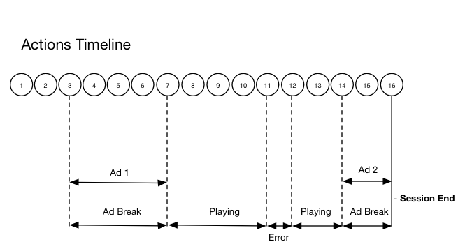

# Tijdlijn 2 - Afloopsessie van gebruiker {#timeline--2-user-abandons-session}

## VOD, pre-rol en, mid-roll advertenties, gebruiker verlaat inhoud vroeg

De volgende diagrammen illustreren de tijdlijn van de afspeelkop en de bijbehorende tijdlijn van de handelingen van een gebruiker. De bijzonderheden van elke actie en de bijbehorende verzoeken worden hieronder weergegeven.




## Handelingsdetails

### Actie 1 - Starten van sessie {#Action-1}

| Handeling | Tijdlijn handeling (seconden) | Positie afspeelkop (seconden) | Aanvraag client |
| --- | :---: | :---: | --- |
| Knop Automatisch afspelen of Afspelen ingedrukt | 0 | 0 | `/api/v1/sessions` |

Deze vraag signaleert _de intentie van de gebruiker om_ een video te spelen. Er wordt een sessie-id ( `{sid}` ) geretourneerd aan de client die wordt gebruikt om alle volgende opvolgende opvolgende aanroepen binnen de sessie te identificeren. De spelerstatus wordt nog niet afgespeeld, maar &#39;gestart&#39;.  [ Verplichte zittingsparameters ](../mc-api-ref/mc-api-sessions-req.md) moeten in de `params` kaart in het verzoeklichaam worden omvat.  Op de achtergrond, produceert deze vraag Adobe Analytics in werking stelt vraag in werking.

```json
{
    "playerTime": {
        "playhead": 0,
        "ts": "<timestamp>"
    },
    "eventType": "sessionStart",
    "params": {
        "media.playerName": "sample-html5-api-player",
        "analytics.trackingServer": "[ _YOUR-TS_ ]",
        "analytics.reportSuite": "[ _YOUR-RSID_ ]",
        "analytics.visitorId": "[ _YOUR-VISITOR-ID_ ]",
        "media.contentType": "VOD",
        "media.length": 60.3333333333333,
        "media.id": "VA API Sample Player",
        "visitor.marketingCloudOrgId": "[YOUR-MCID]",
        "media.name": "ClickMe",
        "media.channel": "sample-channel",
        "media.sdkVersion": "va-api-0.0.0",
        "analytics.enableSSL": false
    }
}
```

### Handeling 2 - Start timer pingelen {#Action-2}

| Handeling | Tijdlijn handeling (seconden) | Positie afspeelkop (seconden) | Aanvraag client |
| --- | :---: | :---: | --- |
| App start gebeurtenistimer | 0 | 0 | |

Start de pingtimer van uw app. De eerste pingel gebeurtenis zou dan 1 seconde binnen moeten in brand steken als er pre-roladvertenties zijn, anders 10 seconden.

### Actie 3 - Ad-break-start {#Action-3}

| Handeling | Tijdlijn handeling (seconden) | Positie afspeelkop (seconden) | Aanvraag client |
| --- | :---: | :---: | --- |
| Begin vóór rol en einde track | 0 | 0 | `/api/v1/sessions/{sid}/events` |

Pre-roll advertenties moeten worden gevolgd. Advertenties kunnen alleen worden bijgehouden binnen een advertentie-einde.

```json
{
    "playerTime": {
        "playhead": 0,
        "ts": "<timestamp>"
    },
    "eventType": "adBreakStart",
    "params": {
        "media.ad.podFriendlyName": "ad_pod1",
        "media.ad.podIndex": 0,
        "media.ad.podSecond": 0
    }
}
```

### Actie 4 - Ad start {#Action-4}

| Handeling | Tijdlijn handeling (seconden) | Positie afspeelkop (seconden) | Aanvraag client |
| --- | :---: | :---: | --- |
| Begin van advertentie 1 vóór de rol bijhouden | 0 | 0 | `/api/v1/sessions/{sid}/events` |

Een advertentie van 12 seconden begint.

```json
{
    "playerTime": {
        "playhead": 0,
        "ts": "<timestamp>"
    },
    "eventType": "adStart",
    "params": {
        "media.ad.podFriendlyName": "ad_pod1",
        "media.ad.name": "Ad 1",
        "media.ad.id": "002",
        "media.ad.length": 7,
        "media.ad.podPosition": 1,
        "media.ad.playerName": "Sample Player",
        "media.ad.advertiser": "Ad Guys",
        "media.ad.campaignId": "1",
        "media.ad.creativeId": "42",
        "media.ad.siteId": "XYZ",
        "media.ad.creativeURL": "https://xyz-creative.com",
        "media.ad.placementId": "sample-placement2"
    },
}
```

### Actie 5 - Advertentiepunten {#Action-5}

| Handeling | Tijdlijn handeling (seconden) | Positie afspeelkop (seconden) | Aanvraag client |
| --- | :---: | :---: | --- |
| App verzendt ping-gebeurtenis | 1 | 0 | `/api/v1/sessions/{sid}/events` |

Pingel de achterkant om de 1 seconde. (Opeenvolgende pingels en pingels worden niet getoond om de korst te houden.)

```json
{
    "playerTime": {
        "playhead": 0,
        "ts": "<timestamp>"
    },
    "eventType": "ping"
}
```

### Actie 6 - Toevoeging voltooid {#Action-6}

| Handeling | Tijdlijn handeling (seconden) | Positie afspeelkop (seconden) | Aanvraag client |
| --- | :---: | :---: | --- |
| Volg de voorrol advertentie 1 voltooid | 12 | 0 | `/api/v1/sessions/{sid}/events` |

De eerste pre-roll advertentie is voorbij.

```json
{
    "playerTime": {
        "playhead": 0,
        "ts": "<timestamp>"
    },
    "eventType": "adComplete"
}
```

### Actie 7: Ad-einde voltooid {#Action-7}

| Handeling | Tijdlijn handeling (seconden) | Positie afspeelkop (seconden) | Aanvraag client |
| --- | :---: | :---: | --- |
| Track voor rol en break voltooid | 12 | 0 | `/api/v1/sessions/{sid}/events` |

Het advertentiespoor is voorbij. Tijdens het hele advertentieseizoen is de speler in de &quot;speelstatus&quot; gebleven.

```json
{
    "playerTime": {
        "playhead": 0,
        "ts": "<timestamp>"
    },
    "eventType": "adBreakComplete"
}
```

### Actie 8 - Inhoud afspelen {#Action-8}

| Handeling | Tijdlijn handeling (seconden) | Positie afspeelkop (seconden) | Aanvraag client |
| --- | :---: | :---: | --- |
| Gebeurtenis track afspelen | 12 | 0 | `/api/v1/sessions/{sid}/events` |

Verplaats de speler naar de afspeelstatus. Volg het afspelen van de inhoud.

```json
{
    "playerTime": {
        "playhead": 0,
        "ts": "<timestamp>"
    },
    "eventType": "play",
    "qoeData": {
        "bitrate": 10000
    }
}
```

### Actie 9 - Pingel {#Action-9}

| Handeling | Tijdlijn handeling (seconden) | Positie afspeelkop (seconden) | Aanvraag client |
| --- | :---: | :---: | --- |
| App verzendt ping-gebeurtenis | 20 | 8 | `/api/v1/sessions/{sid}/events` |

Pingel het achterste eind om de 10 seconden.

```json
{
    "playerTime": {
        "playhead": 8,
        "ts": "<timestamp>"
    },
    "eventType": "ping"
}
```

### Actie 10 - Ping {#Action-10}

| Handeling | Tijdlijn handeling (seconden) | Positie afspeelkop (seconden) | Aanvraag client |
| --- | :---: | :---: | --- |
| App verzendt ping-gebeurtenis | 30 | 18 | `/api/v1/sessions/{sid}/events` |

Pingel het achterste eind om de 10 seconden.

```json
{
    "playerTime": {
        "playhead": 18,
        "ts": "<timestamp>"
    },
    "eventType": "ping"
}
```

### Actie 11 - Fout {#Action-11}

| Handeling | Tijdlijn handeling (seconden) | Positie afspeelkop (seconden) | Aanvraag client |
| --- | :---: | :---: | --- |
| Er treedt een fout op. App verzendt foutgegevens. | 32 | 20 | `/api/v1/sessions/{sid}/events` |

```json
{
    "playerTime": {
        "playhead": 20,
        "ts": "<timestamp>"
    },
    "eventType": "error"
}
```

### Actie 12 - Inhoud afspelen {#Action-12}

| Handeling | Tijdlijn handeling (seconden) | Positie afspeelkop (seconden) | Aanvraag client |
| --- | :---: | :---: | --- |
| Toepassingen herstellen van een fout: de gebruiker drukt op Afspelen | 37 | 20 | `/api/v1/sessions/{sid}/events` |

```json
{
    "playerTime": {
        "playhead": 18,
        "ts": "<timestamp>"
    },
    "eventType":"play",
    "qoeData": {
        "bitrate": 10000
    }
}
```

### Actie 13 - Ping {#Action-13}

| Handeling | Tijdlijn handeling (seconden) | Positie afspeelkop (seconden) | Aanvraag client |
| --- | :---: | :---: | --- |
| App verzendt ping-gebeurtenis | 40 | 28 | `/api/v1/sessions/{sid}/events` |

Pingel het achterste eind om de 10 seconden.

```json
{
    "playerTime": {
        "playhead": 28,
        "ts": "<timestamp>"
    },
    "eventType": "ping"
}
```

### Actie 14 - Ad break start {#Action-14}

| Handeling | Tijdlijn handeling (seconden) | Positie afspeelkop (seconden) | Aanvraag client |
| --- | :---: | :---: | --- |
| Begin middelste rol en onderbreking volgen | 45 | 33 | `/api/v1/sessions/{sid}/events` |

Midden rol en duur van 8 seconden: verzenden `adBreakStart` .

```json
{
    "playerTime": {
        "playhead": 33,
        "ts": "<timestamp>"
    },
    "eventType":"adBreakStart",
    "params": {
        "media.ad.podFriendlyName": "ad_pod2",
        "media.ad.podIndex": 1,
        "media.ad.podSecond": 33
    }
}
```

### Actie 15 - Ad start {#Action-15}

| Handeling | Tijdlijn handeling (seconden) | Positie afspeelkop (seconden) | Aanvraag client |
| --- | :---: | :---: | --- |
| Start Midden rol advertentie 1 bijhouden | 45 | 33 | `/api/v1/sessions/{sid}/events` |

Houd de middenrol advertentie bij.

```json
{
    "playerTime": { "playhead": 33, "ts": "<timestamp>"
    },
    "eventType": "adStart",
    "params": {
        "media.ad.podFriendlyName": "ad_pod1",
        "media.ad.name": "Ad 1",
        "media.ad.id": "002",
        "media.ad.length": 8,
        "media.ad.podPosition": 1,
        "media.ad.playerName": "Sample Player",
        "media.ad.advertiser": "Ad Guys",
        "media.ad.campaignId": "7",
        "media.ad.creativeId": "40",
        "media.ad.siteId": "XYZ",
        "media.ad.creativeURL": "https://example.com",
        "media.ad.placementId": "sample_placement2"
    },
}
```

### Handeling 16 - Toepassing sluiten {#Action-16}

| Handeling | Tijdlijn handeling (seconden) | Positie afspeelkop (seconden) | Aanvraag client |
| --- | :---: | :---: | --- |
| De gebruiker sluit de app. De app bepaalt dat de gebruiker de weergave heeft verlaten en niet terugkeert naar deze sessie. | 48 | 33 | `/api/v1/sessions/{sid}/events` |

Stuur `sessionEnd` naar de VA-achtergrond om aan te geven dat de sessie onmiddellijk moet worden gesloten, zonder verdere verwerking.

```json
{
    "playerTime": {
        "playhead": 33,
        "ts": "<timestamp>"
    },
    "eventType": "sessionEnd"
}
```
