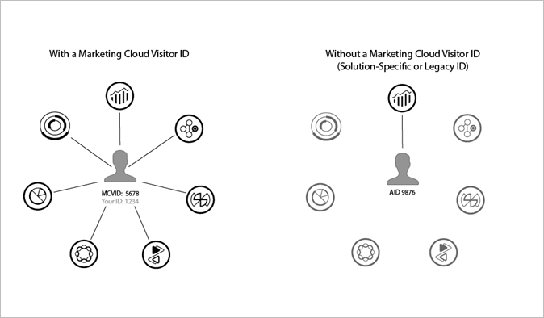

# Vereisten{#prerequisites}

## Besluiten {#decision}

Voordat u begint met het volgen van de implementatie, moet u enkele beslissingen nemen over de implementatie die het meest zinvol is voor uw situatie:

* **Media Analytics -** De meest recente Media SDK&#39;s (de standaard, aanbevolen implementatie) en/of de Media Collection API (RESTful) gebruiken
* **Mijlsteen -** De oudere implementatie voor het bijhouden van Adobe
* **API&#39;s voor gegevensinvoeging -** Het uitvoeren van het volgen zonder Media SDKs te gebruiken

## Taken {#prereq-tasks}

Voor een *Media Analytics* implementatie, hier zijn de taken u moet voltooien alvorens u begint:

1. **Experience Cloud inschakelen.**

   U moet de Adobe Experience Platform Identity Service implementeren.

   De Dienst van de Identiteit laat het gemeenschappelijke identificatiekader voor de Diensten van de Kern van de Experience Cloud, oplossingen, en klantenattributen en publiek in de de kerndienst van Mensen toe. Dit werkt door een unieke, permanente id toe te wijzen aan een sitebezoeker. Wanneer uw organisatie de id-service implementeert, kunt u met deze id dezelfde sitebezoeker en de bijbehorende gegevens identificeren in verschillende Experience Cloud-oplossingen.

   

   De dienst van identiteitskaart kan verschillende oplossing-specifieke IDs (bijvoorbeeld, Analytics HULP) ook vervangen. Via de [Klant-id&#39;s en verificatiestatus](https://experienceleague.adobe.com/docs/id-service/using/reference/authenticated-state.html) functionaliteit, laat de dienst van identiteitskaart u in uw eigen klant IDs tot de Experience Cloud overgaan. Houd er echter rekening mee dat de id-service alleen werkt met de oplossingen waarop u zich al hebt geabonneerd. Als u niet bent aangemeld voor toegang tot andere producten, biedt de id-service geen toegang.

   De id-service is een integraal onderdeel van vele huidige en toekomstige functies, verbeteringen en services voor Experience Cloud. De id-service biedt momenteel ondersteuning voor [Analytics](https://www.adobe.com/marketing-cloud/web-analytics.html) [Audience Manager,](https://www.adobe.com/marketing-cloud/data-management-platform.html) en [Doel.](https://www.adobe.com/marketing-cloud/testing-targeting.html)

   Als u de id-service niet hebt geïmplementeerd, is het nu tijd om een migratiestrategie te overwegen. Voor meer informatie over het belang en de rol van de dienst van identiteitskaart, zie [Waarom de Identiteitsdienst op Uw Radar zou moeten zijn.](https://theblog.adobe.com/why-new-adobe-marketing-cloud-id-service-should-be-on-your-radar/)

   Voor meer informatie over de Experience Cloud-id raadpleegt u [Overzicht van Experience Cloud-id](https://experienceleague.adobe.com/docs/id-service/using/intro/overview.html) en [Adobe Experience Platform Identity Service](https://experienceleague.adobe.com/docs/id-service/using/home.html).

1. **Adobe Analytics-rapporten inschakelen.**

   Als u rapporten wilt inschakelen in Analytics en de inhoud en advertentiegegevens wilt zien die u verzamelt, raadpleegt u [Media-rapporten inschakelen.](/help/media-reports/media-reports-enable.md)
