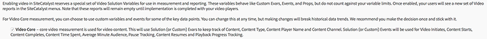
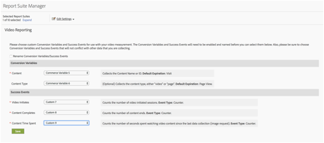

# Milestone - overzicht{#milestone-overview}

>[!CAUTION]
>
>Deze meetoptie is afgekeurd.

[Legacy Milestone-documentatie](milestone_analytics_video.pdf)

## Configuratie {#configuration}

### Mijlestone-videoconfiguratie

Om video te volgen, wijs een reeks van aan *Aangepaste conversievariabelen* (eVars) en *Aangepaste gebeurtenissen* voor gebruik bij het volgen en rapporteren. Eén *Custom Insight* variable ( `s.prop` ) wordt ook gebruikt voor het verven.

De variabelen die u voor elke metrische waarde selecteert, worden toegevoegd aan de videoconfiguratiepagina. Hierdoor kan het systeem automatisch de standaard videorapporten genereren en opmaken. De *videonaam* eVar en de *videoweergaven* de teller wordt allebei vereist. Andere variabelen zijn optioneel, maar aanbevolen voor een volledige meting. Nadat videotracering is ingeschakeld, kunt u rapporten weergeven die zijn gegenereerd op basis van videogegevens die u hebt gerapporteerd via videotracering.

U kunt ook een willekeurig aantal aanvullende meetgegevens bijhouden voor video. Als u bijvoorbeeld meerdere videospelers op uw site gebruikt, kunt u een eVar vullen met de naam van de speler. Sommige variabelen die u selecteert, kunnen ook in andere gebieden van uw site worden gebruikt. Als u bijvoorbeeld op de hele site *inhoudstype* Met deze variabele kunt u meten welk percentage van de paginaweergaven afkomstig is van video en kunt u conversiegebeurtenissen relateren aan video.

### Mijlestone Reporting Configuration

Ga naar **[!UICONTROL Admin > Report Suite Manager].** Selecteer de rapportsuite en kies **[!UICONTROL Video Management > Video Reporting]:**

<!--
{width="248"}
-->


Op het eerste scherm werkt alleen Video Core met Mijlpaal-gegevens. Selecteren **[!UICONTROL Video Core]** en klik op **[!UICONTROL Save].**



Selecteer in het volgende scherm de optie **[!UICONTROL Use Custom Variables].**

<!--
{width="470"}
-->


Selecteer in het uiteindelijke scherm de twee eVars en drie gebeurtenissen die u wilt gebruiken voor de videometing:

<!--

-->



## Referentie videovariabele {#video-variable-reference}

De volgende tabel bevat aanvullende informatie over de handelsvariabelen en aangepaste gebeurtenissen voor video:

| Videometrisch | Type variabele | Beschrijving |
| --- | --- | --- |
| Inhoud | eVar <br/>Standaardvervaldatum: Bezoek | (Vereist) Hiermee wordt de naam van de video verzameld, zoals opgegeven in de implementatie. |
| Inhoudstype | eVar <br/>Standaardvervaldatum: Paginaweergave | Hiermee worden gegevens verzameld over het type inhoud dat door een bezoeker wordt weergegeven. Aan door videometing verzonden bits wordt een inhoudstype toegewezen van `video.` <br/>Deze variabele hoeft niet uitsluitend voor videotracering te worden gereserveerd. Als u andere inhoudrapport-inhoudstypen gebruikt met dezelfde variabele, kunt u de distributie van bezoekers over de verschillende typen inhoud analyseren. U kunt bijvoorbeeld andere inhoudstypen labelen met waarden zoals `article` of `product page` met deze variabele. <br/>Vanuit een videomeetperspectief, *Inhoudstype* Hiermee kunt u videobezoekers identificeren en zo de conversiesnelheden van video berekenen. |
| Tijd van inhoud besteed | Gebeurtenis <br/>Type: Teller | Telt de tijd, in seconden, besteed aan het bekijken van een video sinds het laatste proces van de gegevensinzameling (beeldverzoek). |
| Video wordt gestart | Gebeurtenis <br/>Type: Teller | Geeft aan dat een bezoeker een gedeelte van een video heeft weergegeven. Het biedt echter geen informatie over hoeveel of welk deel van een video de bezoeker heeft bekeken. |
| Video voltooid | Gebeurtenis <br/>Type: Teller | Geeft aan dat een gebruiker een volledige video heeft weergegeven. Standaard wordt de complete-gebeurtenis 1 seconde voor het einde van de video gemeten.  <br/>Tijdens de implementatie kunt u opgeven hoeveel seconden vanaf het einde van de video u een volledige weergave wilt overwegen. Voor live video en andere streams zonder gedefinieerd einde kunt u een aangepast punt opgeven om de voltooiing te meten. Bijvoorbeeld na een bepaalde tijd die is weergegeven. |

## Variabelen van de mediamodule {#media-module-variables}

Met de volgende variabelen kunt u videometing configureren. U moet waarden definiëren voor de variabelen in de tabel Vereiste variabelen. Als u gebeurtenissen in uw videospeler wilt bijhouden, moet u autoTrack (voor ondersteunde spelers) inschakelen of aangepaste Player-gebeurtenistracering implementeren met de methoden open, play, stop en close.

| Variabele    | Beschrijving |
| --- | --- |
| `Media.trackUsingContextData` | **Syntaxis:** <br/><br/> `s.Media.trackUsingContextData = true;` <br/>Met deze optie schakelt u geïntegreerde videotracering in. Wanneer ingesteld op true, genereert de mediamodule contextgegevens voor mediatracering in plaats van de verouderde `pev3`. <br/>Gebruiken `Media.contextDataMapping` om de contextgegevens toe te wijzen aan de geselecteerde gebeurtenissen en gebeurtenissen.<br/>Standaardwaarde: `false` |
| `Media.contextDataMapping` | **Syntaxis:** <br/><br/> `s.Media.contextDataMapping = {`<br/>      `"a.media.name":"eVar2, prop2",` <br/>     `"a.media.segment":"eVar3",` <br/>     `"a.contentType":"eVar1",` <br/>     `"a.media.timePlayed":"event3",` <br/>     `"a.media.view":"event1",` <br/>     `"a.media.segmentView":"event2",` <br/>     `"a.media.complete":"event7",` <br/>     `"a.media.milestones":{` <br/>         `25:"event4",` <br/>         `50:"event5",` <br/>         `75:"event6"` <br/>     ` }` <br/> `};` <br/><br/>Een object dat variabele toewijzing aan Vars en Gebeurtenissen definieert die u voor videometing wilt gebruiken. Het object moet de volgende velden in kaart brengen: <br/><br/> **a.media.name:** (Vereist) Hiermee worden variabelen gevuld met de naam van de video. Geef de eVar op die u hebt geselecteerd voor het opslaan van de naam van de video en de variabele Custom Insight Video ( `s.prop` ) die u wilt gebruiken voor het plakken van video. Geef de waarden op in een lijst met komma&#39;s als scheidingsteken. <br/><br/> **a.media.segment:** (Optioneel) De eVar waarin u de naam van het mediasegment wilt opslaan. a.contentType: (Optioneel) De eVar die u wilt opslaan als videowaarde. Deze bevat een bezoek en het bijhouden van bezoekers waarmee een videobezoek en bezoekersrapportage kunnen worden gegenereerd. De variabele die u selecteert, wordt waarschijnlijk al gebruikt voor het opslaan van gegevens zoals een artikelpresentatie of productpagina <br/><br/> **a.media.view:** (Vereist) De gebeurtenis die u media meningen wilt tellen. <br/><br/> **a.media.segmentView:** (Optioneel) De gebeurtenis die u wilt tellen voor segmentweergaven. <br/><br/> **a.media.complete:** (Optioneel) De gebeurtenis die u wilt tellen voor volledige weergaven. <br/><br/> **a.media.timePlayed:** (Optioneel, sterk aanbevolen) De numerieke gebeurtenis waarin u het aantal afgespeelde videoseconden wilt opslaan. <br/><br/> **a.media.mijlpalen:** (Optioneel) Een object dat s.Media.trackMijlpalen toewijst om gebeurtenissen tegen te gaan. Media.segmentByMijlpalen zou aan waar moeten worden geplaatst als u mijlpalen bepaalt. <br/><br/> **Advertentie bijhouden** Voor het bijhouden van advertenties zijn de volgende contextgegevensvariabelen beschikbaar: <br/> **a.media.ad.name:** (Vereist) Hiermee worden variabelen gevuld met de naam van de advertentie. Geef de eVar op die u hebt geselecteerd voor het opslaan van de advertentienaam en de Custom Insight Video-variabele ( `s.prop` ) die u wilt gebruiken om te plakken. Geef de waarden op in een lijst met komma&#39;s als scheidingsteken. <br/><br/> **a.media.ad.pod:** De positie in de primaire inhoud waarop de advertentie is afgespeeld. <br/><br/> **a.media.ad.podPosition:** De positie in de pod waar de advertentie wordt afgespeeld. <br/><br/> **a.media.ad.CPM:** CPM of gecodeerde CPM (vooraf bevestigd met &quot;~&quot;) die op deze playback van toepassing is. <br/><br/> **a.media.ad.vinew:** Werkt hetzelfde als `a.media.view` <br/><br/> **a.media.ad.clgeworden:** Het aantal klikken tellen voor de advertentie (`Media.click` oproepen) <br/><br/> **a.media.ad.timePlayed:** Werkt hetzelfde als `a.media.timePlayed` <br/><br/> **a.media.ad.complete:** Werkt hetzelfde als `a.media.complete` a.media.ad.segment: Werkt hetzelfde als `a.media.segment` <br/><br/> **a.media.ad.segmentView:** Werkt hetzelfde als `a.media.segmentView` <br/><br/> **a.media.ad.milestone:** Werkt hetzelfde als `a.media.milestones` <br/><br/> **a.media.ad.offsetMilestone:** Werkt hetzelfde als `a.media.offsetMilestones` |
| `Media.trackVars` | **Syntaxis:** <br/><br/> `s.Media.trackVars =` <br/>    `"events,` `prop2,` `eVar1,` `eVar2,` `eVar3";` <br/><br/>Een door komma&#39;s gescheiden lijst met alle variabelen die zijn ingesteld in de code voor het bijhouden van video. |
| `Media.trackEvents` | **Syntaxis:** <br/><br/> `s.Media.trackEvents =` <br/>    `"event1,` `event2,` `event3,` `event4,` `event5,` `event6,` `event7"` <br/><br/>Een door komma&#39;s gescheiden lijst van alle gebeurtenissen die in uw video het volgen code worden geplaatst. |

## Optionele variabelen {#optional-variables}

|  Variabele    | Beschrijving |
| --- | --- |
| `Media.autoTrack` | **Syntaxis:** <br/><br/> `s.Media.autoTrack = true` <br/><br/>Schakelt automatische tracering in voor ondersteunde spelers. Ondersteunde spelers zijn: <ul> <li> Open Source Media Framework (OSMF) </li> <li> FLVPlayback (videospelers die met de wizard Video importeren in Flash Professional zijn gemaakt) </li> <li> Silverlight </li> <li> MediaDisplay </li> <li> MediaPlayback </li> <li> Brightcove API versies 2 &amp; 3 (zie [Brightcove](https://integrations.support.brightcove.com/adobe/adobe-aem-brightcove-connector-using-connector.html) </li> <li> Windows Media Player, QuickTime of Real Player met JavaScript </li> </ul> <br/><br/>Als u geen van de bovenstaande spelers gebruikt, kunt u `Media.open` `Media.play` `Media.stop` `Media.close` om spelergebeurtenissen bij te houden. |
| `Media.autoTrackNetStreams` | **Syntaxis:** <br/><br/> `s.Media.autoTrackNetStreams = true` <br/><br/>Flash 10.3 introduceerde nieuwe functionaliteit aan de component NetStream die verbeterde video het volgen toelaat. Als u een aangepaste Flash NetStream-speler gebruikt, kunt u deze variabele inschakelen voor functionaliteit die lijkt op autoTrack. Deze methode vereist dat video&#39;s worden weergegeven in Flash 10.3 of hoger. |
| `Media.completeByCloseOffset` | **Syntaxis:** <br/><br/> <br/><br/>`s.Media.completeByCloseOffset = true` <br/><br/>Met deze instelling kunt u een volledige videoweergave tellen enkele seconden voor het feitelijke einde van de video.  <br/><br/>De gebeurtenis wordt verzonden op basis van het aantal seconden dat is opgegeven in `completeCloseOffsetThreshold`. Hiermee kunt u de voltooiing meten in videospelers die nooit een verschuiving melden die gelijk is aan de lengte van de video.<br/><br/>Deze waarde wordt standaard ingesteld op true en de drempel op 1 seconde. Met deze standaardwaarden wordt de complete-gebeurtenis 1 seconde voor het einde van de video verzonden. |
| `Media.completeCloseOffsetThreshold` | **Syntaxis:** <br/><br/> `s.Media.completeCloseOffsetThreshold = 1` <br/><br/>Met deze drempel kunt u een volledige videoweergave tellen enkele seconden voor het daadwerkelijke einde van de video.  `Media.completeByCloseOffset` moet op true worden ingesteld om deze drempel te gebruiken.<br/><br/>De waarde met gehele getallen die u opgeeft, bepaalt hoe ver in seconden de verschuiving kan afwijken van de lengte van de video bij het einde en nog steeds als een complete. Hiermee kunt u de voltooiing meten in videospelers die nooit een verschuiving melden die gelijk is aan de lengte van de video.  <br/><br/>De standaardwaarde is 1 seconde. |
| `Media.playerName` | **Syntaxis:** <br/><br/> `s.Media.playerName = "Custom Player Name"` <br/><br/>Hiermee geeft u een aangepaste naam voor de videospeler op. |
| `Media.trackSeconds` | **Syntaxis:** <br/><br/> `s.Media.trackSeconds = 15` <br/><br/>Bepaalt het interval, in seconden, voor het verzenden van video het volgen gegevens naar de servers van de Adobe- gegevensinzameling terwijl de video speelt. De waarde moet worden ingesteld in stappen van 5 seconden. <br/><br/> Inschakelen `Media.trackSeconds` Hiermee worden alleen de gebeurtenissen geactiveerd die zijn gedefinieerd in `Media.contextDataMapping`. Als u aanvullende variabelen wilt verzenden buiten de variabelen die voor videometing zijn opgegeven, moet u Media.Monitor gebruiken. |
| `Media.trackMilestones` | Traceert mijlpalen als percentage van de videolengte.  <br/><br/> **Syntaxis:** <br/><br/> `s.Media.trackMilestones = "25, 50, 75";` <br/><br/>Bepaalt het interval, als percentage van de videolengte, voor het verzenden van video het volgen gegevens naar de servers van de Adobe gegevensinzameling. Geef de mijlpalen op als een door komma&#39;s gescheiden lijst met hele getallen. Bijvoorbeeld: 10 = 10%, 23 = 23%.  <br/><br/>Omdat deze mijlpalen vaste punten in de video zijn, als een bezoeker voorbij de 10% mijlpaal bekijkt, dan opnieuw terugspoelt en de 10% mijlpaal opnieuw overgaat, verzendt de mediamodule de volgende gegevens veelvoudige tijden. Op dezelfde manier als een bezoeker snel voorbij een mijlpaal vooruitspoelt, verzendt de media module niet de het volgen gegevens voor die mijlpaal.  <br/><br/>Inschakelen `Media.trackMilestones` Hiermee worden alleen de gebeurtenissen geactiveerd die zijn gedefinieerd in `Media.contextDataMapping`. Als u aanvullende variabelen wilt verzenden buiten de variabelen die voor videometing zijn opgegeven, moet u Media.Monitor gebruiken. |
| `Media.trackOffsetMilestones` | Traceert mijlpalen als seconden die zijn verstreken vanaf het begin van de video.  <br/><br/> **Syntaxis:** <br/><br/> `s.Media.trackOffsetMilestones = "20, 40, 60";` <br/><br/>Definieert het interval, in seconden vanaf het begin van de video, voor het verzenden van gegevens voor het bijhouden van video naar Adobe-gegevensverzamelingsservers. Geef de mijlpalen op als een door komma&#39;s gescheiden lijst met hele getallen. Bijvoorbeeld: 20 = 20 seconden, 40 = 40 seconden).  <br/><br/>Omdat deze mijlpalen vaste punten in de video zijn, als een bezoeker voorbij de 20 secondenmijlpaal bekijkt, dan opnieuw terugspoelt en de 20 secondenmijlpaal opnieuw overgaat, verzendt de mediamodule de volgende gegevens veelvoudige tijden. Op dezelfde manier als een bezoeker snel voorbij een mijlpaal vooruitspoelt, verzendt de media module niet de het volgen gegevens voor die mijlpaal.  <br/><br/> Inschakelen `Media.trackOffsetMilestones` Hiermee worden alleen de gebeurtenissen geactiveerd die zijn gedefinieerd in `Media.contextDataMapping`. Als u aanvullende variabelen wilt verzenden buiten de variabelen die voor videometing zijn opgegeven, moet u Media.Monitor gebruiken. |
| `Media.segmentByMilestones` | **Syntaxis:** <br/><br/> `s.Media.segmentByMilestones = true;` <br/><br/>Hiermee worden automatisch de segmentnaam, het segmentnummer en de segmentlengte-gegevens gegenereerd op basis van de lengte van de media en de mijlpalen die zijn opgegeven in `Media.trackMilestones` <br/><br/>Segmenteren op basis van mijlpalen is de enige manier om segmenten te definiëren wanneer u `autoTrack`. <br/><br/>Standaardwaarde: `false` |
| `Media.segmentByOffsetMilestones` | **Syntaxis:** <br/><br/> `s.Media.segmentByOffsetMilestones = true;` <br/><br/>Hiermee worden automatisch de segmentnaam, het segmentnummer en de segmentlengte-gegevens gegenereerd op basis van de lengte van de media en de mijlpalen die zijn opgegeven in `Media.trackOffsetMilestones` <br/><br/>Segmenteren op basis van mijlpalen is de enige manier om segmenten te definiëren wanneer u `autoTrack`.  <br/><br/>Standaardwaarde: `false` |

## Variabelen voor Advisering bijhouden {#ad-tracking-variables}

Deze variabelen worden gebruikt om advertentie-informatie samen met de openAd methode te verzenden. Zie [VAST video en opvolging.](https://experienceleague.adobe.com/docs/media-analytics/using/media-overview.html?lang=nl-NL)

| Variabele    | Beschrijving |
| --- | --- |
| `Media.adTrackSeconds` | **Syntaxis:** <br/><br/> `s.Media.adTrackSeconds = 15;` <br/><br/>Definieert het interval, in seconden, voor het verzenden van video- en tekstgegevens naar Adobe-gegevensverzamelingsservers terwijl de video wordt afgespeeld. De waarde moet worden ingesteld in stappen van 5 seconden.  <br/><br/> Inschakelen `Media.adTrackSeconds` Hiermee worden alleen de gebeurtenissen geactiveerd die zijn gedefinieerd in `Media.contextDataMapping`. Als u aanvullende variabelen wilt verzenden buiten de variabelen die voor videometing zijn opgegeven, moet u `Media.monitor`. |
| `Media.adTrackMilestones` | Tracks en mijlpalen als percentage van de lengte van de advertentie.  <br/><br/> **Syntaxis:** <br/><br/> `s.Media.adTrackMilestones = "25, 50, 75";` <br/><br/>Bepaalt het interval, als percentage van de advertentielengte, voor het verzenden van en het volgen van gegevens naar de servers van de Adobe gegevensinzameling. Geef de mijlpalen op als een door komma&#39;s gescheiden lijst met hele getallen. Bijvoorbeeld: 10 = 10%, 23 = 23%).  <br/><br/>Omdat deze mijlpalen vaste punten in de advertentie zijn, als een bezoeker voorbij de 10% mijlpaal bekijkt, dan opnieuw terugspoelt en de 10% mijlpaal opnieuw overgaat, verzendt de mediamodule de volgende gegevens veelvoudige tijden. Op dezelfde manier als een bezoeker snel voorbij een mijlpaal vooruitspoelt, verzendt de media module niet de het volgen gegevens voor die mijlpaal.  <br/><br/> Inschakelen `Media.adTrackMilestones` Hiermee worden alleen de gebeurtenissen geactiveerd die zijn gedefinieerd in `Media.contextDataMapping`. Als u aanvullende variabelen wilt verzenden buiten de variabelen die voor videometing zijn opgegeven, moet u `Media.monitor`. |
| `Media.adTrackOffsetMilestones` | Tracks en mijlpalen in seconden vanaf het begin van de advertentie.  <br/><br/> **Syntaxis:** <br/><br/> `s.Media.adTrackOffsetMilestones = "20, 40, 60";` <br/><br/>Definieert het interval, in seconden vanaf het begin van de advertentie, voor het verzenden en volgen van gegevens naar Adobe gegevensverzamelingsservers. Geef de mijlpalen op als een door komma&#39;s gescheiden lijst met hele getallen. Bijvoorbeeld: 20 = 20 seconden, 40 = 40 seconden).  <br/><br/>Omdat deze mijlpalen vaste punten in de advertentie zijn, als een bezoeker voorbij de 20 secondenmijlpaal bekijkt, dan opnieuw terugspoelt en de 20 secondenmijlpaal opnieuw overgaat, verzendt de media module de volgende gegevens veelvoudige tijden. Op dezelfde manier als een bezoeker snel voorbij een mijlpaal vooruitspoelt, verzendt de media module niet de het volgen gegevens voor die mijlpaal.  <br/><br/> Inschakelen `Media.adTrackOffsetMilestones` Hiermee worden alleen de gebeurtenissen geactiveerd die zijn gedefinieerd in `Media.contextDataMapping`. Als u aanvullende variabelen wilt verzenden buiten de variabelen die voor videometing zijn opgegeven, moet u `Media.monitor`. |
| `Media.adSegmentByMilestones` | **Syntaxis:** <br/><br/> `s.Media.adSegmentByMilestones = true;` <br/><br/>Hiermee worden automatisch de segmentnaam, het segmentnummer en de segmentlengte-gegevens gegenereerd op basis van de lengte van de media en de mijlpalen die zijn opgegeven in `Media.adTrackMilestones` <br/><br/>Segmenteren op basis van mijlpalen is de enige manier om segmenten te definiëren wanneer u `autoTrack`.  <br/><br/>Standaardwaarde: `false` |
| `Media.adSegmentByOffsetMilestones` | **Syntaxis:** <br/><br/> `s.Media.adSegmentByOffsetMilestones = true;` <br/><br/>Hiermee worden automatisch de segmentnaam, het segmentnummer en de segmentlengte-gegevens gegenereerd op basis van de lengte van de media en de mijlpalen die zijn opgegeven in `Media.adTrackOffsetMilestones` <br/><br/>Segmenteren op basis van mijlpalen is de enige manier om segmenten te definiëren wanneer u `autoTrack`. <br/><br/>Standaardwaarde: `false` |

## Methoden van Media Module {#media-module-methods}

De methoden van de mediamodule worden gebruikt voor het handmatig bijhouden van spelergebeurtenissen en voor het bijhouden van aanvullende meetgegevens die geen deel uitmaken van de standaardvideoverslagen.

Als u `Media.autoTrack` en u volgt geen extra metriek, te hoeven u om geen van deze methodes direct te roepen. Alle argumenten zijn vereist, tenzij opgegeven als optioneel.

| Methode    | Beschrijving |
| --- | --- |
| `Media.open` | **Syntaxis:** <br/><br/> `s.Media.open(mediaName, mediaLength, mediaPlayerName)` <br/><br/>Bereidt de mediamodule voor voor het verzamelen van videovolggegevens. Deze methode heeft de volgende parameters: <ul><li> **mediaName:** (Vereist) De naam van de video zoals u deze wilt weergeven in videoverslagen. </li><li>  **mediaLength:** (Vereist) De lengte van de video in seconden.  </li><li> **mediaPlayerName:** (Vereist) De naam van de mediaspeler die wordt gebruikt om de video weer te geven, zoals u deze wilt weergeven in videoverslagen. </li></ul> |
| `Media.openAd` | **Syntaxis:** <br/><br/> `s.Media.openAd(name, length, playerName, parentName,`<br/>   `parentPod, parentPodPosition, CPM)` <br/><br/>Bereidt de mediamodule voor om gegevens te verzamelen en te volgen. Deze methode heeft de volgende parameters: <ul> <li> **naam:** (Vereist) De naam of id van de advertentie.  </li> <li> **lengte:** (Vereist) De lengte van de advertentie.  </li> <li> **playerName:** (Vereist) De naam van de mediaspeler die is gebruikt om de advertentie weer te geven.  </li> <li> **parentName:** De naam of id van de primaire inhoud waarin de advertentie is ingesloten.  </li> <li> **parentPod:** De positie in de primaire inhoud waarop de advertentie is afgespeeld.  </li> <li> **parentPodPosition:** De positie in de pod waar de advertentie wordt afgespeeld.  </li> <li> **CPM:** CPM of gecodeerde CPM (vooraf bevestigd met &quot;~&quot;) die op deze playback van toepassing is.  </li> </ul> |
| `Media.click` | **Syntaxis:** <br/><br/> `s.Media.click(name, offset)` <br/><br/>Bijhouden wanneer op een advertentie in een video wordt geklikt. Deze methode heeft de volgende parameters: <ul> <li> **naam:** De naam van de advertentie. Dit moet overeenkomen met de naam die wordt gebruikt in Media.openAd.  </li> <li> **verschuiving:** De verschuiving in de advertentie toen de klik optrad.  </li> </ul> |
| `Media.close` | **Syntaxis:** <br/><br/> `s.Media.close(mediaName)` <br/><br/>Beëindigt de videoverzameling en verzendt informatie naar de servers van de Adobe- gegevensinzameling. Roep deze methode aan het einde van de video aan. Deze methode heeft de volgende parameter: <br/><br/> **mediaName:** De naam van de video. Dit moet overeenkomen met de naam die wordt gebruikt in `Media.open`. |
| `Media.complete` | **Syntaxis:** <br/><br/> `s.Media.complete(name, offset)` <br/><br/>Deze methode houdt handmatig een complete-gebeurtenis bij. Deze methode wordt gebruikt wanneer u gebeurtenissen moet teweegbrengen gebruikend speciale logica die niet kan worden behandeld gebruikend `Media.completeByCloseOffset`. <br/><br/>Wanneer u bijvoorbeeld een live stream meet die geen bepaald einde heeft, wordt mogelijk een complete geactiveerd wanneer een gebruiker een live stream gedurende X seconden bekijkt. U kunt een complete meten aan de hand van een percentageberekening op basis van de lengte en het type inhoud. Deze methode heeft de volgende parameters: <ul> <li> **mediaName:** De naam van de video. Dit moet overeenkomen met de naam die wordt gebruikt in Media.open.  </li> <li> **mediaOffset:** Het aantal seconden in de video wanneer de complete-gebeurtenis moet worden verzonden. Geef de verschuiving op op basis van de video die op tweede nul begint. <br/><br/>Als uw mediaspeler het gebruik van milliseconden bijhoudt, moet u ervoor zorgen dat de waarde wordt omgezet in seconden voordat u Media.complete aanroept.  </li> </ul> Als u van plan bent om volledig manueel te roepen, plaats <br/><br/> `s.Media.completeByCloseOffset = false`. |
| `Media.play` | **Syntaxis:** <br/><br/> `s.Media.play(name, offset, segmentNum, segment, segmentLength)` <br/><br/>Roep deze methode altijd aan wanneer een video begint met afspelen. Wanneer u handmatige videometingen gebruikt, kunt u de huidige segmentgegevens opgeven wanneer u videomeetgegevens verzendt.  <br/><br/>Als de speler van het ene segment naar het andere verandert, moet u om welke reden dan ook `Media.stop` `Media.play`. <br/><br/>Deze methode heeft de volgende parameters: <br/><br/> **mediaName:** De naam van de video. Dit moet overeenkomen met de naam die wordt gebruikt in Media.open.  <br/><br/> **mediaOffset:** Het aantal seconden in de video dat wordt afgespeeld. Geef de verschuiving op op basis van de video die op tweede nul begint. Als uw mediaspeler het gebruik van milliseconden bijhoudt, moet u ervoor zorgen dat de waarde wordt omgezet in seconden voordat u Media.play aanroept.  <br/><br/> **segmentNum:** (Optioneel) Het huidige segmentnummer, dat marketingrapporten gebruiken om de weergave van segmenten in rapporten te ordenen. De parameter segmentNum moet groter zijn dan nul.  <br/><br/> **segment:** (Optioneel) De huidige segmentnaam.  <br/><br/> **segmentLength:** (Optioneel) <br/><br/>De huidige segmentlengte, in seconden.  <br/><br/>Bijvoorbeeld: <br/><br/> `s.Media.play("My Video", 1800, 2,"Second Quarter", 1800)` <br/><br/> `s.Media.play("My Video", 0, 1,"Preroll", 30)` |
| `Media.stop` | **Syntaxis:** <br/><br/> `s.Media.stop(mediaName, mediaOffset)` <br/><br/>Traceert een stopgebeurtenis (stoppen, pauzeren, enz.) voor de opgegeven video. Deze methode heeft de volgende parameters: <ul> <li> **mediaName:** De naam van de video. Dit moet overeenkomen met de naam die wordt gebruikt in `Media.open`.  </li> <li> **mediaOffset:** Het aantal seconden in de video dat de stop- of pause-gebeurtenis plaatsvindt. Geef de verschuiving op op basis van de video die op tweede nul begint.  </li> </ul> |
| `Media.monitor` | **Syntaxis:** <br/><br/> `s.Media.monitor(s, media)` <br/><br/> **Silverlight-syntaxis:** <br/><br/> `s.Media.monitor =` <br/>   `new AppMeasurement_Media_Monitor(myMediaMonitor);` <br/><br/>De Silverlight toepassingsmedia monitor voert het doelstelling-C patroon van het schakelaarontwerp uit. De `myMediaMonitor` klassenmethode neemt `s` en `media` parameters. <br/><br/>Gebruik deze methode om extra videometriek te verzenden. U kunt aanvullende variabelen instellen (Props, Vars, Events) en deze verzenden met `Media.track` op basis van de huidige status van de video tijdens het afspelen. <br/><br/>Zie [Meten van extra metriek met Media.monitor.](https://experienceleague.adobe.com/docs/media-analytics/using/media-overview.html?lang=nl-NL) <br/><br/>Deze methode heeft de volgende parameters: <br/><br/>  **s:** De `AppMeasurement` instantie (of JavaScript `s` object). <br/><br/> **media:** Een object met leden die de status van de video opgeven. Tot deze leden behoren:  <ul><li> `media.name:` De naam van de video. Dit moet overeenkomen met de naam die wordt gebruikt in `Media.open`; </li><li> `media.length:` De lengte van de video in seconden die in de vraag wordt gegeven aan `Media.open`; </li><li> `media.playerName:` De naam van de mediaspeler die is opgegeven in de oproep aan `Media.open`; </li><li> `media.openTime:` Een NSDate-object dat gegevens bevat over wanneer `Media.open` is opgeroepen; </li><li> `media.offset:` De huidige verschuiving, in seconden, (werkelijke punt in de video) in de video. De verschuiving begint bij nul (de eerste seconde van de video is seconde 0); </li><li> `media.percent:` Het huidige percentage van de video die is afgespeeld, op basis van de videolengte en de huidige verschuiving..  </li><li> `media.timePlayed:` het totale aantal seconden dat tot nu toe is afgespeeld;  </li><li> `media.eventFirstTime:` Geeft aan of dit de eerste keer was dat deze mediagebeurtenis voor deze video werd aangeroepen. </li><li> `media.mediaEvent:` Een tekenreeks met de naam van de gebeurtenis die de monitoraanroep heeft veroorzaakt. </li></ul> |
|  | `media.mediaEvent` events: <ul><li> `OPEN:` Wanneer het afspelen voor het eerst wordt waargenomen via `Media.autoTrack` of een oproep tot `Media.play`; </li><li> `CLOSE:` Wanneer het afspelen wordt beëindigd nadat de video is voltooid tot en met `Media.autoTrack` of bij een oproep tot `Media.close`;</li><li> `PLAY:` Wanneer het afspelen wordt hervat nadat het is gepauzeerd of nadat het is scrubd `Media.autoTrack` of een tweede aanroep van `Media.play`;</li><li> `STOP:` Wanneer het afspelen stopt als het begin van het scrubben wordt onderbroken `Media.autoTrack` of een oproep tot `Media.stop`;</li><li> `MONITOR:` Wanneer onze automatische controle de staat van de video controleert terwijl het speelt (elke seconde);</li><li> `SECONDS:` Bij het tweede interval dat door `Media.trackSeconds` variabele;</li><li> `MILESTONE:` Bij de door de `Media.trackMilestones` variabele; </li></ul> |
| `Media.track` | **Syntaxis:** <br/><br/> `s.Media.track(mediaName)` <br/><br/>Hiermee wordt de huidige videostatus onmiddellijk samen met een andere status verzonden `Media.trackVars` en Media.trackEvents die u hebt gedefinieerd. Deze methode wordt gebruikt binnen `Media.monitor`. <br/><br/>Zie [Meten van extra metriek met Media.monitor.](https://experienceleague.adobe.com/docs/media-analytics/using/media-overview.html?lang=nl-NL) <br/><br/>Bellen `Media.open` en `Media.play` op de video voordat deze methode wordt aangeroepen. Deze methode heeft de volgende parameter: <ul> <li> **mediaName**: De naam van de video. Dit moet overeenkomen met de naam die wordt gebruikt in `Media.open`.</li> </ul> Dit is de enige manier om extra variabelen te verzenden terwijl de video wordt afgespeeld. Het stelt het secondeninterval en de percenten milestone tellers aan nul terug om veelvoudige het volgen klappen te verhinderen. |


## Gebeurtenissen van videospeler bijhouden {#track-video-player-events}

U kunt mediaspelers bijhouden door functies te maken die zijn gekoppeld aan de gebeurtenishandlers van de videospeler. Dit laat u roepen `Media.open`, `Media.play`, `Media.stop`, en `Media.close` op passende tijdstippen. Bijvoorbeeld:

* **Laden:** Bellen `Media.open` en `Media.play`
* **Pauzeren:** Bellen `Media.stop`. Als een gebruiker bijvoorbeeld een video na 15 seconden pauzeert, roept u `s.Media.stop("Video1", 15)`
* **Buffer:** Bellen `Media.stop` terwijl de video buffers. Bellen `Media.play` wanneer het afspelen wordt hervat.
* **Hervatten:** Bellen `Media.play`. Wanneer een gebruiker bijvoorbeeld een video hervat nadat deze aanvankelijk 15 seconden van de video heeft afgespeeld, roept u `s.Media.play("Video1", 15)`.
* **Schuiven (schuifregelaar):** Wanneer de gebruiker de videoschuifregelaar versleept, roept u `Media.stop`. Wanneer de gebruiker de videoschuifregelaar loslaat, roept u `Media.play`.
* **Einde:** Bellen `Media.stop`vervolgens `Media.close`. Roep bijvoorbeeld aan het einde van een video van 100 seconden `s.Media.stop("Video1", 100)`vervolgens `s.Media.close("Video1")`.

Hiervoor kunt u vier aangepaste functies definiëren die u kunt aanroepen van de gebeurtenishandlers van de mediaspeler. De verschillende parameters die in `Media.open`, `Media.play`, `Media.stop`, en `Media.close` komen van de speler. De volgende pseudocode laat zien hoe dit kan worden gedaan:

```javascript
/* Call on video load */
function startMovie() {
    s.Media.open(mediaName, mediaLength, mediaPlayerName);
    playMovie();
}

/* Call on video resume from pause and slider release */
function playMovie() {
    s.Media.play(mediaName,
                 mediaOffset,  
                 segmentNum,  
                 segment,  
                 segmentLength);
}
/* Call on video pause and slider grab */
function stopMovie() {
    s.Media.stop(mediaName, mediaOffset);
}

/* Call on video end */
/* Measuring Video for Developers 43 */
function endMovie() {
    stopMovie();
    s.Media.close(mediaName);
}
```

## JavaScript autotrack {#javascript-autotrack}

Alle `<embed>` of `<object>` -tags op de pagina HTML. Vervolgens worden de gegevens in elke tag doorzocht om te bepalen welke mediaspeler (indien aanwezig) wordt gebruikt. Als de speler Windows Media Player, QuickTime of Real Player is, `autoTrack` kan echter worden gebruikt `autoTrack` voor Windows Media Player werkt alleen met Internet Explorer. Handmatige tracering voor Windows Media Player is vereist voor de ondersteuning van alle andere browsers.

U moet beschikken over de `classid` kenmerk ingesteld op het object dat u wilt bijhouden. De `classid` is vereist om de gebeurtenismanagers bloot te stellen die door de Module van Media worden gebruikt om de video automatisch te volgen.

```javascript
s.Media.autoTrack = true
```

## JavaScript-voorbeeldcode {#javascript-sample-code}

```javascript
// Sample implementation
s.usePlugins=true
function s_doPlugins(s) {
    /* Add manual calls to modules and plugins here */
}

s.doPlugins=s_doPlugins

/*********Media Module Calls**************/
s.loadModule("Media")

/*Configure Media Module Functions */
s.Media.autoTrack= true;
s.Media.trackVars="events, prop2, eVar1, eVar2, eVar3";
s.Media.trackEvents="event1, event2, event3, event4, event5, event6, event7"
s.Media.trackMilestones="25, 50, 75";
s.Media.playerName="My Media Player";
s.Media.segmentByMilestones = true;
s.Media.trackUsingContextData = true;
s.Media.contextDataMapping = {
    "a.media.name":"eVar2, prop2",
    "a.media.segment":"eVar3",
    "a.contentType":"eVar1",
    "a.media.timePlayed":"event3",
    "a.media.view":"event1",
    "a.media.segmentView":"event2",
    "a.media.complete":"event7",
    "a.media.milestones":{
        25:"event4",
        50:"event5",
        75:"event6"
    }
}

s.Media.monitor = function (s, media) { } //If Needed

/* Turn on and configure debugging here */
s.debugTracking = true;
s.trackLocal = true;

/* WARNING: Changing any of the below variables will cause drastic changes to how your visitor
data is collected. Changes should only be made when instructed to do so by your account
manager.*/
s.visitorNamespace = "yourNamespace";
s.trackingServer="metrics.mysite.com" //Use only if using first party cookies
s.trackingServerSecure="smetrics.mysite.com" // Use only if using first party cookies in  
                                             // conjunction with SSL
s.dc = '122';

/************************** PLUGINS SECTION *************************/
/* Insert any plugins code you want to use here. */

/****************************** MODULES *****************************/
/* Insert the media module tracking code here. */
```
