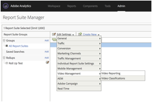
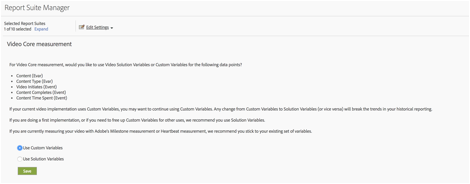

# Overzicht van mijlpaal{#milestone-overview}

>[!CAUTION]
>
>Deze meetoptie is vervangen.

[Legacy Milestone-documentatie](milestone_analytics_video.pdf)

## Configuratie {#configuration}

### Mijlestone-videoconfiguratie

Om video te volgen, wijs een reeks *Variabelen van de Omzetting van de Douane* (eVars) en *Gebeurtenissen van de Douane* voor gebruik in het volgen en het melden aan. Één *Custom Insight* variabele ( `s.prop`) wordt ook gebruikt voor het kleven.

De variabelen die u voor elke metrische waarde selecteert, worden toegevoegd aan de videoconfiguratiepagina. Hierdoor kan het systeem automatisch de standaard videorapporten genereren en opmaken. De *videonaam* eVar en de *videomeningen* teller worden allebei vereist. Andere variabelen zijn optioneel, maar aanbevolen voor een volledige meting. Nadat videotracering is ingeschakeld, kunt u rapporten weergeven die zijn gegenereerd op basis van videogegevens die u hebt gerapporteerd via videotracering.

U kunt ook een willekeurig aantal aanvullende meetgegevens bijhouden voor video. Als u bijvoorbeeld meerdere videospelers op uw site gebruikt, kunt u een eVar vullen met de naam van de speler. Sommige variabelen die u selecteert, kunnen ook in andere gebieden van uw site worden gebruikt. Bijvoorbeeld, als gebruikt over uw plaats, kan de *inhoudstype* variabele u laten meten welk percentage van uw paginameningen uit video komt, en u laten omzettingsgebeurtenissen met video in verband brengen.

### Mijlestone Reporting Configuration

Ga naar **[!UICONTROL Admin > Report Suite Manager]als u videomelding wilt instellen voor een implementatie van mijlpaal.** Selecteer de rapportsuite en kies vervolgens **[!UICONTROL Video Management > Video Reporting]:**

<!--
{width="248"}
-->



Op het eerste scherm werkt alleen Video Core met Mijlpaal-gegevens. Selecteer **[!UICONTROL Video Core]** en klik **[!UICONTROL Save].**


Selecteer **[!UICONTROL Use Custom Variables]in het volgende scherm.**

<!--
{width="470"}
-->



Selecteer in het uiteindelijke scherm de twee eVars en drie gebeurtenissen die u wilt gebruiken voor de videometing:

<!--

-->


## Verwijzing naar videovariabele {#video-variable-reference}

De volgende tabel bevat aanvullende informatie over de handelsvariabelen en aangepaste gebeurtenissen voor video:

| Videometrisch | Type variabele | Beschrijving |
| --- | --- | --- |
| Inhoud | eVar <br/> Standaard vervaldatum: Bezoek | (Vereist) Hiermee wordt de naam van de video verzameld, zoals opgegeven in de implementatie. |
| Inhoudstype | eVar <br/> Standaard verlopen: de mening van de Pagina | Hiermee worden gegevens verzameld over het type inhoud dat door een bezoeker wordt weergegeven. Hits die door videometing worden verzonden wordt toegewezen een inhoudstype van `video.` <br/> Deze variabele moet niet uitsluitend voor video het volgen worden gereserveerd. Als u andere inhoudrapport-inhoudstypen gebruikt met dezelfde variabele, kunt u de distributie van bezoekers over de verschillende typen inhoud analyseren. U kunt bijvoorbeeld andere inhoudstypen labelen met waarden zoals `article` of `product page` met deze variabele. <br/> Van een perspectief van de videometing, *het Type van Inhoud* laat u videobezoekers identificeren en daardoor de tarieven van de videoomzetting berekenen. |
| Tijd van inhoud besteed | Gebeurtenis <br/> Type: Teller | Telt de tijd, in seconden, besteed aan het bekijken van een video sinds het laatste proces van de gegevensinzameling (beeldverzoek). |
| Video wordt gestart | Gebeurtenis <br/> Type: Teller | Geeft aan dat een bezoeker een gedeelte van een video heeft weergegeven. Het biedt echter geen informatie over hoeveel of welk deel van een video de bezoeker heeft bekeken. |
| Video voltooid | Gebeurtenis <br/> Type: Teller | Geeft aan dat een gebruiker een volledige video heeft weergegeven. Standaard wordt de complete-gebeurtenis 1 seconde voor het einde van de video gemeten.  <br/> tijdens implementatie, kunt u specificeren hoeveel seconden van het eind van de video u een volledige mening zou willen overwegen. Voor live video en andere streams zonder gedefinieerd einde kunt u een aangepast punt opgeven om de voltooiing te meten. Bijvoorbeeld na een bepaalde tijd die is weergegeven. |

## Variabelen van de mediamodule {#media-module-variables}

Met de volgende variabelen kunt u videometing configureren. U moet waarden definiëren voor de variabelen in de tabel Vereiste variabelen. Als u gebeurtenissen in uw videospeler wilt bijhouden, moet u autoTrack (voor ondersteunde spelers) inschakelen of aangepaste Player-gebeurtenistracering implementeren met de methoden open, play, stop en close.

| Variabele    | Beschrijving |
| --- | --- |
| `Media.trackUsingContextData` | **Syntaxis:** <br/><br/> `s.Media.trackUsingContextData = true;` <br/> Deze optie laat geïntegreerde video het volgen toe. Wanneer deze optie is ingesteld op true, worden in de mediamodule contextgegevens voor mediatracering gegenereerd in plaats van de verouderde `pev3` . <br/> Gebruik `Media.contextDataMapping` om de contextgegevens aan geselecteerde gebeurtenissen en gebeurtenissen in kaart te brengen.<br/> Standaardwaarde: `false` |
| `Media.contextDataMapping` | **Syntaxis:** <br/><br/> `s.Media.contextDataMapping = {`<br/>      `"a.media.name":"eVar2, prop2",` <br/>     `"a.media.segment":"eVar3",` <br/>     `"a.contentType":"eVar1",` <br/>     `"a.media.timePlayed":"event3",` <br/>     `"a.media.view":"event1",` <br/>     `"a.media.segmentView":"event2",` <br/>     `"a.media.complete":"event7",` <br/>     `"a.media.milestones":{` <br/>         `25:"event4",` <br/>         `50:"event5",` <br/>         `75:"event6"` <br/>     ` }`  <br/> `};` <br/><br/> een voorwerp dat veranderlijke afbeelding aan Vars en Gebeurtenissen bepaalt die u voor videometing wilt gebruiken. Het object moet de volgende velden toewijzen: <br/><br/> **a.media.name:** (Vereist) bevolkt variabelen met de videonaam. Geef de eVar op die u hebt geselecteerd om de naam van de video op te slaan, en de Custom Insight Video-variabele ( `s.prop` ) die u wilt gebruiken voor het plakken van video&#39;s. Geef de waarden op in een lijst met komma&#39;s als scheidingsteken. <br/><br/> **a.media.segment:** (Facultatief) eVar die u de naam van het media segment wilt opslaan. a.contentType: (Optioneel) De eVar die u wilt opslaan in de videowaarde. Deze bevat een bezoek en het bijhouden van bezoekers die zijn ingeschakeld voor het genereren van een videobezoek en het melden van bezoekers. De variabele die u selecteert, wordt waarschijnlijk al gebruikt om gegevens op te slaan, zoals een presentatie van een artikel of een productpagina <br/><br/> **a.media.view:** (Vereist) de Gebeurtenis die u media meningen wilt tellen. <br/><br/> **a.media.segmentView:** (Facultatief) de Gebeurtenis die u segmentmeningen wilt tellen. <br/><br/> **a.media.complete:** (Facultatief) de Gebeurtenis die u volledige meningen wilt tellen. <br/><br/> **a.media.timePlayyed:** (Facultatief, hoogst geadviseerd) De numerieke Gebeurtenis die u het aantal afgespeelde videoseconden wilt opslaan. <br/><br/> **a.media.milestone:** (Facultatief) een voorwerp dat s.Media.trackMijlestone mijlpalen in kaart brengt om Gebeurtenissen tegen te gaan. Media.segmentByMijlpalen zou aan waar moeten worden geplaatst als u mijlpalen bepaalt. <br/><br/> **het volgen van de Advertentie** om advertenties te volgen, zijn de volgende variabelen van contextgegevens beschikbaar: <br/> **a.media.ad.name:** (Vereist) bevolkt variabelen met de advertentienaam. Geef de eVar op die u hebt geselecteerd om de naam van de advertentie op te slaan, en de Custom Insight Video-variabele ( `s.prop` ) die u wilt gebruiken voor plakken. Geef de waarden op in een lijst met komma&#39;s als scheidingsteken. <br/><br/> **a.media.ad.pod:** de positie in de primaire inhoud de advertentie werd gespeeld. <br/><br/> **a.media.ad.podPosition:** De positie binnen de peul waar de advertentie wordt gespeeld. <br/><br/> **a.media.ad.CPM:** CPM of gecodeerde CPM (vooraf bepaald met &quot;~&quot;) die op deze playback van toepassing is. <br/><br/> **a.media.ad.vinew:** werkt het zelfde als `a.media.view` <br/><br/> **a.media.ad.clFirst:** Telling het aantal kliks voor de advertentie (`Media.click` vraag) <br/><br/> **a.media.ad.timePlayed:** werkt het zelfde als `a.media.timePlayed` <br/><br/> **a.media.ad.complete:** werkt het zelfde als `a.media.complete` a.media.ad.segment: Werkt het zelfde als `a.media.segment` <br/><br/> **a.media.ad.segmentView:** werkt het zelfde als `a.media.segmentView` <br/><br/> **a.media.ad.milestone:** werkt het zelfde als `a.media.milestones` <br/><br/> **a.media.ad.offsetMilestone:** werkt het zelfde als `a.media.offsetMilestones` |
| `Media.trackVars` | **Syntaxis:** <br/><br/> `s.Media.trackVars =` <br/>    `"events,` `prop2,` `eVar1,` `eVar2,` `eVar3";` <br/><br/> Een door komma&#39;s gescheiden lijst met alle variabelen die in uw code voor het bijhouden van video zijn ingesteld. |
| `Media.trackEvents` | **Syntaxis:** <br/><br/> `s.Media.trackEvents =` <br/>    `"event1,` `event2,` `event3,` `event4,` `event5,` `event6,` `event7"` <br/><br/> Een door komma&#39;s gescheiden lijst van alle gebeurtenissen die in uw video-tracking-code zijn ingesteld. |

## Optionele variabelen {#optional-variables}

|  Variabele    | Beschrijving |
| --- | --- |
| `Media.autoTrack` | **Syntaxis:** <br/><br/> `s.Media.autoTrack = true` <br/><br/> laat automatisch het volgen voor gesteunde spelers toe. Ondersteunde spelers zijn: <ul> <li> Open Source Media Framework (OSMF) </li> <li> FLVPlayback (videospelers die zijn gemaakt met de wizard Video importeren in Flash Professional) </li> <li> Silverlight </li> <li> MediaDisplay </li> <li> MediaPlayback </li> <li> Helderheid API versies 2 &amp; 3 (zie [&#x200B; Helderheid &#x200B;](https://integrations.support.brightcove.com/adobe/adobe-aem-brightcove-connector-using-connector.html) </li> <li> Windows Media Player, QuickTime of Real Player met JavaScript </li> </ul> <br/><br/> Als u een van de bovenstaande spelers niet gebruikt, kunt u `Media.open` `Media.play` `Media.stop` `Media.close` gebruiken om spelergebeurtenissen bij te houden. |
| `Media.autoTrackNetStreams` | **Syntaxis:** <br/><br/> `s.Media.autoTrackNetStreams = true` <br/><br/> Flash 10.3 introduceerde nieuwe functionaliteit aan de component NetStream die verbeterde video het volgen toelaat. Als u een aangepaste Flash NetStream-speler gebruikt, kunt u deze variabele inschakelen voor functionaliteit die lijkt op autoTrack. Deze methode vereist dat video&#39;s worden weergegeven in Flash 10.3 of hoger. |
| `Media.completeByCloseOffset` | **Syntaxis:** <br/><br/> <br/><br/>`s.Media.completeByCloseOffset = true` <br/><br/> Deze het plaatsen laat u een volledige videomening een paar seconden vóór het daadwerkelijke eind van de video tellen.  <br/><br/> de gebeurtenis wordt verzonden gebaseerd op het aantal seconden die in `completeCloseOffsetThreshold` worden gespecificeerd. Hiermee kunt u de voltooiing meten in videospelers die nooit een verschuiving melden die gelijk is aan de lengte van de video.<br/><br/> door gebrek, wordt deze waarde geplaatst aan waar en de drempel wordt geplaatst aan 1 seconde. Met deze standaardwaarden wordt de complete-gebeurtenis 1 seconde voor het einde van de video verzonden. |
| `Media.completeCloseOffsetThreshold` | **Syntaxis:** <br/><br/> `s.Media.completeCloseOffsetThreshold = 1` <br/><br/> Deze drempel laat u een volledige videomening een paar seconden vóór het daadwerkelijke eind van de video tellen.  `Media.completeByCloseOffset` moet zijn ingesteld op true als u deze drempel wilt gebruiken.<br/><br/> de geheelwaarde u verstrekt bepaalt hoe ver weg in seconden de compensatie van de lengte van de video bij dicht kan zijn en nog tellen als volledige. Hiermee kunt u de voltooiing meten in videospelers die nooit een verschuiving melden die gelijk is aan de lengte van de video.  <br/><br/> de standaarddrempel is 1 seconde. |
| `Media.playerName` | **Syntaxis:** <br/><br/> `s.Media.playerName = "Custom Player Name"` <br/><br/> Specificeert een naam van de douanevideospeler. |
| `Media.trackSeconds` | **Syntaxis:** <br/><br/> `s.Media.trackSeconds = 15` <br/><br/> bepaalt het interval, in seconden, voor het verzenden van video het volgen gegevens naar de servers van de de gegevensinzameling van Adobe terwijl de video speelt. De waarde moet worden ingesteld in stappen van 5 seconden. <br/><br/> Als u `Media.trackSeconds` inschakelt, worden alleen de gebeurtenissen geactiveerd die zijn gedefinieerd in `Media.contextDataMapping` . Als u aanvullende variabelen wilt verzenden buiten de variabelen die voor videometing zijn opgegeven, moet u Media.Monitor gebruiken. |
| `Media.trackMilestones` | Traceert mijlpalen als percentage van de videolengte.  <br/><br/> **Syntaxis:** <br/><br/> `s.Media.trackMilestones = "25, 50, 75";` <br/><br/> bepaalt het interval, als percentage van de videolengte, voor het verzenden van video het volgen gegevens naar de servers van de de gegevensinzameling van Adobe. Geef de mijlpalen op als een door komma&#39;s gescheiden lijst met hele getallen. 10 = 10%, 23 = 23%.  <br/><br/> omdat deze mijlpalen vaste punten in de video zijn, als een bezoeker voorbij de 10% mijlpaal bekijkt, dan terugspoelt en de 10% mijlpaal opnieuw overgaat, verzendt de media module de volgende gegevens veelvoudige tijden. Op dezelfde manier als een bezoeker snel voorbij een mijlpaal vooruitspoelt, verzendt de media module niet de het volgen gegevens voor die mijlpaal.  <br/><br/> toelatend `Media.trackMilestones` brengt slechts de gebeurtenissen teweeg die in `Media.contextDataMapping` worden bepaald. Als u aanvullende variabelen wilt verzenden buiten de variabelen die voor videometing zijn opgegeven, moet u Media.Monitor gebruiken. |
| `Media.trackOffsetMilestones` | Traceert mijlpalen als seconden die zijn verstreken vanaf het begin van de video.  <br/><br/> **Syntaxis:** <br/><br/> `s.Media.trackOffsetMilestones = "20, 40, 60";` <br/><br/> bepaalt het interval, aangezien de seconden vanaf het begin van de video zijn verstreken, voor het verzenden van video het volgen gegevens naar de servers van de de gegevensinzameling van Adobe. Geef de mijlpalen op als een door komma&#39;s gescheiden lijst met hele getallen. 20 = 20 seconden, 40 = 40 seconden).  <br/><br/> omdat deze mijlpalen vaste punten in de video zijn, als een bezoeker voorbij de 20 secondenmijlpaal bekijkt, dan terugspoelt en opnieuw de 20 secondenmijlpaal overgaat, verzendt de media module de volgende gegevens veelvoudige tijden. Op dezelfde manier als een bezoeker snel voorbij een mijlpaal vooruitspoelt, verzendt de media module niet de het volgen gegevens voor die mijlpaal.  <br/><br/> Als u `Media.trackOffsetMilestones` inschakelt, worden alleen de gebeurtenissen geactiveerd die zijn gedefinieerd in `Media.contextDataMapping` . Als u aanvullende variabelen wilt verzenden buiten de variabelen die voor videometing zijn opgegeven, moet u Media.Monitor gebruiken. |
| `Media.segmentByMilestones` | **Syntaxis:** <br/><br/> `s.Media.segmentByMilestones = true;` <br/><br/> produceert automatisch de segmentnaam, het segmentaantal, en de gegevens van de segmentlengte, die op de lengte van de media en de mijlpalen worden gebaseerd die in `Media.trackMilestones` worden gespecificeerd <br/><br/> segmenteren door mijlpalen is de enige manier om segmenten te bepalen wanneer het gebruiken van `autoTrack`. <br/><br/> Standaardwaarde: `false` |
| `Media.segmentByOffsetMilestones` | **Syntaxis:** <br/><br/> `s.Media.segmentByOffsetMilestones = true;` <br/><br/> produceert automatisch de segmentnaam, het segmentaantal, en de gegevens van de segmentlengte, die op de lengte van de media en de mijlpalen worden gebaseerd die in `Media.trackOffsetMilestones` worden gespecificeerd <br/><br/> segmenteren door mijlpalen is de enige manier om segmenten te bepalen wanneer het gebruiken van `autoTrack`.  <br/><br/> Standaardwaarde: `false` |

## Variabelen voor Advisering bijhouden {#ad-tracking-variables}

Deze variabelen worden gebruikt om advertentie-informatie samen met de openAd methode te verzenden. Zie [&#x200B; VAST Video en het Volgen.](https://experienceleague.adobe.com/docs/media-analytics/using/media-overview.html?lang=nl-NL)

| Variabele    | Beschrijving |
| --- | --- |
| `Media.adTrackSeconds` | **Syntaxis:** <br/><br/> `s.Media.adTrackSeconds = 15;` <br/><br/> bepaalt het interval, in seconden, voor het verzenden van video en het volgen gegevens naar de servers van de de gegevensinzameling van Adobe terwijl de video speelt. De waarde moet worden ingesteld in stappen van 5 seconden.  <br/><br/> Als u `Media.adTrackSeconds` inschakelt, worden alleen de gebeurtenissen geactiveerd die zijn gedefinieerd in `Media.contextDataMapping` . Als u aanvullende variabelen wilt verzenden buiten de variabelen die voor videometing zijn opgegeven, moet u `Media.monitor` gebruiken. |
| `Media.adTrackMilestones` | Tracks en mijlpalen als percentage van de lengte van de advertentie.  <br/><br/> **Syntaxis:** <br/><br/> `s.Media.adTrackMilestones = "25, 50, 75";` <br/><br/> bepaalt het interval, als percentage van de advertentielengte, voor het verzenden van en het volgen van gegevens naar de servers van de de gegevensinzameling van Adobe. Geef de mijlpalen op als een door komma&#39;s gescheiden lijst met hele getallen. 10 = 10%, 23 = 23%).  <br/><br/> omdat deze mijlpalen vaste punten in de advertentie zijn, als een bezoeker voorbij de 10% mijlpaal bekijkt, dan terugspoelt en de 10% mijlpaal opnieuw overgaat, verzendt de media module de volgende gegevens veelvoudige tijden. Op dezelfde manier als een bezoeker snel voorbij een mijlpaal vooruitspoelt, verzendt de media module niet de het volgen gegevens voor die mijlpaal.  <br/><br/> Als u `Media.adTrackMilestones` inschakelt, worden alleen de gebeurtenissen geactiveerd die zijn gedefinieerd in `Media.contextDataMapping` . Als u aanvullende variabelen wilt verzenden buiten de variabelen die voor videometing zijn opgegeven, moet u `Media.monitor` gebruiken. |
| `Media.adTrackOffsetMilestones` | Tracks en mijlpalen in seconden vanaf het begin van de advertentie.  <br/><br/> **Syntaxis:** <br/><br/> `s.Media.adTrackOffsetMilestones = "20, 40, 60";` <br/><br/> bepaalt het interval, aangezien de seconden vanaf het begin van de advertentie, zijn verstreken voor het verzenden van en het volgen van gegevens naar de servers van de de gegevensinzameling van Adobe. Geef de mijlpalen op als een door komma&#39;s gescheiden lijst met hele getallen. 20 = 20 seconden, 40 = 40 seconden).  <br/><br/> omdat deze mijlpalen vaste punten in de advertentie zijn, als een bezoeker voorbij de 20 secondenmijlpaal bekijkt, dan terugspoelt en opnieuw de 20 secondenmijlpaal overgaat, verzendt de media module de volgende gegevens veelvoudige tijden. Op dezelfde manier als een bezoeker snel voorbij een mijlpaal vooruitspoelt, verzendt de media module niet de het volgen gegevens voor die mijlpaal.  <br/><br/> Als u `Media.adTrackOffsetMilestones` inschakelt, worden alleen de gebeurtenissen geactiveerd die zijn gedefinieerd in `Media.contextDataMapping` . Als u aanvullende variabelen wilt verzenden buiten de variabelen die voor videometing zijn opgegeven, moet u `Media.monitor` gebruiken. |
| `Media.adSegmentByMilestones` | **Syntaxis:** <br/><br/> `s.Media.adSegmentByMilestones = true;` <br/><br/> produceert automatisch de segmentnaam, het segmentaantal, en de gegevens van de segmentlengte, die op de lengte van de media en de mijlpalen worden gebaseerd die in `Media.adTrackMilestones` worden gespecificeerd <br/><br/> segmenteren door mijlpalen is de enige manier om segmenten te bepalen wanneer het gebruiken van `autoTrack`.  <br/><br/> Standaardwaarde: `false` |
| `Media.adSegmentByOffsetMilestones` | **Syntaxis:** <br/><br/> `s.Media.adSegmentByOffsetMilestones = true;` <br/><br/> produceert automatisch de segmentnaam, het segmentaantal, en de gegevens van de segmentlengte, die op de lengte van de media en de mijlpalen worden gebaseerd die in `Media.adTrackOffsetMilestones` worden gespecificeerd <br/><br/> segmenteren door mijlpalen is de enige manier om segmenten te bepalen wanneer het gebruiken van `autoTrack`. <br/><br/> Standaardwaarde: `false` |

## Methoden van Media Module {#media-module-methods}

De methoden van de mediamodule worden gebruikt voor het handmatig bijhouden van spelergebeurtenissen en voor het bijhouden van aanvullende meetgegevens die geen deel uitmaken van de standaardvideoverslagen.

Als u `Media.autoTrack` gebruikt en geen extra metriek volgt, te hoeven u om het even welk van deze methodes niet direct te roepen. Alle argumenten zijn vereist, tenzij opgegeven als optioneel.

| Methode    | Beschrijving |
| --- | --- |
| `Media.open` | **Syntaxis:** <br/><br/> `s.Media.open(mediaName, mediaLength, mediaPlayerName)` <br/><br/> bereidt de media module voor om video het volgen gegevens te verzamelen. Deze methode heeft de volgende parameters: <ul><li> **mediaName:** (Vereist) de naam van de video aangezien u het in videorapporten wilt verschijnen. </li><li>  **mediaLength:** (Vereist) de lengte van de video in seconden.  </li><li> **mediaPlayerName:** (Vereist) de naam van de media speler die wordt gebruikt om de video te bekijken, aangezien u het in videorapporten wilt verschijnen. </li></ul> |
| `Media.openAd` | **Syntaxis:** <br/><br/> `s.Media.openAd(name, length, playerName, parentName,`<br/>   `parentPod, parentPodPosition, CPM)` <br/><br/> Bereidt de media module voor om gegevens te verzamelen en te volgen. Deze methode heeft de volgende parameters: <ul> <li> **naam:** (Vereist) de naam of identiteitskaart van de advertentie.  </li> <li> **lengte:** (Vereist) de lengte van de advertentie.  </li> <li> **playerName:** (Vereist) de naam van de media speler die wordt gebruikt om de advertentie te bekijken.  </li> <li> **parentName:** De naam of identiteitskaart van de primaire inhoud waar de advertentie wordt ingebed.  </li> <li> **parentPod:** De positie in de primaire inhoud de advertentie werd gespeeld.  </li> <li> **parentPodPosition:** De positie binnen de peul waar de advertentie wordt gespeeld.  </li> <li> **CPM:** CPM of gecodeerde CPM (vooraf bepaald met a &quot;~&quot;) die op deze playback van toepassing is.  </li> </ul> |
| `Media.click` | **Syntaxis:** <br/><br/> `s.Media.click(name, offset)` <br/><br/> spoor wanneer een advertentie in een video wordt geklikt. Deze methode heeft de volgende parameters: <ul> <li> **naam:** De naam van de advertentie. Dit moet overeenkomen met de naam die wordt gebruikt in Media.openAd.  </li> <li> **compensatie:** de compensatie in advertentie toen de klik voorkwam.  </li> </ul> |
| `Media.close` | **Syntaxis:** <br/><br/> `s.Media.close(mediaName)` <br/><br/> beëindigt videogegevensinzameling en verzendt informatie naar de servers van de gegevensinzameling van Adobe. Roep deze methode aan het einde van de video aan. Deze methode heeft de volgende parameter: <br/><br/> **mediaName:** De naam van de video. Deze moet overeenkomen met de naam die wordt gebruikt in `Media.open` . |
| `Media.complete` | **Syntaxis:** <br/><br/> `s.Media.complete(name, offset)` <br/><br/> Deze methode volgt manueel een volledige gebeurtenis. Deze methode wordt gebruikt wanneer u gebeurtenissen moet activeren met behulp van speciale logica die niet kan worden afgehandeld met `Media.completeByCloseOffset` . <br/><br/> Bijvoorbeeld, als u een levende stroom meet die geen bepaald eind heeft, zou u volledig kunnen teweegbrengen nadat een gebruiker een levende stroom voor X seconden bekijkt. U kunt een complete meten aan de hand van een percentageberekening op basis van de lengte en het type inhoud. Deze methode heeft de volgende parameters: <ul> <li> **mediaName:** De naam van de video. Dit moet overeenkomen met de naam die wordt gebruikt in Media.open.  </li> <li> **mediaOffset:** Het aantal seconden in de video wanneer de volledige gebeurtenis zou moeten worden verzonden. Geef de verschuiving op op basis van de video die op tweede nul begint. <br/><br/> als uw media spelersporen gebruikend milliseconden, zorg ervoor de waarde in seconden wordt omgezet alvorens u Media.complete roept.  </li> </ul> Als u de aanroep handmatig wilt voltooien, stelt u <br/><br/> in `s.Media.completeByCloseOffset = false`. |
| `Media.play` | **Syntaxis:** <br/><br/> `s.Media.play(name, offset, segmentNum, segment, segmentLength)` <br/><br/> Vraag deze methode wanneer een video begint speel. Wanneer u handmatige videometingen gebruikt, kunt u de huidige segmentgegevens opgeven wanneer u videomeetgegevens verzendt.  <br/><br/> als uw speler van één segment in een andere verandert, om het even welke reden, zou u `Media.stop` moeten roepen `Media.play`. <br/><br/> Deze methode neemt de volgende parameters: <br/><br/> **mediaName:** De naam van de video. Dit moet overeenkomen met de naam die wordt gebruikt in Media.open.  <br/><br/> **mediaOffset:** Het aantal seconden in de video die het spelen begint. Geef de verschuiving op op basis van de video die op tweede nul begint. Als uw mediaspeler het gebruik van milliseconden bijhoudt, moet u ervoor zorgen dat de waarde wordt omgezet in seconden voordat u Media.play aanroept.  <br/><br/> **segmentNum:** (Facultatief) het huidige segmentaantal, dat marketing rapporten gebruikt om tot de vertoning van segmenten in rapporten opdracht te geven. De parameter segmentNum moet groter zijn dan nul.  <br/><br/> **segment:** (Facultatief) de huidige segmentnaam.  <br/><br/> **segmentLength:** (Facultatief) <br/><br/> de huidige segmentlengte, in seconden.  <br/><br/> Bijvoorbeeld: <br/><br/> `s.Media.play("My Video", 1800, 2,"Second Quarter", 1800)` <br/><br/> `s.Media.play("My Video", 0, 1,"Preroll", 30)` |
| `Media.stop` | **Syntaxis:** <br/><br/> `s.Media.stop(mediaName, mediaOffset)` <br/><br/> volgt een eindegebeurtenis (einde, pauze, enz.) voor de gespecificeerde video. Deze methode heeft de volgende parameters: <ul> <li> **mediaName:** De naam van de video. Deze moet overeenkomen met de naam die wordt gebruikt in `Media.open` .  </li> <li> **mediaOffset:** het aantal seconden in de video dat de einde of pauze gebeurtenis voorkomt. Geef de verschuiving op op basis van de video die op tweede nul begint.  </li> </ul> |
| `Media.monitor` | **Syntaxis:** <br/><br/> `s.Media.monitor(s, media)` <br/><br/> **Silverlight Syntaxis:** <br/><br/> `s.Media.monitor =` <br/>   `new AppMeasurement_Media_Monitor(myMediaMonitor);` <br/><br/> Silverlight app media monitor voert het doelstelling-C patroon van het schakelaarontwerp uit. De `myMediaMonitor` -klassemethode gebruikt de `s` - en `media` -parameters. <br/><br/> gebruik deze methode om extra videometriek te verzenden. U kunt aanvullende variabelen instellen (Props, Vars, Gebeurtenissen) en deze verzenden met `Media.track` op basis van de huidige status van de video tijdens het afspelen. <br/><br/> zie [&#x200B; het Meten van Extra Metriek gebruikend Media.monitor.](https://experienceleague.adobe.com/docs/media-analytics/using/media-overview.html?lang=nl-NL) <br/><br/> Deze methode neemt de volgende parameters: <br/><br/>  **s:** de `AppMeasurement` instantie (of JavaScript `s` voorwerp). <br/><br/> **media:** een voorwerp met leden die de staat van de video verstrekken. Tot deze leden behoren:  <ul><li> `media.name:` De naam van de video. Deze moet overeenkomen met de naam die wordt gebruikt in `Media.open` ; </li><li> `media.length:` The length of the video in seconds given in the call to `Media.open` ; </li><li> `media.playerName:` De naam van de mediaspeler die is opgegeven in de aanroep van `Media.open` ; </li><li> `media.openTime:` Een NSDate-object met gegevens over wanneer `Media.open` is aangeroepen; </li><li> `media.offset:` De huidige verschuiving, in seconden, (werkelijke punt in de video) in de video. De verschuiving begint bij nul (de eerste seconde van de video is seconde 0); </li><li> `media.percent:` Het huidige percentage van de video die is afgespeeld, op basis van de videolengte en de huidige verschuiving..  </li><li> `media.timePlayed:` Het totale aantal seconden dat tot nu toe is afgespeeld;  </li><li> `media.eventFirstTime:` Geeft aan of dit de eerste keer was dat deze mediagebeurtenis voor deze video werd aangeroepen; </li><li> `media.mediaEvent:` Een tekenreeks met de naam van de gebeurtenis die de monitoraanroep heeft veroorzaakt. </li></ul> |
| | `media.mediaEvent` -gebeurtenissen: <ul><li> `OPEN:` Wanneer het afspelen voor het eerst wordt waargenomen via `Media.autoTrack` of via een aanroep van `Media.play` ; </li><li> `CLOSE:` Wanneer het afspelen wordt beëindigd wanneer de video is voltooid via `Media.autoTrack` of bij een aanroep van `Media.close` ;</li><li> `PLAY:` Wanneer het afspelen wordt hervat nadat het is gepauzeerd of nadat `Media.autoTrack` of een tweede aanroep van `Media.play` is doorgescrubd;</li><li> `STOP:` Wanneer het afspelen stopt als het begin van het scrubben `Media.autoTrack` of het aanroepen van `Media.stop` wordt onderbroken;</li><li> `MONITOR:` Wanneer de automatische controle de status van de video tijdens het afspelen controleert (elke seconde);</li><li> `SECONDS:` Bij het tweede interval dat door de `Media.trackSeconds` variabele wordt bepaald;</li><li> `MILESTONE:` Bij de mijlpalen die door de `Media.trackMilestones` variabele worden bepaald; </li></ul> |
| `Media.track` | **Syntaxis:** <br/><br/> `s.Media.track(mediaName)` <br/><br/> verzendt onmiddellijk de huidige videostaat, samen met om het even welke `Media.trackVars` en Media.trackEvents u hebt bepaald. Deze methode wordt gebruikt binnen `Media.monitor` . <br/><br/> zie [&#x200B; het Meten van Extra Metriek gebruikend Media.monitor.](https://experienceleague.adobe.com/docs/media-analytics/using/media-overview.html?lang=nl-NL) <br/><br/> Vraag `Media.open` en `Media.play` op de video alvorens deze methode te roepen. Deze methode heeft de volgende parameter: <ul> <li> **mediaName**: De naam van de video. Deze moet overeenkomen met de naam die wordt gebruikt in `Media.open` .</li> </ul> Dit is de enige manier om extra variabelen te verzenden terwijl de video wordt afgespeeld. Het stelt het secondeninterval en de percenten milestone tellers aan nul terug om veelvoudige het volgen klappen te verhinderen. |


## Gebeurtenissen van videospeler bijhouden {#track-video-player-events}

U kunt mediaspelers bijhouden door functies te maken die zijn gekoppeld aan de gebeurtenishandlers van de videospeler. Hiermee kunt u `Media.open` , `Media.play` , `Media.stop` en `Media.close` op het juiste moment aanroepen. Bijvoorbeeld:

* **Lading:** Vraag `Media.open` en `Media.play`
* **Pauze:** Vraag `Media.stop`. Roep bijvoorbeeld `s.Media.stop("Video1", 15)` aan als een gebruiker een video na 15 seconden pauzeert
* **Buffer:** Vraag `Media.stop` terwijl de videobuffers. Roep `Media.play` aan wanneer het afspelen wordt hervat.
* **hervat:** Vraag `Media.play`. Wanneer een gebruiker bijvoorbeeld een video hervat nadat deze eerst 15 seconden van de video heeft afgespeeld, roept u `s.Media.play("Video1", 15)` aan.
* **Schroef (schuif):** wanneer de gebruiker de videoschuif sleept, roep `Media.stop`. Roep `Media.play` aan wanneer de gebruiker de videoschuifregelaar loslaat.
* **Eind:** Vraag `Media.stop`, toen `Media.close`. Roep aan het einde van een video van 100 seconden bijvoorbeeld `s.Media.stop("Video1", 100)` aan en vervolgens `s.Media.close("Video1")` .

Hiervoor kunt u vier aangepaste functies definiëren die u kunt aanroepen van de gebeurtenishandlers van de mediaspeler. De verschillende parameters die in `Media.open` , `Media.play` , `Media.stop` en `Media.close` worden doorgegeven, komen van de speler. De volgende pseudocode laat zien hoe dit kan worden gedaan:

```javascript
/* Call on video load */
function startMovie() {
    s.Media.open(mediaName, mediaLength, mediaPlayerName);
    playMovie();
}

/* Call on video resume from pause and slider release */
function playMovie() {
    s.Media.play(mediaName,
                 mediaOffset,  
                 segmentNum,  
                 segment,  
                 segmentLength);
}
/* Call on video pause and slider grab */
function stopMovie() {
    s.Media.stop(mediaName, mediaOffset);
}

/* Call on video end */
/* Measuring Video for Developers 43 */
function endMovie() {
    stopMovie();
    s.Media.close(mediaName);
}
```

## JavaScript autotrack {#javascript-autotrack}

De JavaScript-mediamodule identificeert alle `<embed>` - of `<object>` -tags op de pagina-HTML. Vervolgens worden de gegevens in elke tag doorzocht om te bepalen welke mediaspeler (indien aanwezig) wordt gebruikt. Als de speler Windows Media Player, QuickTime of Real Player is, kan `autoTrack` worden gebruikt, hoewel `autoTrack` voor Windows Media Player alleen werkt met Internet Explorer. Handmatige tracering voor Windows Media Player is vereist voor de ondersteuning van alle andere browsers.

Het kenmerk `classid` moet zijn ingesteld op het object dat u wilt bijhouden. `classid` wordt vereist om de gebeurtenismanagers bloot te stellen die door de Module van Media worden gebruikt om de video automatisch te volgen.

```javascript
s.Media.autoTrack = true
```

## JavaScript-voorbeeldcode {#javascript-sample-code}

```javascript
// Sample implementation
s.usePlugins=true
function s_doPlugins(s) {
    /* Add manual calls to modules and plugins here */
}

s.doPlugins=s_doPlugins

/*********Media Module Calls**************/
s.loadModule("Media")

/*Configure Media Module Functions */
s.Media.autoTrack= true;
s.Media.trackVars="events, prop2, eVar1, eVar2, eVar3";
s.Media.trackEvents="event1, event2, event3, event4, event5, event6, event7"
s.Media.trackMilestones="25, 50, 75";
s.Media.playerName="My Media Player";
s.Media.segmentByMilestones = true;
s.Media.trackUsingContextData = true;
s.Media.contextDataMapping = {
    "a.media.name":"eVar2, prop2",
    "a.media.segment":"eVar3",
    "a.contentType":"eVar1",
    "a.media.timePlayed":"event3",
    "a.media.view":"event1",
    "a.media.segmentView":"event2",
    "a.media.complete":"event7",
    "a.media.milestones":{
        25:"event4",
        50:"event5",
        75:"event6"
    }
}

s.Media.monitor = function (s, media) { } //If Needed

/* Turn on and configure debugging here */
s.debugTracking = true;
s.trackLocal = true;

/* WARNING: Changing any of the below variables will cause drastic changes to how your visitor
data is collected. Changes should only be made when instructed to do so by your account
manager.*/
s.visitorNamespace = "yourNamespace";
s.trackingServer="metrics.mysite.com" //Use only if using first party cookies
s.trackingServerSecure="smetrics.mysite.com" // Use only if using first party cookies in  
                                             // conjunction with SSL
s.dc = '122';

/************************** PLUGINS SECTION *************************/
/* Insert any plugins code you want to use here. */

/****************************** MODULES *****************************/
/* Insert the media module tracking code here. */
```
