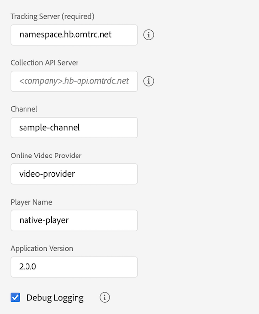

# Migreren van de standalone Media SDK naar Adobe Launch - iOS

>[!NOTE]
>Adobe Experience Platform Launch is omgedoopt tot een reeks technologieën voor gegevensverzameling in Experience Platform. Als gevolg hiervan zijn er verschillende terminologiewijzigingen in de productdocumentatie doorgevoerd. Raadpleeg het volgende [ document ](https://experienceleague.adobe.com/docs/experience-platform/tags/term-updates.html?lang=en) voor een geconsolideerde referentie van de terminologiewijzigingen.

## Configuratie

### Standalone Media SDK

In de standalone Media SDK configureert u de trackingconfiguratie in de app.
en geeft deze door aan de SDK wanneer u de Beheer maakt.

```objective-c
ADBMediaHeartbeatConfig *config =
  [[ADBMediaHeartbeatConfig alloc] init];

config.trackingServer = @"namespace.hb.omtrdc.net";
config.channel = @"sample-channel";
config.appVersion = @"v2.0.0";
config.ovp = @"video-provider";
config.playerName = @"native-player";
config.ssl = YES;
config.debugLogging = YES;

ADBMediaHeartbeat* tracker =
  [[ADBMediaHeartbeat alloc] initWithDelegate:self config:config];
```

### Extensie starten

1. Klik in Experience Platform Launch op het tabblad [!UICONTROL Extensions] voor uw mobiele eigenschap
1. Zoek op het tabblad [!UICONTROL Catalog] de extensie Adobe Media Analytics for Audio and Video en klik op [!UICONTROL Install] .
1. In de pagina van de uitbreidingsmontages, vorm de volgende parameters.
De uitbreiding van Media zal de gevormde parameters voor het volgen gebruiken.

   

[ vorm de uitbreiding van Analytics van Media ](https://developer.adobe.com/client-sdks/documentation/adobe-media-analytics/)

## Beheer maken

### Standalone Media SDK

In de zelfstandige Media SDK maakt u handmatig het `ADBMediaHeartbeatConfig` -object
en configureert u de volgende parameters. Implementeer de gedelegeerde interface die de
`getQoSObject()` en `getCurrentPlaybackTime()functions.`

Maak een MediaHeartbone-instantie die u wilt bijhouden:

```objective-c
@interface PlayerDelegate : NSObject<ADBMediaHeartbeatDelegate>
@end

@implementation PlayerDelegate {
}

- (NSTimeInterval) getCurrentPlaybackTime {
    // When called should return the current player time in seconds.
    return playhead_;
}

- (nonnull ADBMediaObject*) getQoSObject {
    // When called should return the latest qos values.
    return qosObject_;
}
@end

ADBMediaHeartbeatConfig *config = [[ADBMediaHeartbeatConfig alloc] init];

config.trackingServer = @"namespace.hb.omtrdc.net";
config.channel = @"sample-channel";
config.appVersion = @"app-version";
config.ovp = @"video-provider";
config.playerName = @"native-player";
config.ssl = YES;
config.debugLogging = YES;
ADBMediaHeartbeatDelegate* delegate = [[PlayerDelegate alloc] init];

ADBMediaHeartbeat* tracker =
  [[ADBMediaHeartbeat alloc] initWithDelegate:delegate config:config];
```

### Extensie starten

[ Media API verwijzing - creeer de Trekker van Media ](https://developer.adobe.com/client-sdks/documentation/adobe-media-analytics/api-reference/#createtracker)

Registreer de media-extensie en de afhankelijke extensies bij de mobiele kern voordat u de Beheer maakt.

```objective-c
// Register the extension once during app launch
#import <ACPCore.h>
#import <ACPAnalytics.h>
#import <ACPMedia.h>
#import <ACPIdentity.h>

- (BOOL)application:(UIApplication *)application didFinishLaunchingWithOptions:(NSDictionary *)launchOptions {
    [ACPCore setLogLevel:ACPMobileLogLevelDebug];
    [ACPCore configureWithAppId:@"your-launch-app-id"];
    [ACPMedia registerExtension];
    [ACPAnalytics registerExtension];
    [ACPIdentity registerExtension];
    [ACPCore start:nil];
    return YES;
}
```

Zodra de media-extensie is geregistreerd, kan de tracker worden gemaakt met de volgende API.
Tracker selecteert automatisch de configuratie van het gevormde lanceringsbezit.

```objective-c
[ACPMedia createTracker:^(ACPMediaTracker * _Nullable mediaTracker) {
    // Use the instance for tracking media.
}];
```

## Waarden voor afspeelkop en kwaliteit van ervaring bijwerken.

### Standalone Media SDK

In de standalone Media SDK, een afgevaardigde voorwerp dat uitvoert
`ADBMediaHeartbeartDelegate` -protocol wordt doorgegeven tijdens het maken van tracker.
De implementatie moet de nieuwste QoE en afspeelkop retourneren telkens als de
tracker roept de interface `getQoSObject()` en `getCurrentPlaybackTime()` aan
methoden.

### Extensie starten

De huidige afspeelkop van de speler moet worden bijgewerkt met de functie
`updateCurrentPlayhead` -methode die door de tracker beschikbaar wordt gemaakt. Voor nauwkeurige tracering
u zou deze methode minstens eens per seconde moeten roepen.

[ Verwijzing van media API - Update Huidige Playhead ](https://developer.adobe.com/client-sdks/documentation/adobe-media-analytics/api-reference/#updatecurrentplayhead)

De implementatie moet de QoE-informatie bijwerken door de
`updateQoEObject` -methode die door de tracker beschikbaar wordt gemaakt. U moet deze methode aanroepen
wanneer er een wijziging optreedt in de kwaliteitswaarden.

[ Media API verwijzing - het Voorwerp van QoE van de Update ](https://developer.adobe.com/client-sdks/documentation/adobe-media-analytics/api-reference/#createqoeobject)

## Standaardmedia/metagegevens doorgeven

### Standalone Media SDK

* Metagegevens standaardmedia:

  ```objective-c
  ADBMediaObject *mediaObject =
    [ADBMediaHeartbeat createMediaObjectWithName:@"media-name"
                       mediaId:@"media-id"
                       length:60
                       streamType:ADBMediaHeartbeatStreamTypeVod
                       mediaType:ADBMediaTypeVideo];
  
  // Standard metadata keys provided by adobe.
  NSMutableDictionary *standardMetadata = [[NSMutableDictionary alloc] init];
  [standardMetadata setObject:@"Sample show" forKey:ADBVideoMetadataKeySHOW];
  [standardMetadata setObject:@"Sample season" forKey:ADBVideoMetadataKeySEASON];
  [mediaObject setValue:standardMetadata forKey:ADBMediaObjectKeyStandardMediaMetadata];
  
  //Attaching custom metadata
  NSMutableDictionary *videoMetadata = [[NSMutableDictionary alloc] init];
  [mediaMetadata setObject:@"false" forKey:@"isUserLoggedIn"];
  [mediaMetadata setObject:@"Sample TV station" forKey:@"tvStation"];
  
  [tracker trackSessionStart:mediaObject data:mediaMetadata];
  ```

* Standaard Advertentiemetagegevens:

  ```objective-c
  ADBMediaObject* adObject =
    [ADBMediaHeartbeat createAdObjectWithName:[adData objectForKey:@"name"]
                       adId:[adData objectForKey:@"id"]
                       position:[[adData objectForKey:@"position"] doubleValue]
                       length:[[adData objectForKey:@"length"] doubleValue]];
  
  // Standard metadata keys provided by adobe.
  NSMutableDictionary *standardMetadata =
    [[NSMutableDictionary alloc] init];
  [standardMetadata setObject:@"Sample Advertiser"
                    forKey:ADBAdMetadataKeyADVERTISER];
  [standardMetadata setObject:@"Sample Campaign"
                    forKey:ADBAdMetadataKeyCAMPAIGN_ID];
  [adObject setValue:standardMetadata
                    forKey:ADBMediaObjectKeyStandardAdMetadata];
  
  //Attaching custom metadata
  NSMutableDictionary *adDictionary = [[NSMutableDictionary alloc] init];
  [adDictionary setObject:@"Sample affiliate" forKey:@"affiliate"];
  
  [tracker trackEvent:ADBMediaHeartbeatEventAdStart
           mediaObject:adObject
           data:adDictionary];
  ```

### Extensie starten

* Metagegevens standaardmedia:

  ```objective-c
  NSDictionary *mediaObject =
    [ACPMedia createMediaObjectWithName:@"media-name"
              mediaId:@"media-id"
              length:60
              streamType:ACPMediaStreamTypeVod
              mediaType:ACPMediaTypeVideo];
  
  NSMutableDictionary *mediaMetadata =
    [[NSMutableDictionary alloc] init];
  
  // Standard metadata keys provided by adobe.
  [mediaMetadata setObject:@"Sample show" forKey:ACPVideoMetadataKeyShow];
  [mediaMetadata setObject:@"Sample season" forKey:ACPVideoMetadataKeySeason];
  
  // Custom metadata keys
  [mediaMetadata setObject:@"false" forKey:@"isUserLoggedIn"];
  [mediaMetadata setObject:@"Sample TV station" forKey:@"tvStation"];
  [_tracker trackSessionStart:mediaObject data:mediaMetadata];
  ```

* Standaard Advertentiemetagegevens:

  ```objective-c
  NSDictionary* adObject =
    [ACPMedia createAdObjectWithName:@"ad-name"
              adId:@"ad-id"
              position:1
              length:15];
  
  NSMutableDictionary* adMetadata =
    [[NSMutableDictionary alloc] init];
  
  // Standard metadata keys provided by adobe.
  [adMetadata setObject:@"Sample Advertiser" forKey:ACPAdMetadataKeyAdvertiser];
  [adMetadata setObject:@"Sample Campaign" forKey:ACPAdMetadataKeyCampaignId];
  
  // Custom metadata keys
  [adMetadata setObject:@"Sample affiliate" forKey:@"affiliate"];
  
  [tracker trackEvent:ACPMediaEventAdStart mediaObject:adObject data:adMetadata];
  ```
