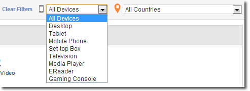

# Overzicht van media{#media-overview}

Het dashboard voor mediaoverzicht is ontworpen om u in staat te stellen media op uw site te controleren. In de weergave Mediaoverzicht worden verschillende metingen van het aggregaat weergegeven, zodat u snel kunt controleren of het medium naar behoren functioneert. In een grafiek wordt de inhoud weergegeven die begint naast de advertentie, zodat u deze gegevens snel kunt bekijken voor elk media-item.

{width=&quot;672px&quot;}

## Snelle filters {#quick-filters}

Snel media metriek tonen door apparaat of geo land:

{width=&quot;400px&quot;}

## Mediaprestaties {#media-performance}

Klik en sleep om in te zoomen en houd de muisaanwijzer vervolgens boven korrelige metriek voor bepaalde media. Klik op  

om de weergave opnieuw in te stellen nadat u hebt ingezoomd.

{width=&quot;400px&quot;}

