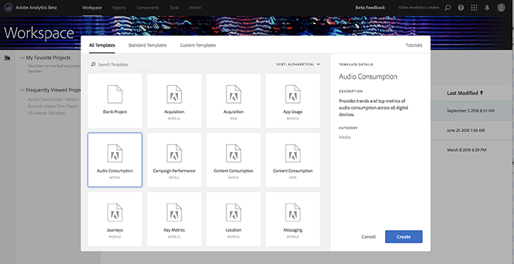
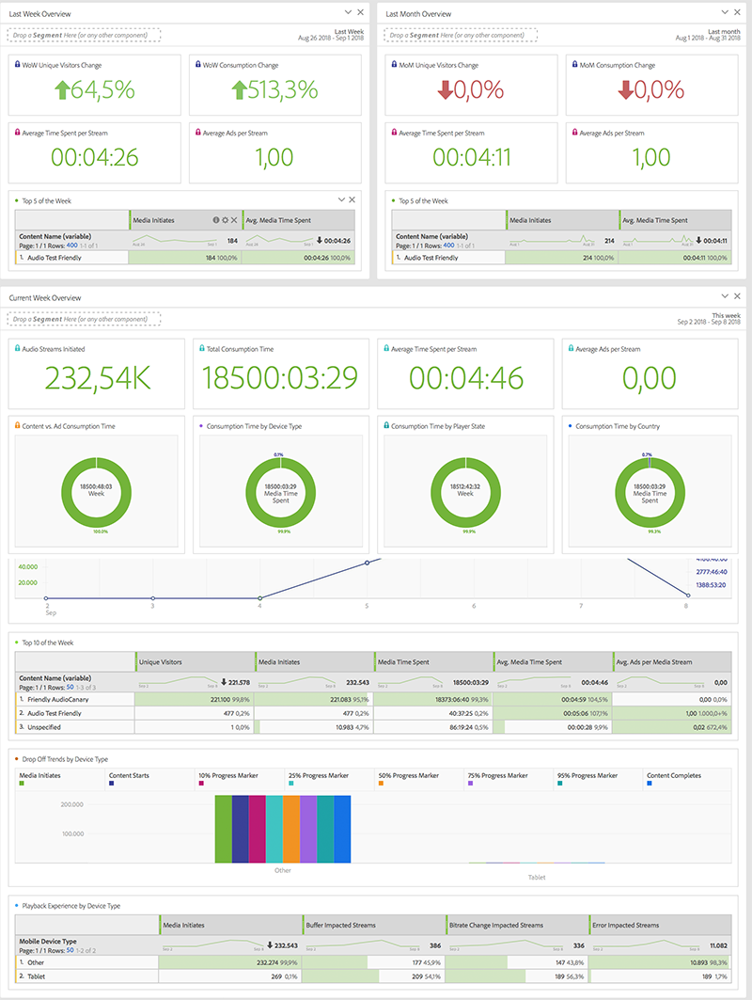

# Sjablonen voor de werkruimte Media{#media-workspace-templates}

Met Adobe Analytics Workspace kunt u snel dashboards instellen voor het analyseren van uw trackinggegevens. Wanneer u een nieuw project creeert, of wanneer u binnen naar Workspace gaat om een bestaand project te beheren, kunt u van standaardmalplaatjes kiezen die gemeenschappelijke algemene volgende scenario&#39;s, zoals Aankoop, het Stroomende Gebruik van Media, en meer behandelen. U kunt ook uw eigen aangepaste sjablonen maken, wijzigen en opslaan.

U werkt met sjablonen op het tabblad Werkruimte in Adobe Analytics wanneer u een project maakt of beheert. Wanneer u aanvankelijk naar Workspace gaat, krijgt u de opties te zien om een nieuw project te maken of een bestaand project te openen:

* **Een nieuw project maken -** Wanneer u op de  **[!UICONTROL Create New Project]** knop in Workspace klikt, wordt een dialoogvenster weergegeven waarin u een keuze kunt maken uit uw verzameling sjablonen (inclusief Standaard en Aangepast):

   

   Als u bijvoorbeeld de sjabloon **[!UICONTROL Audio Consumption]** kiest, wordt een project met het volgende audiogeoriënteerde dashboard weergegeven:

   

* **Beheer projecten -** In een bestaand project, kunt u de gegevenspresentatie en sparen als wijzigen om uw eigen inzameling van douanesjablonen tot stand te brengen.
