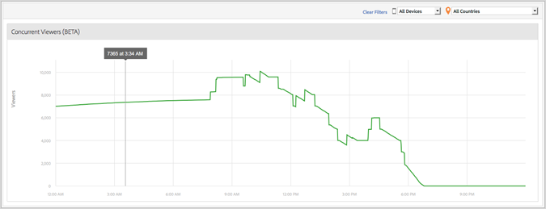

# Meldingen gelijktijdige viewers voor media {#media-concurrent-viewers}

Op het dashboard Medium Gelijktijdige viewers worden gedurende één dag gelijktijdige viewers weergegeven. De gegevens kunnen worden gefilterd op inhoud, apparaattype of land.

>[!TIP]
>
> Dit rapport is gebaseerd op gelijktijdige actieve mediasessies.  Als u gelijktijdige viewers wilt zien door een unieke bezoeker, met de extra mogelijkheden om een segment toe te passen, op te delen en te vergelijken, gebruikt u de opdracht [Deelvenster Mediagelijktijdige viewers in Analysis Workspace](https://experienceleague.adobe.com/docs/analytics/analyze/analysis-workspace/panels/media-concurrent-viewers.html).

## Rapportfuncties {#report-features}

Dit rapport bevat enkele kenmerken:

* Dit is niet in real time. Het heeft normale Adobe Analytics latentie.
* Het verslag bestrijkt een tijdsbestek van 24 uur. De x-as is tijd-van-dag die op de tijdzone van de rapportreeks wordt gebaseerd.
* Dit toont gelijktijdige kijkers bij minieme granulariteit.
* Er is een *Rapport Mediagelijktijdige viewers* Hiermee kunt u zien hoeveel kijkers in alle inhoud kijken of luisteren.
* Er is een rapport voor gelijktijdige viewers in het dialoogvenster *Details media* een rapport waarin wordt aangegeven hoeveel viewers naar een bepaald media-item luisteren.
* Het rapport werkt slechts over één dag.
* De klant kan naar historische gelijktijdige viewerrapporten (beperkt tot één dag) kijken.

## Beperkingen {#limitations}

Hier volgen enkele beperkingen voor dit rapport:

* Er worden geen gegevens weergegeven als het geselecteerde interval geen hele dag is.
* U kunt de gegevens, zoals ReportBuilder, niet exporteren.
* U kunt de gegevens niet in een tabelindeling presenteren.
* U kunt een rapport niet verzenden via e-mail.
* Zelfs als u geen advertenties bijhoudt, moet u media tracking opnieuw inschakelen en de module Media Ad selecteren.
* Deze functionaliteit biedt nauwkeurige gegevens wanneer u een hartslagbibliotheek gebruikt die mogelijkheden voor het bijhouden van pauzes heeft.
