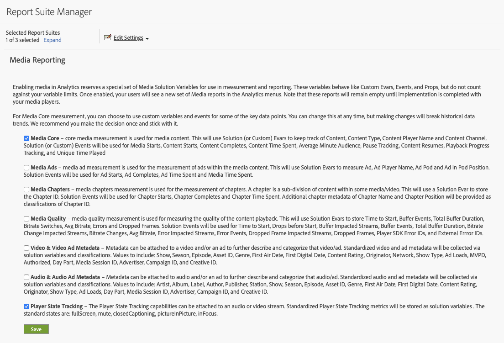

# Uitvoering en verslaglegging

Tijdens een afspeelsessie moet elke statusinstantie (begin tot eind) afzonderlijk worden bijgehouden. De Media SDK en de Media Collection API verstrekken het volgen methodes voor dit vermogen.

De Media SDK bevat twee methoden voor het bijhouden van aangepaste statussen:

`trackStateStart("state_name")`

`trackStateClose("state_name")`


De Media Collection API omvat twee gebeurtenissen die `media.stateName` als vereiste parameter hebben:

`stateStart` en `stateEnd`

## Media SDK-implementatie

Status speler start

```
// StateStart (ex: Mute is switched on)
var stateObject = ADB.Media.createStateObject(ADB.Media.PlayerState.Mute);
tracker.trackEvent(ADB.Media.Event.StateStart, stateObject);
```

Status van speler eindigt op

```
// StateEnd (ex: Mute is switched off)
tracker.trackEvent(ADB.Media.Event.StateEnd, stateObject);
```


## API-implementatie voor mediaverzameling

Status speler start

```
// StateStart (ex: Mute is switched on)
http(s)://<Analytics_Visitor_Namespace>.hb-api.omtrdc.net/api/v1/sessions/<SID>/events
{
  "eventType": "stateStart",
  "params": {
    "media.state.name": "mute"
  },
  "playerTime": {
    "playhead": 0,
    "ts": 1569999130627
  }
}
```

Status van speler eindigt op

```
// StateEnd (ex: Mute is switched off)
http(s)://<Analytics_Visitor_Namespace>.hb-api.omtrdc.net/api/v1/sessions/<SID>/events

{
  "eventType": "stateEnd",
  "params": {
    "media.state.name": "mute"
  },
  "playerTime": {
    "playhead": 600,
    "ts": 1569999730638
  }
}
```

## Staatcijfers

De metriek die voor elke individuele staat wordt verstrekt wordt berekend en aan Adobe Analytics als parameters van de Gegevens van de Context en voor rapporteringsdoeleinden opgeslagen. Er zijn drie cijfers beschikbaar voor elk frame:

* `a.media.states.[state.name].set = true` — Ingesteld op true als de status ten minste eenmaal is ingesteld voor elke specifieke weergave van een stream.
* `a.media.states.[state.name].count = 4` — Geeft het aantal instanties van een status aan tijdens elke afzonderlijke afspeelbewerking van een stream.
* `a.media.states.[state.name].time = 240` — Geeft de totale frameduur aan in seconden per afzonderlijke afspeelbewerking van een stream

## Rapportage

Alle metriek van de spelerstaat kan voor om het even welke rapporteringsvisualisatie beschikbaar in Analysis Workspace of een component (segment, berekende metriek) worden gebruikt zodra een rapportreeks voor het volgen van de spelerstaat wordt toegelaten. Deze metriek zou van Admin Console voor elk individueel rapport kunnen worden toegelaten gebruikend Media die Opstelling melden (geef Montages > Mediabeheer > Mediarapportering uit).



In Analysis Workspace bevinden alle nieuwe eigenschappen zich in het deelvenster Metriek. U kunt bijvoorbeeld zoeken op `full screen` om de gegevens op het volledige scherm weer te geven in het deelvenster Metriek.


## Door speler opgegeven meetgegevens importeren naar Adobe Experience Platform

De gegevens die in Analytics worden opgeslagen, kunnen voor elk doel worden gebruikt en de metriek van de spelerstaat kunnen in Adobe Experience Platform worden ingevoerd gebruikend XDM en met Customer Journey Analytics worden gebruikt. De eigenschappen van de standaardstatus hebben specifieke eigenschappen, terwijl de aangepaste statussen eigenschappen zijn die beschikbaar zijn via aangepaste gebeurtenissen. Voor extra informatie over de standaardstaatseigenschappen, zie de *Lijst van Eigenschappen voor XDM de sectie van Identiteiten* op de [ pagina van de Parameters van de Staat van de Speler ](/help/implementation/variables/player-state-parameters.md).
