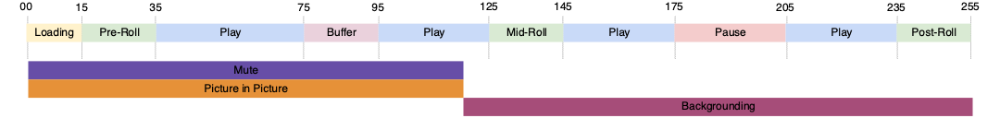

# Meerdere spelerstatussen bijhouden

Soms is het begin en einde van twee spelerstaten tegelijkertijd of is het einde van een status ook het begin van een andere status, zoals in de volgende afbeelding wordt getoond:



De huidige implementatie staat beide scenario&#39;s toe:
- `stateStart(pictureInPicture)` - t0
- `stateStart(mute)` - t0
- `stateEnd(mute)` - t1
- `stateEnd(pictureInPicture)` - t1
- `stateStart(fullScreen)` - t1
- `stateEnd(fullScreen)` - t2

Hiervoor moet u echter meerdere `stateStart` en `stateEnd` gebeurtenissen om meerdere gelijktijdige statuswijzigingen aan te geven. Om dit algemene gedrag te optimaliseren, moet u een nieuwe `statesUpdate` gebeurtenistype is geïmplementeerd, dat een lijst met staten beëindigt en een lijst met nieuwe staten start.

De nieuwe `statesUpdate` wordt de bovenstaande lijst met gebeurtenissen:
- `statesUpdate(statesEnd=[], statesStart=[pictureInPicture, mute])` - t0
- `statesUpdate(statesEnd=[mute, pictureInPicture], statesStart=[fullScreen])` - t1
- `statesUpdate(statesEnd=[fullScreen], statesStart=[])` - t2

Het aantal vraag van staatsupdates is verminderd van zes tot drie voor het zelfde gedrag. De laatste gebeurtenis had ook eenvoudig kunnen zijn `stateEnd(fullScreen)`.

## API-implementatie voor mediaverzameling {#mpst-api}

U kunt de API voor mediagroep gebruiken om meerdere statussen van spelers te implementeren.

### Voorbeeld

In het volgende voorbeeld ziet u een voorbeeld van een API-implementatie voor Media Collection voor het bijhouden van meerdere spelerstatussen.

```
// statesUpdate (ex: mute and pictureInPicture are switched on)
http(s)://<Analytics_Visitor_Namespace>.hb-api.omtrdc.net/api/v1/sessions/<SID>/events
{
  "eventType": "statesUpdate",
  "params": {
    "statesStart": [
      {
        "media.state.name": "mute"
      },
      {
        "media.state.name": "pictureInPicture"
      }
    ]
  },
  "playerTime": {
    "playhead": 0,
    "ts": 1569999130627
  }
}
```

```
// statesUpdate (ex: mute and pictureInPicture are switched off, fullScreen is switched on)
http(s)://<Analytics_Visitor_Namespace>.hb-api.omtrdc.net/api/v1/sessions/<SID>/events
{
  "eventType": "statesUpdate",
  "params": {
    "statesEnd": [
      {
        "media.state.name": "mute"
      },
      {
        "media.state.name": "pictureInPicture"
      }
    ],
    "statesStart": [
      {
        "media.state.name": "fullScreen"
      }
    ]
  },
  "playerTime": {
    "playhead": 0,
    "ts": 1569999130627
  }
}
```

```
// statesUpdate (ex: fullScreen is switched off)
http(s)://<Analytics_Visitor_Namespace>.hb-api.omtrdc.net/api/v1/sessions/<SID>/events
{
  "eventType": "statesUpdate",
  "params": {
    "statesEnd": [
      {
        "media.state.name": "fullScreen"
      }
    ]
  },
  "playerTime": {
    "playhead": 0,
    "ts": 1569999130627
  }
}
```

## Media SDK-implementatie

Er is geen Media SDK-implementatie.
