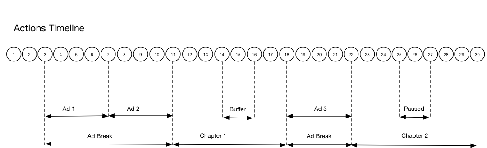

# Tijdlijn: hoofdstukken {#timeline-3-chapters}

## VOD, pre-roll advertenties, pauzeren, bufferen, inhoud weergeven tot het einde

De volgende diagrammen illustreren de tijdlijn van de afspeelkop en de bijbehorende tijdlijn van de handelingen van een gebruiker. De bijzonderheden van elke actie en de bijbehorende verzoeken worden hieronder weergegeven.




## Handelingsdetails

### Actie 1 - Starten van sessie {#Action-1}

| Handeling | Tijdlijn handeling (seconden) | Positie afspeelkop (seconden) | Aanvraag client |
| --- | :---: | :---: | --- |
| De knop Automatisch afspelen of Afspelen is ingedrukt, de video wordt geladen. | 0 | 0 | `/api/v1/sessions` |

Deze vraag signaleert _de intentie van de gebruiker om_ een video te spelen. Er wordt een sessie-id ( `{sid}` ) geretourneerd aan de client die wordt gebruikt om alle volgende opvolgende opvolgende aanroepen binnen de sessie te identificeren. De spelerstatus wordt nog niet afgespeeld, maar &#39;gestart&#39;.  Verplichte sessieparameters moeten in de `params` -kaart in de aanvraaginstantie worden opgenomen.  Op de achtergrond, produceert deze vraag Adobe Analytics in werking stelt vraag in werking. Zie de documentatie van de API voor mediagroep voor informatie over sessies.

```json
{
    "playerTime": {
        "playhead": 0,
        "ts": "<timestamp>"
    },
    "eventType": "sessionStart",
    "params": {
        "media.playerName": "sample-html5-api-player",
        "analytics.trackingServer": "[ _YOUR-TS_ ]",
        "analytics.reportSuite": "[ _YOUR_RSID_ ]",
        "analytics.visitorId": "[ _YOUR_VISITOR_ID_ ]",
        "media.contentType": "VOD",
        "media.length": 60.3333333333333,
        "media.id": "VA API Sample Player",
        "visitor.marketingCloudOrgId": "[YOUR_MCID]",
        "media.name": "ClickMe",
        "media.channel": "sample-channel",
        "media.sdkVersion": "va-api-0.0.0",
        "analytics.enableSSL": false
    }
}
```

### Handeling 2 - De timer pingelen wordt gestart {#Action-2}

| Handeling | Tijdlijn handeling (seconden) | Positie afspeelkop (seconden) | Aanvraag client |
| --- | :---: | :---: | --- |
| App start gebeurtenistimer | 0 | 0 | |

Begin pingelt tijdopnemer. De eerste pingel gebeurtenis zou dan 1 seconde binnen moeten in brand steken als er pre-roladvertenties zijn, anders 10 seconden.

### Actie 3 - Ad-break-start {#Action-3}

| Handeling | Tijdlijn handeling (seconden) | Positie afspeelkop (seconden) | Aanvraag client |
| --- | :---: | :---: | --- |
| Begin vóór rol en einde track | 0 | 0 | `/api/v1/sessions/{sid}/events` |

Advertenties kunnen alleen worden bijgehouden binnen een advertentie-einde.

```json
{
    "playerTime": {
        "playhead": 0,
        "ts": "<timestamp>"
    },
    "eventType": "adBreakStart",
    "params": {
        "media.ad.podFriendlyName": "ad_pod1",
        "media.ad.podIndex": 0, "media.ad.podSecond": 0
    }
}
```

### Actie 4 - Ad start {#Action-4}

| Handeling | Tijdlijn handeling (seconden) | Positie afspeelkop (seconden) | Aanvraag client |
| --- | :---: | :---: | --- |
| Begin van advertentie 1 vóór de rol bijhouden | 0 | 0 | `/api/v1/sessions/{sid}/events` |

Volg de eerste advertentie voor de rol, die 15 seconden lang is. Aangepaste metagegevens opnemen met deze `adStart` .

```json
{
    "playerTime": {
        "playhead": 0,
        "ts": "<timestamp>"
    },
    "eventType": "adStart",
    "params": {
        "media.ad.podFriendlyName": "ad_pod1",
        "media.ad.name": "Ad 1",
        "media.ad.id": "001",
        "media.ad.length": 15,
        "media.ad.podPosition": 1,
        "media.ad.playerName": "Sample Player",
        "media.ad.advertiser": "Ad Guys",
        "media.ad.campaignId": "1",
        "media.ad.creativeId": "42",
        "media.ad.siteId": "XYZ",
        "media.ad.creativeURL": "https://example.com",
        "media.ad.placementId": "sample_placement"
    },
    "customMetadata": {
        "myCustomData1": "CustomData1",
        "myCustomData2": "CustomData2"
    }
}
```

### Actie 5 - Advertentiepunten {#Action-5}

| Handeling | Tijdlijn handeling (seconden) | Positie afspeelkop (seconden) | Aanvraag client |
| --- | :---: | :---: | --- |
| App verzendt ping-gebeurtenis | 10 | 0 | `/api/v1/sessions/{sid}/events` |

Pingel de achterkant om de 1 seconde. (Opeenvolgende en pingels die niet in het belang van de beknoptheid worden getoond.)

```json
{
    "playerTime": {
        "playhead": 0,
        "ts": "<timestamp>"
    },
    "eventType": "ping"
}
```

### Actie 6 - Toevoeging voltooid {#Action-6}

| Handeling | Tijdlijn handeling (seconden) | Positie afspeelkop (seconden) | Aanvraag client |
| --- | :---: | :---: | --- |
| Volg de voorrol advertentie 1 voltooid | 15 | 0 | `/api/v1/sessions/{sid}/events` |

Volg het einde van de eerste pre-roll advertentie.

```json
{
    "playerTime": {
        "playhead": 0,
        "ts": "<timestamp>"
    },
    "eventType": "adComplete"
}
```

### Actie 7 - Ad start {#Action-7}

| Handeling | Tijdlijn handeling (seconden) | Positie afspeelkop (seconden) | Aanvraag client |
| --- | :---: | :---: | --- |
| Begin van advertentie 2 vóór de rol bijhouden | 15 | 0 | `/api/v1/sessions/{sid}/events` |

Volg het begin van de tweede advertentie voor de rol, die 7 seconden lang is.

```json
{
    "playerTime": {
        "playhead": 0,
        "ts": "<timestamp>"
    },
    "eventType": "adStart",
    "params": {
        "media.ad.podFriendlyName": "ad_pod1",
        "media.ad.name": "Ad 2",
        "media.ad.id": "002",
        "media.ad.length": 7,
        "media.ad.podPosition": 1,
        "media.ad.playerName": "Sample Player",
        "media.ad.advertiser": "Ad Guys",
        "media.ad.campaignId": "2",
        "media.ad.creativeId": "44",
        "media.ad.siteId": "XYZ",
        "media.ad.creativeURL": "https://example.com",
        "media.ad.placementId": "sample_placement2"
    },
}
```

### Actie 8 - Pingelen {#Action-8}

| Handeling | Tijdlijn handeling (seconden) | Positie afspeelkop (seconden) | Aanvraag client |
| --- | :---: | :---: | --- |
| App verzendt ping-gebeurtenis | 16 | 0 | `/api/v1/sessions/{sid}/events` |

Pingel de achterkant om de 1 seconde. (Opeenvolgende en pingels die niet in het belang van de beknoptheid worden getoond.)

```json
{
    "playerTime": {
        "playhead": 0,
        "ts": "<timestamp>"
    },
    "eventType": "ping"
}
```

### Actie 9 - Toevoegen voltooid {#Action-9}

| Handeling | Tijdlijn handeling (seconden) | Positie afspeelkop (seconden) | Aanvraag client |
| --- | :---: | :---: | --- |
| Volg de instructies voor de rol Advertentie 2 voltooid | 22 | 0 | `/api/v1/sessions/{sid}/events` |

Het einde van de tweede advertentie vóór de rol bijhouden.

```json
{
    "playerTime": {
        "playhead": 0,
        "ts": "<timestamp>"
    },
    "eventType": "adComplete"
}
```

### Actie 10 - Einde advertentie {#Action-10}

| Handeling | Tijdlijn handeling (seconden) | Positie afspeelkop (seconden) | Aanvraag client |
| --- | :---: | :---: | --- |
| Track voor rol en break voltooid | 22 | 0 | `/api/v1/sessions/{sid}/events` |

Het advertentiespoor is voorbij. Tijdens de hele advertentiesessie is de spelstatus blijven spelen.

```json
{
    "playerTime": {
        "playhead": 0,
        "ts": "<timestamp>"
    },
    "eventType": "adBreakComplete"
}
```

### Actie 11 - Inhoud afspelen {#Action-11}

| Handeling | Tijdlijn handeling (seconden) | Positie afspeelkop (seconden) | Aanvraag client |
| --- | :---: | :---: | --- |
| Gebeurtenis track afspelen | 22 | 0 | `/api/v1/sessions/{sid}/events` |

Na de gebeurtenis `adBreakComplete` plaatst u de speler in de afspeelstatus met de gebeurtenis `play` .

```json
{
    "playerTime": {
        "playhead": 0,
        "ts": "<timestamp>"
    },
    "eventType": "play"
}
```

### Actie 12 - Begin hoofdstuk {#Action-12}

| Handeling | Tijdlijn handeling (seconden) | Positie afspeelkop (seconden) | Aanvraag client |
| --- | :---: | :---: | --- |
| De gebeurtenis Start van hoofdstuk bijhouden | 23 | 1 | `/api/v1/sessions/{sid}/events` |

Volg na de afspeelgebeurtenis het begin van het eerste hoofdstuk.

```json
{
    "playerTime": {
        "playhead": 0,
        "ts": "<timestamp>"
    },
    "eventType": "chapterStart",
    "params": {
        "media.chapter.index": 1,
        "media.chapter.offset": 0, "media.chapter.length": 20, "media.chapter.friendlyName": "Chapter Uno"
    },
}
```

### Actie 13 - Ping {#Action-13}

| Handeling | Tijdlijn handeling (seconden) | Positie afspeelkop (seconden) | Aanvraag client |
| --- | :---: | :---: | --- |
| App verzendt ping-gebeurtenis | 30 | 8 | `/api/v1/sessions/{sid}/events` |

Pingel het achterste eind om de 10 seconden.

```json
{
    "playerTime": {
        "playhead": 8,
        "ts": "<timestamp>"
    },
    "eventType": "ping"
}
```

### Actie 14 - Begin buffer {#Action-14}

| Handeling | Tijdlijn handeling (seconden) | Positie afspeelkop (seconden) | Aanvraag client |
| --- | :---: | :---: | --- |
| Gebeurtenis bufferbegin opgetreden | 33 | 11 | `/api/v1/sessions/{sid}/events` |

Houd de verplaatsing naar de bufferstatus bij.

```json
{
    "playerTime": {
        "playhead": 11,
        "ts": "<timestamp>"
    },
    "eventType": "bufferStart"
}
```

### Actie 15 - Buffereinde (afspelen) {#Action-15}

| Handeling | Tijdlijn handeling (seconden) | Positie afspeelkop (seconden) | Aanvraag client |
| --- | :---: | :---: | --- |
| Buffering beëindigd, de app volgt hervatting van inhoud | 36 | 11 | `/api/v1/sessions/{sid}/events` |

Bufferbewerkingen worden na 3 seconden beëindigd. Zet de speler dus terug naar de afspeelstatus. U moet een andere gebeurtenis voor het afspelen van tracks verzenden die buiten de buffering valt.  **de `play` vraag na a `bufferStart` leidt tot een &quot;bufferEnd&quot;vraag aan het achtereind,** zodat is er geen behoefte aan een `bufferEnd` gebeurtenis.

```json
{
    "playerTime": {
        "playhead": 11,
        "ts": "<timestamp>"
    },
    "eventType": "play"
}
```

### Actie 16 - Ping {#Action-16}

| Handeling | Tijdlijn handeling (seconden) | Positie afspeelkop (seconden) | Aanvraag client |
| --- | :---: | :---: | --- |
| App verzendt ping-gebeurtenis | 40 | 15 | `/api/v1/sessions/{sid}/events` |

Pingel het achterste eind om de 10 seconden.

```json
{
    "playerTime": {
        "playhead": 15,
        "ts": "<timestamp>"
    },
    "eventType": "ping"
}
```

### Actie 17 - Einde hoofdstuk {#Action-17}

| Handeling | Tijdlijn handeling (seconden) | Positie afspeelkop (seconden) | Aanvraag client |
| --- | :---: | :---: | --- |
| Hoofdstukeinde van app-tracks | 45 | 20 | `/api/v1/sessions/{sid}/events` |

Het eerste hoofdstuk eindigt, vlak voor het tweede en het tweede einde.

```json
{
    "playerTime": {
        "playhead": 20,
        "ts": "<timestamp>"
    },
    "eventType": "chapterComplete"
}
```

### Actie 18 - Ad break start {#Action-18}

| Handeling | Tijdlijn handeling (seconden) | Positie afspeelkop (seconden) | Aanvraag client |
| --- | :---: | :---: | --- |
| Begin middelste rol en onderbreking volgen | 46 | 21 | `/api/v1/sessions/{sid}/events` |

Midden rol en duur van 8 seconden: verzenden `adBreakStart` .

```json
{
    "playerTime": {
        "playhead": 21,
        "ts": "<timestamp>"
    },
    "eventType": "adBreakStart",
    "params": {
        "media.ad.podFriendlyName": "ad_pod2",
        "media.ad.podIndex": 1, "media.ad.podSecond": 21
    }
}
```

### Actie 19 - Ad start {#Action-19}

| Handeling | Tijdlijn handeling (seconden) | Positie afspeelkop (seconden) | Aanvraag client |
| --- | :---: | :---: | --- |
| Begin middelste rol #3 | 46 | 21 | `/api/v1/sessions/{sid}/events` |

Houd de middenrol advertentie bij.

```json
{
    "playerTime": {
        "playhead": 21,
        "ts": "<timestamp>"
    },
    "eventType": "adStart",
    "params": {
        "media.ad.podFriendlyName": "ad_pod2",
        "media.ad.name": "Ad 3",
        "media.ad.id": "003",
        "media.ad.length": 8,
        "media.ad.podPosition": 2,
        "media.ad.playerName": "Sample Player",
        "media.ad.advertiser": "Ad Guys",
        "media.ad.campaignId": "7",
        "media.ad.creativeId": "40",
        "media.ad.siteId": "XYZ",
        "media.ad.creativeURL": "https://example.com",
        "media.ad.placementId": "sample_placement2"
    },
}
```

### Actie 20 - Pings {#Action-20}

| Handeling | Tijdlijn handeling (seconden) | Positie afspeelkop (seconden) | Aanvraag client |
| --- | :---: | :---: | --- |
| App verzendt ping-gebeurtenis | 47 | 21 | `/api/v1/sessions/{sid}/events` |

Pingel de achterkant om de 1 seconde. (Opeenvolgende en pingels die niet in het belang van de beknoptheid worden getoond.)

```json
{
    "playerTime": {
        "playhead": 21,
        "ts": "<timestamp>"
    },
    "eventType": "ping"
}
```

### Actie 21 - Toevoeging voltooid {#Action-21}

| Handeling | Tijdlijn handeling (seconden) | Positie afspeelkop (seconden) | Aanvraag client |
| --- | :---: | :---: | --- |
| Track mid-roll advertentie 1 voltooid | 54 | 21 | `/api/v1/sessions/{sid}/events` |

De mid-roll advertentie is compleet.

```json
{
    "playerTime": {
        "playhead": 21,
        "ts": "<timestamp>"
    },
    "eventType": "adComplete"
}
```

### Actie 22 - Einde advertentie {#Action-22}

| Handeling | Tijdlijn handeling (seconden) | Positie afspeelkop (seconden) | Aanvraag client |
| --- | :---: | :---: | --- |
| Halverrol en break bijhouden voltooid | 54 | 21 | `/api/v1/sessions/{sid}/events` |

Het advertentieeinde is voltooid.

```json
{
    "playerTime": {
        "playhead": 21,
        "ts": "<timestamp>"
    },
    "eventType": "adBreakComplete"
}
```

### Actie 23 - Begin hoofdstuk {#Action-23}

| Handeling | Tijdlijn handeling (seconden) | Positie afspeelkop (seconden) | Aanvraag client |
| --- | :---: | :---: | --- |
| Begin van hoofdstuk 2 volgen | 55 | 22 | `/api/v1/sessions/{sid}/events` |


```json
{
    "playerTime": {
        "playhead": 22,
        "ts": "<timestamp>"
    },
    "eventType": "chapterStart",
    "params": {
        "media.chapter.index": 2,
        "media.chapter.offset": 22, "media.chapter.length": 22, "media.chapter.friendlyName": "Chapter Dos"
    },
}
```

### Actie 24 - Ping {#Action-24}

| Handeling | Tijdlijn handeling (seconden) | Positie afspeelkop (seconden) | Aanvraag client |
| --- | :---: | :---: | --- |
| App verzendt ping-gebeurtenis | 60 | 27 | `/api/v1/sessions/{sid}/events` |

Pingel het achterste eind om de 10 seconden.

```json
{
    "playerTime": {
        "playhead": 27,
        "ts": "<timestamp>"
    },
    "eventType": "ping"
}
```

### Actie 25 - Pauze {#Action-25}

| Handeling | Tijdlijn handeling (seconden) | Positie afspeelkop (seconden) | Aanvraag client |
| --- | :---: | :---: | --- |
| Door gebruiker gepauzeerd | 64 | 31 | `/api/v1/sessions/{sid}/events` |

De handeling van de gebruiker verplaatst de afspeelstatus naar &quot;gepauzeerd&quot;.

```json
{
    "playerTime": {
        "playhead": 31,
        "ts": "<timestamp>"
    },
    "eventType": "pauseStart"
}
```

### Actie 26 - Ping {#Action-26}

| Handeling | Tijdlijn handeling (seconden) | Positie afspeelkop (seconden) | Aanvraag client |
| --- | :---: | :---: | --- |
| App verzendt ping-gebeurtenis | 70 | 31 | `/api/v1/sessions/{sid}/events` |

Pingel het achterste eind om de 10 seconden. Player bevindt zich nog steeds in de bufferstatus. De gebruiker blijft 20 seconden aan inhoud vastzitten. Fuming...

```json
{
    "playerTime": {
        "playhead": 31,
        "ts": "<timestamp>"
    },
    "eventType": "ping"
}
```

### Actie 27 - Inhoud afspelen {#Action-27}

| Handeling | Tijdlijn handeling (seconden) | Positie afspeelkop (seconden) | Aanvraag client |
| --- | :---: | :---: | --- |
| Gebruiker heeft op Afspelen gedrukt om de hoofdinhoud te hervatten | 74 | 31 | `/api/v1/sessions/{sid}/events` |

De afspeelstatus verplaatsen naar Afspelen.  **de `play` vraag na a `pauseStart` trekt een &quot;hervattingsvraag&quot;aan het achtereind** af, zodat is er geen behoefte aan een `resume` gebeurtenis.

```json
{
    "playerTime": {
        "playhead": 31,
        "ts": "<timestamp>"
    },
    "eventType": "play"
}
```

### Actie 28 - Ping {#Action-28}

| Handeling | Tijdlijn handeling (seconden) | Positie afspeelkop (seconden) | Aanvraag client |
| --- | :---: | :---: | --- |
| App verzendt ping-gebeurtenis | 80 | 37 | `/api/v1/sessions/{sid}/events` |

Pingel het achterste eind om de 10 seconden.

```json
{
    "playerTime": {
        "playhead": 37,
        "ts": "<timestamp>"
    },
    "eventType": "ping"
}
```

### Actie 29 - Einde hoofdstuk {#Action-29}

| Handeling | Tijdlijn handeling (seconden) | Positie afspeelkop (seconden) | Aanvraag client |
| --- | :---: | :---: | --- |
| Hoofdstuk 2 | 87 | 44 | `/api/v1/sessions/{sid}/events` |

Het einde van het tweede en laatste hoofdstuk bijhouden.

```json
{
    "playerTime": {
        "playhead": 0,
        "ts": "<timestamp>"
    },
    "eventType": "chapterComplete"
}
```

### Actie 30 - Sessie voltooid {#Action-30}

| Handeling | Tijdlijn handeling (seconden) | Positie afspeelkop (seconden) | Aanvraag client |
| --- | :---: | :---: | --- |
| De gebruiker heeft de inhoud tot het einde bekeken. | 88 | 45 | `/api/v1/sessions/{sid}/events` |

Verzend `sessionComplete` naar de achtergrond om aan te geven dat de gebruiker klaar is met het bekijken van de volledige inhoud.

```json
{
    "playerTime": {
        "playhead": 45,
        "ts": "<timestamp>"
    },
    "eventType": "sessionComplete"
}
```


>[!NOTE]
>
>**Geen de Gebeurtenissen van het Onderzoek? -** Er is geen expliciete ondersteuning voor `seekStart` - of `seekComplete` -gebeurtenissen in de Media Collection API. Dit is omdat bepaalde spelers een zeer groot aantal dergelijke gebeurtenissen produceren wanneer de eindgebruiker schrobt, en verscheidene honderden gebruikers de netwerkbandbreedte van een backenddienst gemakkelijk konden knelpen. Adobe biedt expliciete ondersteuning voor zoekgebeurtenissen door de hartslagduur te berekenen op basis van de tijdstempel van het apparaat in plaats van de positie van de afspeelkop.
