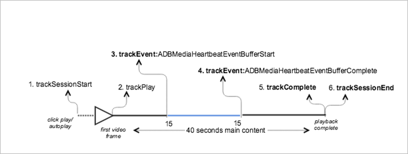

# VOD afspelen met bufferen{#vod-playback-with-buffering}

## Scenario {#scenario}

In dit scenario vindt enige buffering plaats wanneer VOD-inhoud wordt afgespeeld.

Tenzij gespecificeerd, zijn de netwerkvraag in dit scenario het zelfde als de vraag in de [ playback van VOD zonder advertenties ](/help/use-cases/tracking-scenarios/vod-no-intrs-details.md) scenario.

| Trigger   | Hartslagmethode   | Netwerkaanroepen   | Notities   |
|---|---|---|---|
| Gebruiker klikt **[!UICONTROL Play]** | `trackSessionStart` | Start inhoud analyse, Start inhoud hartslag | Dit kan een gebruiker zijn die **[!UICONTROL Play]** klikt of een automatisch afgespeelde gebeurtenis. |
| Het eerste frame van de video wordt afgespeeld. | `trackPlay` | Hartslaginhoud afspelen | Deze methode activeert de timer. Hartslagen worden elke 10 seconden verzonden zolang het afspelen duurt. |
| De inhoud wordt afgespeeld. |  | Content Heartbeats |  |
| De buffering begint. | `trackEvent:BufferStart` | Hartslagbuffer |  |
| De inhoud wordt gebufferd. |  | Content Heartbeats |  |
| De buffering is voltooid. | `trackEvent:BufferComplete` | Hartslagbuffer, hartslagspel |  |
| De inhoud wordt afgespeeld. |  | Content Heartbeats |  |
| Het afspelen van de inhoud is voltooid. | `trackComplete` | Hartslaginhoud voltooid | Het einde van de afspeelkop is bereikt. |
| De sessie is afgelopen. | `trackSessionEnd` |  | `SessionEnd` betekent het einde van een weergavesessie. Deze API moet worden aangeroepen, zelfs als de gebruiker de video niet in de gaten houdt om te worden voltooid. |

## Parameters {#parameters}

### Hartslagbuffer

| Parameter | Waarde | Notities |
|---|---|---|
| `s:event:type` | `"buffer"` |  |

## Voorbeeldcode {#sample-code}

In dit scenario vindt buffering plaats wanneer de VOD-inhoud wordt afgespeeld.



### Android

Stel de volgende code in om dit scenario in Android weer te geven:

```java
// Set up mediaObject 

MediaObject mediaInfo = MediaHeartbeat.createMediaObject( 
  Configuration.MEDIA_NAME,  
  Configuration.MEDIA_ID,  
  Configuration.MEDIA_LENGTH,  
  MediaHeartbeat.StreamType.VOD 

); 

HashMap<String, String> videoMetadata = new HashMap<String, String>(); 
videoMetadata.put(CUSTOM_KEY_1, CUSTOM_VAL_1); 
videoMetadata.put(CUSTOM_KEY_2, CUSTOM_VAL_2); 

// 1. Call trackSessionStart() when the user clicks Play or if autoplay is used,  
//    i.e., there is an intent to start playback. 
_mediaHeartbeat.trackSessionStart(mediaInfo, videoMetadata); 

...... 
...... 

// 2. Call trackPlay() when the playback actually starts, i.e., when the first  
//    frame of the main content is rendered on the screen. 
_mediaHeartbeat.trackPlay(); 

....... 
....... 

// 3. Track the MediaHeartbeat.Event.BufferStart event when the video player  
//    goes into the buffering state and begins to buffer content. 
_mediaHeartbeat.trackEvent(MediaHeartbeat.Event.BufferStart, null, null); 

....... 
....... 

// 4. Track the MediaHeartbeat.Event.BufferComplete event when the video player  
//    goes into the buffering state and begins to buffer content. 
_mediaHeartbeat.trackEvent(MediaHeartbeat.Event.BufferComplete, null, null); 

....... 
....... 

// 5. Call trackComplete() when the playback reaches the end, i.e., when the 
//    video completes and finishes playing. 
_mediaHeartbeat.trackComplete(); 

........ 
........ 

// 6. Call trackSessionEnd() when the playback session is over. This method must  
//    be called even if the user does not watch the video to completion. 
_mediaHeartbeat.trackSessionEnd(); 

........ 
```

### iOS

Stel de volgende code in om dit scenario in iOS weer te geven:

```
// Set up mediaObject 
ADBMediaObject *mediaObject =  
[ADBMediaHeartbeat createMediaObjectWithName:MEDIA_NAME  
                   length:MEDIA_LENGTH  
                   streamType:ADBMediaHeartbeatStreamTypeVOD]; 
 
NSMutableDictionary *videoContextData = [[NSMutableDictionary alloc] init]; 
[videoContextData setObject:CUSTOM_VAL_1 forKey:CUSTOM_KEY_1]; 
[videoContextData setObject:CUSTOM_VAL_2 forKey:CUSTOM_KEY_2]; 

// 1. Call trackSessionStart when the user clicks Play or if autoplay is used,  
//    i.e., there is an intent to start playback. 
[_mediaHeartbeat trackSessionStart:mediaObject data:videoContextData]; 
....... 
....... 

// 2. Call trackPlay when the playback actually starts, i.e., when the first  
//    frame of the main content is rendered on the screen. 
[_mediaHeartbeat trackPlay];  
....... 
....... 

// 3. Track the trackEvent:ADBMediaHeartbeatEventBufferStart event when the  
//    video player goes in buffering state and begins to buffer content. 
[_mediaHeartbeat trackEvent:ADBMediaHeartbeatEventBufferStart  
               mediaObject:nil  
               data:nil]; 
....... 
....... 

// 4. Track the trackEvent:ADBMediaHeartbeatEventBufferComplete event when  
//    the video player goes in buffering state and begins to buffer content. 
[_mediaHeartbeat trackEvent:ADBMediaHeartbeatEventBufferComplete  
               mediaObject:nil  
               data:nil]; 
....... 
....... 

// 5. Call trackComplete when the playback reaches the end, i.e., when the 
//    video completes and finishes playing. 
[_mediaHeartbeat trackComplete]; 
....... 
....... 

// 6. Call trackSessionEnd when the playback session is over. This method must  
//    be called even if the user does not watch the video to completion. 
[_mediaHeartbeat trackSessionEnd]; 
....... 
....... 
```

### JavaScript

Voer de volgende tekst in om dit scenario weer te geven:

```js
// Set up mediaObject 

var mediaInfo = MediaHeartbeat.createMediaObject( 
  Configuration.MEDIA_NAME,  
  Configuration.MEDIA_ID,  
  Configuration.MEDIA_LENGTH,  
  MediaHeartbeat.StreamType.VOD 

); 

var videoMetadata = { 
  CUSTOM_KEY_1 : CUSTOM_VAL_1,  
  CUSTOM_KEY_2 : CUSTOM_VAL_2,  
  CUSTOM_KEY_3 : CUSTOM_VAL_3 
}; 

// 1. Call trackSessionStart() when Play is clicked or if autoplay is used,  
//    i.e., there's an intent to start playback. 
this._mediaHeartbeat.trackSessionStart(mediaInfo, videoMetadata); 

...... 
...... 

// 2. Call trackPlay() when the playback actually starts, i.e., when the  
//    first frame of the ad video is rendered on the screen. 
this._mediaHeartbeat.trackPlay(); 

....... 
....... 

// 3. Track event MediaHeartbeat.Event.BufferStart when the video player  
//    goes into the buffering state and begins to buffer content. 
this._mediaHeartbeat.trackEvent(MediaHeartbeat.Event.BufferStart); 

....... 
....... 

// 4. Track the MediaHeartbeat.Event.BufferComplete event when the  
//    video player goes into the buffering state and begins to buffer content. 
this._mediaHeartbeat.trackEvent(MediaHeartbeat.Event.BufferComplete); 

....... 
....... 

// 5. Call trackComplete() when the playback reaches the end, i.e.,  
//    when playback completes and finishes playing. 
this._mediaHeartbeat.trackComplete(); 

........ 
........ 

// 6. Call trackSessionEnd() when the playback session is over. This method must  
//    be called even if the user does not watch the video to completion. 
this._mediaHeartbeat.trackSessionEnd(); 

........ 
........ 
```
