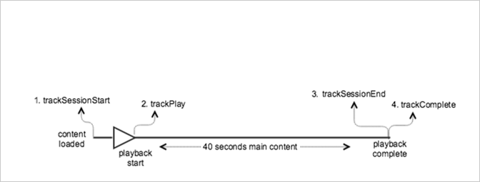

# VOD afspelen zonder advertenties{#vod-playback-with-no-ads}

## Scenario {#scenario}

Dit scenario heeft één VOD-element, zonder advertenties, dat van begin tot eind wordt afgespeeld.

| Trigger | Hartslagmethode | Netwerkaanroepen | Notities   |
|---|---|---|---|
| Gebruiker klikt **[!UICONTROL Play]** | `trackSessionStart` | Start inhoud analyse, Start inhoud hartslag | Dit kan een gebruiker zijn die op Afspelen klikt of een automatisch afspeelbare gebeurtenis. |
| Eerste frame van het medium | `trackPlay` | Hartslaginhoud afspelen | Deze methode activeert de timer en vanaf dit punt worden hartslagen tijdens het afspelen elke 10 seconden verzonden. |
| Inhoud afspelen |  | Content Heartbeats |  |
| Inhoud is voltooid | `trackComplete` | Hartslaginhoud voltooid | *Volledig* betekent dat het eind van playhead werd bereikt. |

## Parameters {#parameters}

Veel van de zelfde waarden die u op de Vraag van het Begin van de Inhoud van de Hartslag ziet worden ook gezien bij de Vraag van Adobe Analytics `Content Start`. Er zijn vele parameters die Adobe gebruikt om de diverse media rapporten te bevolken, maar slechts zijn de belangrijkste parameters vermeld in de volgende lijst:

### Begin van hartslaginhoud

| Parameter | Waarde | Notities   |
|---|---|---|
| `s:sc:rsid` | &lt;Uw Adobe-rapportsuite-id> |  |
| `s:sc:tracking_server` | &lt;Uw URL voor Analytics Tracking Server> |  |
| `s:user:mid` | moet worden ingesteld | Moet overeenkomen met de gemiddelde waarde van de aanroep van `Adobe Analytics Content Start` . |
| `s:event:type` | `"start"` |  |
| `s:asset:type` | `"main"` |  |
| `s:asset:media_id` | &lt;Uw mediumnaam> |  |
| `s:meta:*` | optioneel | Aangepaste metagegevens die zijn ingesteld op het medium. |

## Hartslaginhoud afspelen {#heartbeat-content-play}

Deze parameters zouden bijna identiek aan de `Heartbeat Content Start` vraag moeten kijken, maar het belangrijkste verschil is de `s:event:type` parameter. Alle andere parameters zouden nog moeten bestaan.

| Parameter | Waarde | Notities   |
|---|---|---|
| `s:event:type` | `"play"` |  |
| `s:asset:type` | `"main"` |  |

## Koptekst van inhoud {#content-heartbeats}

Tijdens het afspelen van media verzendt een timer minstens één hartslag om de 10 seconden. Deze hartslagen bevatten informatie over afspelen, advertenties, buffering, enzovoort. De exacte inhoud van elke hartslag valt buiten het bereik van dit document, maar het belangrijkste probleem is dat hartslagen consistent worden geactiveerd terwijl het afspelen wordt voortgezet.

Zoek in de inhoudskoppen naar de volgende parameters:

| Parameters | Waarde | Notities   |
|---|---|---|
| `s:event:type` | `"play"` |  |
| `l:event:playhead` | &lt;positie van de afspeelkop> bijvoorbeeld 50,60,70 | Deze parameter geeft de huidige positie van de afspeelkop weer. |

## Hartslaginhoud voltooid {#heartbeat-content-complete}

Wanneer het afspelen is voltooid, wat betekent dat het einde van de afspeelkop is bereikt, wordt een `Heartbeat Content Complete` -aanroep verzonden. Deze vraag kijkt als andere Hartslagvraag, maar het bevat sommige specifieke parameters:

| Parameters | Waarde | Notities   |
|---|---|---|
| `s:event:type` | `"complete"` |  |
| `s:asset:type` | `"main"` |  |

## Voorbeeldcode {#sample-code}

In dit scenario is de inhoud 40 seconden lang. De clip wordt tot het einde afgespeeld zonder onderbrekingen.



### Android

```java
// Set up  mediaObject 
MediaObject mediaInfo = MediaHeartbeat.createMediaObject( 
  Configuration.MEDIA_NAME,  
  Configuration.MEDIA_ID,  
  Configuration.MEDIA_LENGTH,  
  MediaHeartbeat.StreamType.VOD 
); 

HashMap<String, String> mediaMetadata = new HashMap<String, String>(); 
mediaMetadata.put(CUSTOM_VAL_1, CUSTOM_KEY_1); 
mediaMetadata.put(CUSTOM_VAL_2, CUSTOM_KEY_2); 

// 1. Call trackSessionStart() when the user clicks Play or if autoplay  
//    is used, i.e., there's an intent to start playback.  
_mediaHeartbeat.trackSessionStart(mediaInfo, mediaMetadata); 

...... 
...... 

// 2. Call trackPlay() when the playback actually starts,  
//    i.e., the first frame of media is rendered on the screen.  
_mediaHeartbeat.trackPlay(); 

....... 
....... 

// 3. Call trackSessionEnd() when the playback session ends prior to the  
//    media completing to the finish. This method must be called when   
//    playback ends if the user does not watch the media to completion. When trackSessionEnd is used, trackComplete should not be called. 
_mediaHeartbeat.trackSessionEnd(); 

........ 
........ 

// 4. Call trackComplete() when the playback reaches the end and   
//    completes, i.e., when the media finishes because it is played to completion. When trackComplete is used, trackSessionEnd does not need to be called.
_mediaHeartbeat.trackComplete(); 

........ 
........ 
```

### iOS

```
when the user clicks Play 
ADBMediaObject *mediaObject =  
[ADBMediaHeartbeat createMediaObjectWithName:MEDIA_NAME  
                   length:MEDIA_LENGTH  
                   streamType:ADBMediaHeartbeatStreamTypeVOD]; 

NSMutableDictionary *mediaContextData = [[NSMutableDictionary alloc] init]; 
[mediaContextData setObject:CUSTOM_VAL_1 forKey:CUSTOM_KEY_1]; 
[mediaContextData setObject:CUSTOM_VAL_2 forKey:CUSTOM_KEY_2]; 

// 1. Call trackSessionStart when the user clicks Play or if autoplay is used,  
//    i.e., there's an intent to start playback. 
[_mediaHeartbeat trackSessionStart:mediaObject data:mediaContextData]; 
...... 
...... 

// 2. Call trackPlay when the playback actually starts, i.e., when the  
//    first frame of main content is rendered on the screen. 
[_mediaHeartbeat trackPlay]; 
....... 
....... 

// 3. Call trackComplete when the playback reaches the end, i.e.,  
//    when the media completes and finishes playing. 
[_mediaHeartbeat trackComplete]; 
........ 
........ 

// 4. Call trackSessionEnd when the playback session is over. This method  
//    must be called even if the user does not watch the media to completion. 
[_mediaHeartbeat trackSessionEnd]; 
........ 
........ 
```

### JavaScript

```js
// Set up mediaObject 

var mediaInfo = MediaHeartbeat.createMediaObject(Configuration.MEDIA_NAME, Configuration.MEDIA_ID,  
Configuration.MEDIA_LENGTH,MediaHeartbeat.StreamType.VOD); 
var mediaMetadata = { 
  CUSTOM_KEY_1 : CUSTOM_VAL_1,  
  CUSTOM_KEY_2 : CUSTOM_VAL_2,  
  CUSTOM_KEY_3 : CUSTOM_VAL_3 

}; 

// 1. Call trackSessionStart() when the user clicks play, or when autoplay is used,  
//    i.e., there's an intent to start playback. 
this._mediaHeartbeat.trackSessionStart(mediaInfo, mediaMetadata); 

...... 
...... 

// 2. Call trackPlay() when the main content starts, i.e.,  
//    the first frame of the media content is rendered on the screen. 
this._mediaHeartbeat.trackPlay(); 

....... 
....... 

// 3. Call trackComplete() when the playback reaches the end,  
    i.e., the media completes and finishes playing. 
this._mediaHeartbeat.trackComplete(); 

........ 
........ 

// 4. Call trackSessionEnd() when the playback session is over.  
//    This method must be called even if the user does not  
//    watch the media to completion. 
this._mediaHeartbeat.trackSessionEnd(); 

........ 
........
```
