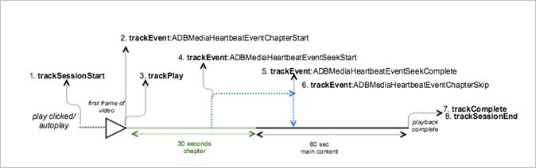

# VOD afspelen met overgeslagen hoofdstuk{#vod-playback-with-a-skipped-chapter}

## Scenario {#scenario}

In dit scenario slaat de gebruiker een hoofdstuk in de hoofdinhoud over.

Dit is het zelfde scenario zoals [ de playback van VOD met één hoofdstuk ](/help/use-cases/tracking-scenarios/vod-one-chapter.md), behalve de gebruiker in dit geval van plan is uit het hoofdstuk te zoeken daardoor het aan land in belangrijkste inhoud.

| Trigger | Hartslagmethode | Netwerkaanroepen   | Notities |
|---|---|---|---|
| Gebruiker klikt **[!UICONTROL Play]** | `trackSessionStart` | Start inhoud analyse, Start inhoud hartslag | De meetbibliotheek is zich er niet van bewust dat er een pre-roll advertentie is. Deze netwerkvraag is nog precies het zelfde als [ Playback zonder onderbrekingen in iOS ](vod-no-intrs-details.md) scenario. |
| Het hoofdstuk begint. | `trackEvent:ChapterStart` | Begin van hoofdstuk hartslag |  |
| Het eerste frame van het hoofdstuk wordt afgespeeld. | `trackPlay` | Hoofdgedeelte afspelen | Wanneer hoofdstukinhoud vóór hoofdinhoud wordt afgespeeld, willen wij hartslagen beginnen wanneer het hoofdstuk begint. |
| Het hoofdstuk speelt. |  | Hoofdstukbeats |  |
| Het eerste hoofdstuk wordt overgeslagen bij het zoeken. | `trackEvent:trackSeekStart` |  | Geen hartslagen tijdens zoeken |
| Het zoeken is voltooid. | `trackEvent:trackSeekComplete` |  | De hartslagen zullen dit bericht hervatten. |
| De toepassing realiseert zich dat de gebruiker uit de regelmatige hoofdstukgrens heeft gezocht. | `trackEvent:trackChapterSkip` |  |  |
| De inhoud wordt afgespeeld. |  | Content Heartbeats |  |
| Het afspelen van de inhoud is voltooid. | `trackComplete` | Hartslaginhoud voltooid | Deze netwerkvraag is precies het zelfde als [ Playback zonder onderbrekingen in iOS ](vod-no-intrs-details.md) scenario. |
| De sessie is afgelopen. | `trackSessionEnd` |  | `SessionEnd` betekent het einde van een weergavesessie. Deze API moet worden aangeroepen, zelfs als de gebruiker de media niet controleert om te worden voltooid. |

## Parameters {#parameters}

De parameters die tijdens hoofdstukplayback worden gebruikt zijn identiek aan de parameters in de [ playback van VOD met één hoofdstuk ](/help/use-cases/tracking-scenarios/vod-one-chapter.md) scenario, behalve dat er geen hoofdstuk volledige netwerkvraag is.

## Voorbeeldcode {#sample-code}



### Android

Stel de volgende code in om dit scenario in Android weer te geven:

```java
// Set up mediaObject 
MediaObject mediaInfo = MediaHeartbeat.createMediaObject( 
  Configuration.MEDIA_NAME,  
  Configuration.MEDIA_ID,  
  Configuration.MEDIA_LENGTH,  
  MediaHeartbeat.StreamType.VOD 

); 

HashMap<String, String> mediaMetadata = new HashMap<String, String>(); 
mediaMetadata.put(CUSTOM_KEY_1, CUSTOM_VAL_1); 
mediaMetadata.put(CUSTOM_KEY_2, CUSTOM_VAL_2); 

// 1. Call trackSessionStart() when the user clicks Play or if autoplay is used,  
//    i.e., there is an intent to start playback.  
_mediaHeartbeat.trackSessionStart(mediaInfo, mediaMetadata); 

...... 
...... 

// Chapter 
HashMap<String, String> chapterMetadata = new HashMap<String, String>(); 
chapterMetadata.put(CUSTOM_KEY_1, CUSTOM_VAL_1); 
MediaObject chapterDataInfo =  
MediaHeartbeat.createChapterObject(CHAPTER_NAME,  
                                   CHAPTER_POSITION,  
                                   CHAPTER_LENGTH,  
                                   CHAPTER_START_TIME); 

// 2. Track the MediaHeartbeat.Event.ChapterStart event when the chapter starts to play.  
_mediaHeartbeat.trackEvent(MediaHeartbeat.Event.ChapterStart,  
                         chapterDataInfo,  
                         chapterMetadata); 

....... 
....... 

// 3. Call trackPlay() when the playback actually starts, i.e., when the first frame  
//    of the main content is rendered on the screen.  
_mediaHeartbeat.trackPlay(); 

....... 
....... 

// 4. Track the MediaHeartbeat.Event.SeekStart event when the user begins to seek out  
//    of the chapter with the intent to skip it.  
_mediaHeartbeat.trackEvent(MediaHeartbeat.Event.SeekStart, null, null); 

....... 
....... 

// 5. Track the MediaHeartbeat.Event.SeekComplete event when the user seeks out of the  
//    chapter with the intent to skip it.  
_mediaHeartbeat.trackEvent(MediaHeartbeat.Event.SeekComplete, null, null); 

....... 
....... 

// 6. Track the MediaHeartbeat.Event.ChapterSkip event because the user skipped the  
//    chapter by seeking out of it in the steps above.  
_mediaHeartbeat.trackEvent(MediaHeartbeat.Event.ChapterSkip, null, null); 

....... 
....... 

// 7. Call trackComplete() when the playback reaches the end, i.e., when the media 
//    completes and finishes playing.  
_mediaHeartbeat.trackComplete(); 

........ 

........ 

// 8. Call trackSessionEnd() when the playback session is over. This method must be  
//    called even if the user does not watch the media to completion.  
_mediaHeartbeat.trackSessionEnd(); 

........ 
........ 
```

### iOS

Stel de volgende code in om dit scenario in iOS weer te geven:

```
// Set up mediaObject 
ADBMediaObject *mediaObject =  
[ADBMediaHeartbeat createMediaObjectWithName:MEDIA_NAME  
                   length:MEDIA_LENGTH  
                   streamType:ADBMediaHeartbeatStreamTypeVOD]; 
 
NSMutableDictionary *mediaContextData = [[NSMutableDictionary alloc] init]; 
[mediaContextData setObject:CUSTOM_VAL_1 forKey:CUSTOM_KEY_1]; 
[mediaContextData setObject:CUSTOM_VAL_2 forKey:CUSTOM_KEY_2]; 

// 1. Call trackSessionStart when the user clicks Play or if autoplay is used,  
//    i.e., there's an intent to start playback. 
[_mediaHeartbeat trackSessionStart:mediaObject data:mediaContextData]; 
....... 
....... 
 
// Chapter 
NSMutableDictionary *chapterContextData = [[NSMutableDictionary alloc] init]; 
[chapterContextData setObject:CONTEXT_DATA_VALUE forKey:CONTEXT_DATA_KEY]; 
 
id chapterInfo =  
[ADBMediaHeartbeat createChapterObjectWithName:CHAPTER_NAME  
                   position:CHAPTER_POSITION  
                   length:CHAPTER_LENGTH  
                   startTime:CHAPTER_START_TIME]; 
    
// 2. Track the ADBMediaHeartbeatEventChapterStart event when the chapter starts. 
[_mediaHeartbeat trackEvent:ADBMediaHeartbeatEventChapterStart  
               mediaObject:chapterInfo  
               data:chapterContextData]; 
....... 
....... 

// 3. Call trackPlay when the playback actually starts, i.e., when the first  
//    frame of the main content is rendered on the screen. 
[_mediaHeartbeat trackPlay]; 
....... 
....... 

// 4. Track the trackEvent:ADBMediaHeartbeatEventSeekStart event when the user  
//    begins to seek out of the chapter with the intent to skip it. 
[_mediaHeartbeat trackEvent:ADBMediaHeartbeatEventSeekStart mediaObject:nil data:nil]; 
....... 
....... 

// 5. Track the trackEvent:ADBMediaHeartbeatEventSeekComplete event when the  
//    user seeks out of the chapter with the intent to skip it. 
[_mediaHeartbeat trackEvent:ADBMediaHeartbeatEventSeekComplete mediaObject:nil data:nil]; 
....... 
....... 

// 6. Track the trackEvent:ADBMediaHeartbeatEventChapterSkip event because the  
//    user skipped the chapter by seeking out of it in the steps above. 
[_mediaHeartbeat trackEvent:ADBMediaHeartbeatEventChapterSkip  
               mediaObject:chapterInfo  
               data:chapterContextData]; 
....... 
....... 
 
// 7. Call trackComplete when the playback reaches the end, i.e., when the media 
//    completes and finishes playing. 
[_mediaHeartbeat trackComplete]; 
....... 
....... 

// 8. Call trackSessionEnd when the playback session is over. This method must  
//    be called even if the user does not watch the media to completion. 
[_mediaHeartbeat trackSessionEnd]; 
....... 
....... 
```

### JavaScript

Voer de volgende tekst in om dit scenario in JavaScript weer te geven:

```js
// Set up mediaObject 
var mediaInfo = MediaHeartbeat.createMediaObject( 
  Configuration.MEDIA_NAME,  
  Configuration.MEDIA_ID,  
  Configuration.MEDIA_LENGTH,  
  MediaHeartbeat.StreamType.VOD 
); 

var mediaMetadata = { 
  CUSTOM_KEY_1 : CUSTOM_VAL_1,  
  CUSTOM_KEY_2 : CUSTOM_VAL_2,  
  CUSTOM_KEY_3 : CUSTOM_VAL_3 

}; 

// 1. Call trackSessionStart() when Play is clicked or if autoplay is used,  
//    i.e., there's an intent to start playback. 
this._mediaHeartbeat.trackSessionStart(mediaInfo, mediaMetadata); 

...... 
...... 

// Chapter 
var chapterMetadata = { 
  CUSTOM_KEY_1 : CUSTOM_VAL_1 
}; 

var chapterDataInfo =  
MediaHeartbeat.createChapterObject(CHAPTER_NAME,  
                                  CHAPTER_POSITION,  
                                  CHAPTER_LENGTH,  
                                  CHAPTER_START_TIME); 

// 2. Track the MediaHeartbeat.Event.ChapterStart event when the chapter starts to play. 
this._mediaHeartbeat.trackEvent(MediaHeartbeat.Event.ChapterStart,  
                              chapterDataInfo,  
                              chapterMetadata); 

....... 
....... 

// 3. Call trackPlay() when the playback actually starts, i.e., when the  
//    first frame of the main content is rendered on the screen. 
this._mediaHeartbeat.trackPlay(); 

....... 
....... 

// 4. Track the MediaHeartbeat.Event.SeekStart event when the user begins  
//    to seek out of the chapter with the intent to skip it. 
this._mediaHeartbeat.trackEvent(MediaHeartbeat.Event.SeekStart); 

....... 
....... 

// 5. Track the MediaHeartbeat.Event.SeekComplete event when the user seeks  
//    out of the chapter with the intent to skip it. 
this._mediaHeartbeat.trackEvent(MediaHeartbeat.Event.SeekComplete); 

....... 
....... 

// 6. Track the MediaHeartbeat.Event.ChapterSkip event because the user  
//    skipped the chapter by seeking out of it in the steps above. 
this._mediaHeartbeat.trackEvent(MediaHeartbeat.Event.ChapterSkip); 

....... 
....... 

// 7. Call trackComplete() when the playback reaches the end, i.e., completes  
//    and finishes playing. 
this._mediaHeartbeat.trackComplete(); 

........ 
........ 

// 8. Call trackSessionEnd() when the playback session is over. This method must be  
//    called even if the user does not watch the media to completion. 
this._mediaHeartbeat.trackSessionEnd(); 

........ 
........ 
```
