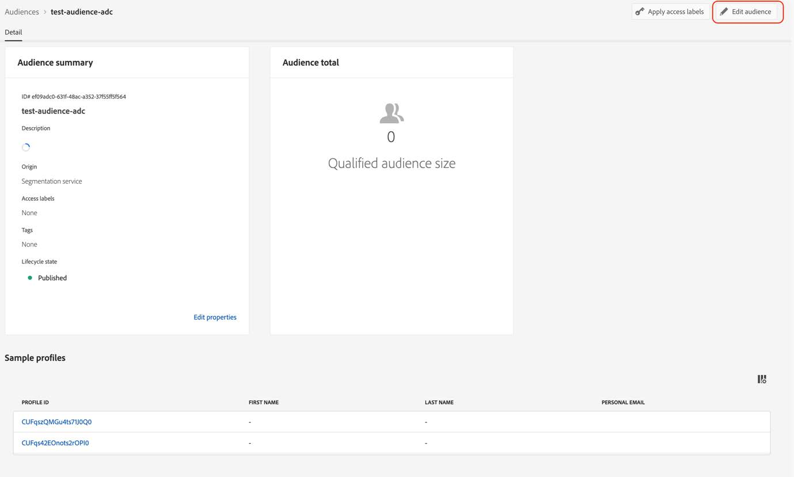

# Soorten publiek migreren naar de nieuwe streamingmediavelden

Dit document beschrijft hoe een publiek dat gebieden van het Adobe het stromen gegevenstype van de Inzameling van Media van de Inzameling genoemd &quot;Media&quot;gebruikt zou moeten worden gemigreerd om het nieuwe overeenkomstige gegevenstype te gebruiken genoemd &quot;[ Media die Details ](https://experienceleague.adobe.com/en/docs/experience-platform/xdm/data-types/media-reporting-details) melden.&quot;

## Een publiek migreren

Om een publiek van het oude gegevenstype te migreren genoemd &quot;Media&quot;aan het nieuwe geroepen gegevenstype &quot;[ Media die Details ](https://experienceleague.adobe.com/en/docs/experience-platform/xdm/data-types/media-reporting-details) melden,&quot;u moet het publiek uitgeven en in elke regel vervangen het oude gebied van het vervangen gegevenstype met het nieuwe overeenkomstige gebied van het nieuwe gegevenstype:

1. Zoek regels met velden van het vervangen gegevenstype &quot;Media&quot;. Dit zijn alle velden die met het pad beginnen, `media.mediaTimed` .

1. Dupliceer die regels gebruikend gebieden van nieuwe &quot;[ Media die Details ](https://experienceleague.adobe.com/en/docs/experience-platform/xdm/data-types/media-reporting-details)&quot;gegevenstype melden.

1. Houd beide regels op zijn plaats tot u bevestigt dat het publiek zoals verwacht werkt.

1. Verwijder de regels die velden bevatten uit het afgekeurde gegevenstype &quot;Media&quot;.

1. Controleer of het publiek nog steeds naar behoren functioneert.

Zie de [ parameter van identiteitskaart van de Inhoud ](https://experienceleague.adobe.com/en/docs/media-analytics/using/implementation/variables/audio-video-parameters#content-id) op de [ Audio en videoparameters ](https://experienceleague.adobe.com/en/docs/media-analytics/using/implementation/variables/audio-video-parameters) pagina aan kaart tussen de oude gebieden en de nieuwe gebieden. Het oude veldpad wordt gevonden onder de eigenschap &quot;XDM Field Path&quot; terwijl het nieuwe veldpad wordt gevonden onder de eigenschap &quot;Reporting XDM Field Path&quot;.

## Voorbeeld

Om het gemakkelijker te maken om de migratierichtlijnen te volgen, overweeg het volgende voorbeeld dat een publiek met één enkele regel bevat. Omdat het publiek één regel heeft, moet u de migratierichtlijnen slechts eenmaal toepassen.

1. Selecteer [!UICONTROL **uitgeeft publiek**] knoop in de hoger-juiste hoek.

1. Bepaal de plaats van de regels die voor het publiek worden gevormd.

    uit

    uit

1. Selecteer de regel om de configuratie te openen.

    uit

1. (Optioneel) Als u het pad wilt weergeven van het veld dat in de regel wordt gebruikt, selecteert u de informatieknop bij de veldnaam.

    uit

1. Identificeer de veldnaam (in dit geval &quot;Media start&quot;).

    uit

1. Zie de [ Audio en videoparameters ](https://experienceleague.adobe.com/en/docs/media-analytics/using/implementation/variables/audio-video-parameters) pagina aan kaart tussen de oude gebieden. Het oude veldpad kan worden gevonden onder de eigenschap &quot;XDM Field Path&quot;, terwijl het nieuwe veldpad kan worden gevonden onder de eigenschap &quot;Reporting XDM Field Path&quot;. Als voorbeeld, voor [ begint de Media ](https://experienceleague.adobe.com/en/docs/media-analytics/using/implementation/variables/audio-video-parameters#media-starts) parameter, is de correspondent voor `media.mediaTimed.impressions.value` `mediaReporting.sessionDetails.isViewed`.

   

1. Voeg dezelfde regel toe als de bestaande regel met het nieuwe veld.

    toe

    toe

    toe

1. Selecteer [!UICONTROL **sparen**] om het publiek te bewaren. U kunt deze opstelling houden zolang u moet bevestigen dat het publiek nog werkt zoals verwacht.

1. Nadat de bevestiging volledig is, verwijder het oude gebied, dan uitgezocht [!UICONTROL **sparen**] om het publiek te bewaren.

    toe

1. Valideer het publiek opnieuw.

   Het doelmigratieproces is voltooid.
