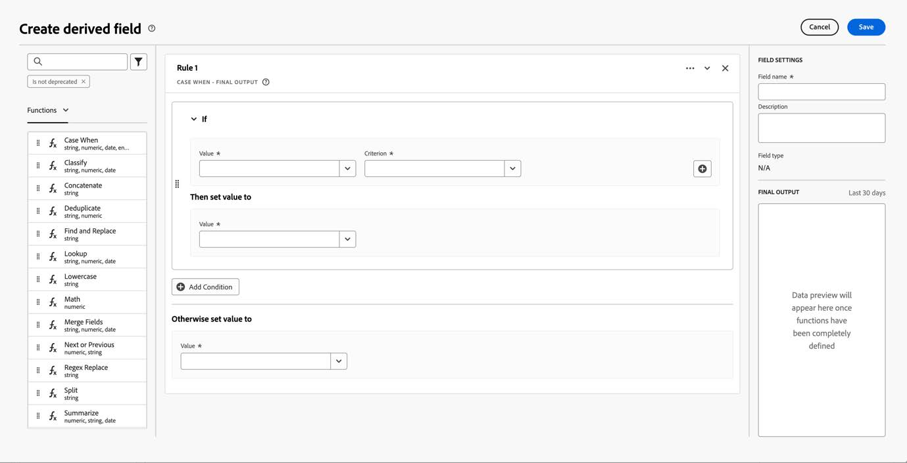
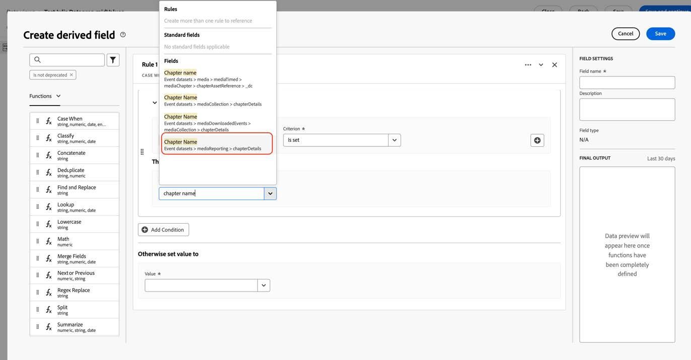

# Customer Journey Analytics migreren voor het gebruik van de nieuwe Streaming Media-velden

Dit document beschrijft hoe een opstelling van Customer Journey Analytics die Adobe gebruikt die het gegevenstype van de Inzameling van Media &quot;Media&quot;wordt genoemd zou moeten worden bijgewerkt om het nieuwe overeenkomstige gegevenstype te gebruiken genoemd &quot;[ Media die Details ](https://experienceleague.adobe.com/en/docs/experience-platform/xdm/data-types/media-reporting-details) melden.&quot;

## Customer Journey Analytics migreren

Om een opstelling van Customer Journey Analytics van het oude gegevenstype te migreren genoemd &quot;Media&quot;aan het nieuwe gegevenstype genoemd &quot;[ Media die Details ](https://experienceleague.adobe.com/en/docs/experience-platform/xdm/data-types/media-reporting-details) melden,&quot;moet u de volgende montages bijwerken die het oude gegevenstype gebruiken:

* Gegevensweergaven

* Afgeleide velden

### Gegevens migreren

De gegevensweergaven migreren naar het nieuwe gegevenstype:

1. Zoek alle gegevensweergaven met het afgekeurde gegevenstype &quot;Media&quot;. Dit zijn alle velden waarvoor het pad begint met `media.mediaTimed` .

1. Voer een van de volgende handelingen uit:

   * Voeg in deze gegevensweergaven de velden in van het nieuwe gegevenstype &quot;Media Reporting Details&quot;.

   * Maak een afgeleid veld dat het nieuwe gegevenstype &quot;Media Reporting Details&quot; gebruikt als dit is ingesteld of dat terugvalt naar het oude gegevenstype &quot;Media&quot; als het gegevenstype &quot;Media Reporting Details&quot; niet is ingesteld.

### Afgeleide velden migreren

U kunt als volgt afgeleide velden migreren naar het nieuwe gegevenstype:

1. Zoek alle afgeleide velden met het afgekeurde gegevenstype &quot;Media&quot;. Dit zijn alle afgeleide velden die velden bevatten waarvan het pad begint met `media.mediaTimed` .

1. Vervang alle oude velden in het afgeleide veld door het nieuwe corresponderende veld van &quot;Media Reporting Details&quot;.

Zie de [ parameter van identiteitskaart van de Inhoud ](https://experienceleague.adobe.com/en/docs/media-analytics/using/implementation/variables/audio-video-parameters#content-id) op de [ Audio en videoparameters ](https://experienceleague.adobe.com/en/docs/media-analytics/using/implementation/variables/audio-video-parameters) pagina aan kaart tussen de oude gebieden en de nieuwe gebieden. Het oude veldpad wordt gevonden onder de eigenschap &quot;XDM Field Path&quot; terwijl het nieuwe veldpad wordt gevonden onder de eigenschap &quot;Reporting XDM Field Path&quot;.

## Voorbeeld

Om het gemakkelijker te maken om de migratierichtlijnen te volgen, overweeg het volgende voorbeeld dat een gegevensmening met gebieden van het oude verouderde &quot;Media&quot;gegevenstype bevat. In deze gegevensweergave moet u de nieuwe corresponderende velden toevoegen.

### De gegevensweergave bijwerken

U kunt een van de volgende opties gebruiken om de gegevensweergave bij te werken:

#### Optie 1

1. Zoek een metrische of een dimensie die het oude veld van het vervangen gegevenstype gebruikt.

   

1. Controleer het overeenkomstige nieuwe gebied in de [ Verschuiving van het Hoofdstuk ](https://experienceleague.adobe.com/en/docs/media-analytics/using/implementation/variables/chapter-parameters#chapter-offset) sectie in het [ de parameters van het Hoofdstuk ](https://experienceleague.adobe.com/en/docs/media-analytics/using/implementation/variables/chapter-parameters) artikel.

1. Zoek het nieuwe corresponderende veld in de gegevensweergave.

   

1. Sleep het nieuwe veld naar de metrische waarde of de afmeting.

1. Herhaal dit proces voor alle metriek en afmetingen die gebieden van het afgekeurde &quot;Media&quot;gegevenstype gebruiken.

#### Optie 2

Met deze optie maakt u een afgeleid veld waarmee de waarde in het oude veld wordt geselecteerd of de waarde in het nieuwe veld op basis waarvan een waarde voor een specifieke gebeurtenis bestaat. Dit afgeleide gebied vervangt het oude &quot;Media&quot;gegevenstype in om het even welke projecten waar het wordt gebruikt.

Als u een afgeleid gebied voor de &quot;Naam van het Hoofdstuk&quot;wilt tot stand brengen die het nieuwe &quot;Media die Details&quot;gegevenstype&quot;gebruikt als het wordt geplaatst, of die terug naar het oude &quot;Media&quot;gegevenstype als het &quot;Media meldt&quot;gegevenstype niet wordt geplaatst:

1. Sleep een &quot;Geval wanneer&quot;clausule in de afgeleide gebieden.

    te creëren

1. Vul [!UICONTROL **als**] clausule gebruikend de waarde van de **Rapporterende Weg van het Gebied XDM**, zoals aangetoond in de [ naam van het Hoofdstuk ](https://experienceleague.adobe.com/en/docs/media-analytics/using/implementation/variables/chapter-parameters#chapter-name) parameter op de [ parameters van het Hoofdstuk ](https://experienceleague.adobe.com/en/docs/media-analytics/using/implementation/variables/chapter-parameters) pagina.

   

   

   

   

1. Vul de fallback-waarde met het oude veld van het afgekeurde gegevenstype &quot;Media&quot;.

   

   

   Dit is de definitieve definitie van het afgeleide gebied.

   

1. Als u de afgeleide velden wilt bijwerken, zoekt u een afgeleid veld dat de oude vervangen velden gebruikt (pad dat begint met `media.mediaTimed`).

   

1. De muis over het afgeleide gebied dat u wilt bijwerken, dan selecteren [!UICONTROL **geeft**] pictogram uit.

1. Zoek alle velden van het oude gegevenstype (pad dat begint met `media.mediaTimed` ) en vervang deze door het nieuwe corresponderende veld.

   

1. Controleer het overeenkomstige nieuwe gebied in de [ Naam van de Inhoud (veranderlijke) ](https://experienceleague.adobe.com/en/docs/media-analytics/using/implementation/variables/audio-video-parameters#content-name-variable) sectie in het [ Streaming de parameters van Media ](https://experienceleague.adobe.com/en/docs/media-analytics/using/implementation/variables/audio-video-parameters#content-name-variable) artikel.

1. Vervang het oude veld door het nieuwe veld.

   

1. Herhaal dit proces voor alle afgeleide gebieden gebruikend gebieden van het oude vervangen &quot;Media&quot;gegevenstype.

   De migratie van de CJA-installatie is voltooid.

