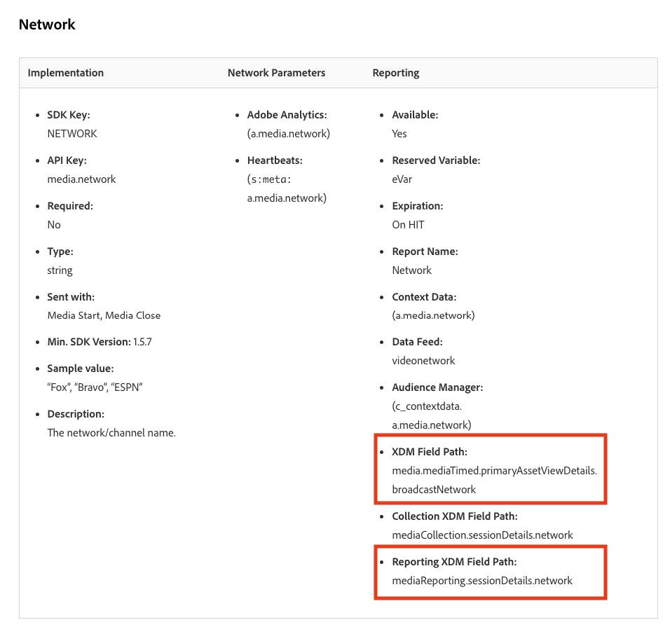

# Gegevensvoorinstelling voor aangepaste velden migreren naar de nieuwe streaming mediavelden

In dit document wordt beschreven hoe de Data Prep-service wordt gemigreerd die wordt gebruikt vóór de gegevensverzamelingsstromen van Adobe die zijn ingeschakeld voor Adobe Streaming Media Collection-gegevens. De migratie zet een afbeelding van de Prep van Gegevens van het Adobe die gegevenstype van de Inzameling van Media &quot;Media&quot;om het nieuwe overeenkomstige gegevenstype te gebruiken genoemd &quot;[ Media die Details ](https://experienceleague.adobe.com/en/docs/experience-platform/xdm/data-types/media-reporting-details) melden.&quot;

## Gegevensvoorinstelling migreren voor aangepaste velden

Om de afbeeldingen van Prep van Gegevens van het oude gegevenstype te migreren genoemd &quot;Media&quot;aan het nieuwe geroepen gegevenstype &quot;[ Media die Details ](https://experienceleague.adobe.com/en/docs/experience-platform/xdm/data-types/media-reporting-details) melden,&quot;u moet de Prep van Gegevens in kaart brengen uitgeven:

>[!IMPORTANT]
>
>Zorg ervoor dat de bronconnector Analytics is geïmplementeerd met de nieuwe `mediaReporting` -velden voordat u de stappen in deze sectie uitvoert, om gegevensverlies te voorkomen.

1. In Adobe Experience Platform, onder de [!UICONTROL **Bronnen**] sectie, ga naar [!UICONTROL **Dataflows**] tabel.

1. Zoek de gegevensstroom die verantwoordelijk is voor het importeren van streaming mediagegevens van Adobe Analytics naar Adobe Experience Platform via Adobe Data Collection.

1. Selecteer [!UICONTROL **dataflow van de Update**] om de Opstelling van Prep van Gegevens te wijzigen door elke douane bronafbeelding te vervangen die een afgekeurd gebied met het nieuwe overeenkomstige gebied van het nieuwe voorwerp XDM bevat.

1. Zoek de toewijzingen die bronvelden van het afgekeurde object Media bevatten.

1. Vervang deze bronnen door velden uit het nieuwe object &quot;Media Reporting Details&quot; te gebruiken.

1. Controleer of de toewijzingen nog steeds naar behoren werken.

Zie de [ parameter van identiteitskaart van de Inhoud ](https://experienceleague.adobe.com/en/docs/media-analytics/using/implementation/variables/audio-video-parameters#content-id) op de [ Audio en videoparameters ](https://experienceleague.adobe.com/en/docs/media-analytics/using/implementation/variables/audio-video-parameters) pagina aan kaart tussen de oude gebieden en de nieuwe gebieden. Het oude veldpad wordt gevonden onder de eigenschap &quot;XDM Field Path&quot; terwijl het nieuwe veldpad wordt gevonden onder de eigenschap &quot;Reporting XDM Field Path&quot;.

## Voorbeeld

Om het gemakkelijker te maken om de migratierichtlijnen te volgen, overweeg het volgende voorbeeld dataflow die één enkele afbeelding bevat. In dit geval hoeft u de migratierichtlijnen slechts eenmaal toe te passen.

1. In Adobe Experience Platform, onder de [!UICONTROL **Bronnen**] sectie, ga naar [!UICONTROL **Dataflows**] tabel.

1. Zoek de gegevensstroom die verantwoordelijk is voor het importeren van streaming mediagegevens van Adobe Analytics naar Adobe Experience Platform via Adobe Data Collection.

1. Selecteer **[!UICONTROL Update dataflow]** om de bewerkingsinterface in te voeren, zoals wordt weergegeven in de onderstaande afbeelding.

   

1. Selecteer op het tabblad **[!UICONTROL Mapping]** de optie **[!UICONTROL Custom]** .

1. Identificeer de aangepaste toewijzingen die `media.mediaTimed` -velden als bronnen gebruiken.

   

   In dit voorbeeld is het doelveld onder `_dcbl`, omdat u in uw ontwikkelorganisatie een aangepaste veldgroep hebt gemaakt op het schema. Het pad van de aangepaste veldgroep verschilt op basis van de organisatienaam.

1. Voor elke toewijzing die het `media.mediaTimed` -object gebruikt, zoekt u de bijbehorende correspondent in het `mediaReporting` -object aan de hand van deze documentatie.

   Voor Network bijvoorbeeld is de correspondent voor `media.mediaTimed.primaryAssetViewDetails` .broadcastNetwork `mediaReporting.sessionDetails.network` .

   

1. Vervang in het veld **[!UICONTROL Source field]** het pad `media.mediaTimed` door het pad `mediaReporting` . Het doelveld blijft ongewijzigd.

   

1. Selecteer **[!UICONTROL Next]** om uw wijzigingen op te slaan.

   De status wordt weergegeven als **[!UICONTROL Processing]** . Nadat de wijzigingen zijn toegepast, wordt de status weergegeven als **[!UICONTROL Enabled]** .

   

## Voorbeeld met verschillende gegevenstypen

In het bovenstaande voorbeeld waren alle gegevenstypen in kwestie String, zodat de vervangende toewijzing direct was.

Als het gegevenstype van het brongebied verschillend is dan het gegevenstype van het doelgebied, moet u de richtlijnen in de [ het oplossen van problemengids van de Prep van Gegevens ](https://experienceleague.adobe.com/en/docs/experience-platform/data-prep/troubleshooting-guide) volgen, [ het behandelen van gegevensformaten met de Prep van Gegevens ](https://experienceleague.adobe.com/en/docs/experience-platform/data-prep/data-handling), en [ de kaartfuncties van Prep van Gegevens ](https://experienceleague.adobe.com/en/docs/experience-platform/data-prep/data-handling).

Als het brontype bijvoorbeeld een tekenreeks is en het doeltype een Booleaanse waarde is, kan Data Prep de waarde automatisch parseren en de bronwaarde omzetten in een booleaanse waarde.

Als het brontype een getal is en het doeltype een booleaanse waarde heeft, moet u gegevensmanipulatiefuncties gebruiken:

Toewijzing met `media.mediaTimed` aan een aangepast veld.

Toewijzing met `mediaReporting` aan hetzelfde aangepaste veld:

